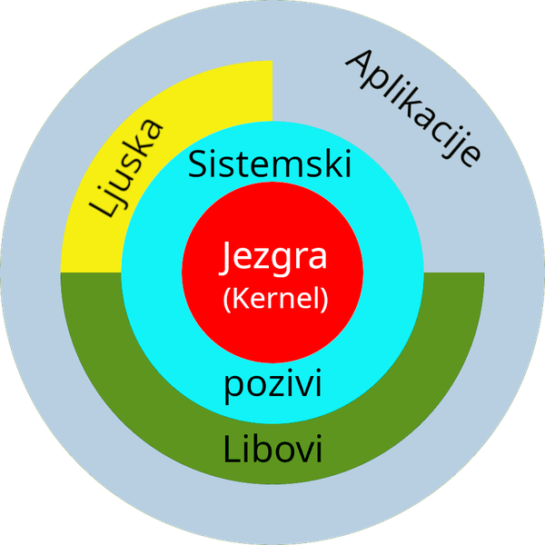

# Osnove UNIX-a

U ovom poglavlju dan je uvod u UNIX operacijski sustav: njegovu arhitekturu, organizaciju datotečnog sustava, prava pristupa, naredbenu ljusku, preusmjeravanje ulaza i izlaza, ulančavanje naredbi, te pisanje shell skripti. Nije riječ o C programiranju — sve što slijedi odvija se u **terminalu**, izravnom interakcijom korisnika s ljuskom. Razumijevanje ovih osnova preduvjet je za sve sljedeće poglavlje, gdje ćemo se baviti programiranjem aplikacija koje se izvršavaju na UNIX sustavima.

## Arhitektura UNIX operacijskog sustava

UNIX je organiziran u nekoliko slojeva apstrakcije, prikazanih na sljedećoj slici:



U središtu se nalazi **jezgra** (engl. *kernel*) — najniži sloj softvera koji izravno upravlja sklopovljem računala (procesorom, memorijom, diskovima, mrežnim sučeljima, ulazno-izlaznim uređajima). Jezgra je jedini dio sustava koji ima privilegirani pristup hardveru; sve ostale komponente — uključujući vlastite uvodne programe poput ljuske — moraju s hardverom komunicirati posredno, kroz nju.

Komunikacija s jezgrom odvija se putem **sistemskih poziva** (engl. *system calls*) — strogo definiranog skupa funkcija koje korisnički programi pozivaju kad žele zatražiti uslugu od jezgre. Sistemski pozivi su jedino sučelje između korisničkih programa i jezgre. Na taj način programer ne mora poznavati detalje implementacije sklopovlja, nego radi protiv unificiranog i stabilnog sučelja.

Iznad sistemskih poziva nalaze se **biblioteke funkcija** (engl. *libraries*, libovi) — zbirke funkcija više razine koje predstavljaju dodatnu razinu apstrakcije. Najpoznatiji primjer je standardna C biblioteka (`libc`) koja sadrži funkcije poput `printf`, `fopen`, `malloc` i mnoge druge. Funkcije iz biblioteka u konačnici se svode na jedan ili više sistemskih poziva, ali programeru pružaju znatno jednostavnije sučelje.

**Naredbena ljuska** (engl. *shell*) je interpreter naredbenog retka koji korisniku omogućuje interaktivan pristup svim funkcijama sustava. Bitno je naglasiti da ljuska **nije dio jezgre** — ona je obični korisnički program koji koristi sistemske pozive i biblioteke kao i svaki drugi program. UNIX ljuska istovremeno je i kompletan programski jezik: korisnik može pisati skripte koje uključuju varijable, uvjetno grananje, petlje i funkcije, sve koristeći isključivo ljusku. Jedna od temeljnih prednosti je **filozofija ulančavanja** — izlaz jedne naredbe može postati ulaz druge, što omogućuje izgradnju složenih lanaca obrade podataka od jednostavnih, specijaliziranih programa. Ova ideja sažeta je u UNIX maksimi: *mali programi koji rade jednu stvar dobro mogu se kombinirati u moćne lance obrade*.

Najviši sloj čine **aplikacije** — svi korisnički programi: tekstualni editori, web preglednici, baze podataka, inženjerski alati. Sve operacije ostvaruju pozivanjem funkcija iz biblioteka ili izravnim sistemskim pozivima.

Iako je na slici prikazan kao zaseban sloj, **datotečni sustav** zapravo prožima cijelu arhitekturu. Jezgra ga implementira i izlaže putem sistemskih poziva. UNIX-ova filozofija *"sve je datoteka"* znači da se i uređaji, međuprocesna komunikacija i mnogi drugi resursi sustava prikazuju kao datoteke — što znatno pojednostavljuje programiranje jer se sve resursi koriste kroz isto sučelje.

## Sustav datoteka

### Tipovi datoteka

UNIX razlikuje nekoliko tipova datoteka. Tip se može vidjeti prvim znakom u ispisu naredbe `ls -l`:

| Oznaka | Tip | Opis |
|---|---|---|
| `-` | obična datoteka | bilo koji podaci na disku — tekst, binarni programi, slike, arhive |
| `d` | direktorij | popis zapisa o datotekama i poddirektorijima |
| `l` | simbolički link | datoteka koja sadrži putanju na drugu datoteku ("prečac") |
| `c` | character special | uređaj kojemu pristupamo znak po znak (`/dev/tty`) |
| `b` | block special | uređaj kojem pristupamo blok po blok (`/dev/sda`) |
| `s` | socket | krajnja točka mrežne ili lokalne komunikacije |
| `p` | imenovani cjevovod (FIFO) | jednosmjerni komunikacijski kanal između procesa |

Ključna posljedica filozofije *"sve je datoteka"*: svi ovi tipovi resursa koriste se istim malim skupom sistemskih poziva — `open()`, `read()`, `write()`, `close()`. Program ne treba znati radi li o običnoj datoteci na disku, terminalu, mrežnom socketu ili imenovanom cjevovodu — sa svima radi na isti način.

### Struktura direktorija

UNIX datotečni sustav organiziran je kao stablo: jedan korijenski direktorij označen znakom `/` na vrhu, ispod njega proizvoljno mnogo razina poddirektorija. Svaki direktorij u trenutku stvaranja automatski dobiva dva posebna unosa koji se ne mogu izbrisati:

- `.` — pokazivač na **trenutni** direktorij,
- `..` — pokazivač na **roditeljski** direktorij (jednu razinu više). Iznimka je korijenski direktorij `/`, gdje i `.` i `..` pokazuju na sam `/`.

Pri navigaciji datotečnim sustavom razlikujemo apsolutnu i relativnu putanju.

**Apsolutna putanja** uvijek počinje znakom `/` i jednoznačno određuje položaj datoteke neovisno o tome gdje se trenutno nalazimo. Primjer:

```
/home/dkrst/nastava/unix
```

Ova putanja označava isti direktorij neovisno o korisnikovoj trenutnoj lokaciji. Možemo je zamisliti kao kompletnu kućnu adresu — bez obzira odakle u svijetu napišemo adresu, razglednica će stići pravoj osobi.

**Relativna putanja** polazi od trenutnog radnog direktorija i ne počinje s `/`. Možemo je zamisliti kao uputu kako stići do određenog mjesta u gradu: *"na prvom križanju lijevo, pa dva ravno..."* — vrijedi samo ako polazimo s točno određene lokacije. Tako, ako se nalazimo u `/home/dkrst`, putanja `nastava/unix` označava `/home/dkrst/nastava/unix`. Ako se nalazimo u `/home/dkrst/vjezbe`, do istog cilja stižemo putanjom `../nastava/unix` — `..` nas vraća jedan korak gore.

Trenutni radni direktorij ispisujemo naredbom `pwd` (*print working directory*), a mijenjamo naredbom `cd` (*change directory*).

### Prava pristupa

UNIX je višekorisnički sustav, što znači da na istom računalu istovremeno može raditi više korisnika. Da različitih korisnici ne bi međusobno smetali — slučajno ili namjerno mijenjajući tuđe datoteke — uveden je **sustav prava pristupa**.

Prava se dodjeljuju u tri razine, prema skupini korisnika:

- **user** — vlasnik datoteke (obično onaj tko ju je stvorio),
- **group** — grupa kojoj datoteka pripada (npr. zaposlenici istog odjela),
- **others** — svi ostali korisnici sustava.

Za svaku skupinu definirana su tri prava:

| Oznaka | Naziv | Značenje za datoteke |
|---|---|---|
| **r** | čitanje (*read*) | dopušta otvaranje i čitanje sadržaja |
| **w** | pisanje (*write*) | dopušta izmjenu sadržaja datoteke |
| **x** | izvršavanje (*execute*) | dopušta pokretanje datoteke kao programa |

Dakle, svaka datoteka ima ukupno **devet bitova** prava — tri prava puta tri skupine. Ovih devet bitova pri ispisu naredbom `ls -l` izgleda ovako:


Primjer: prava `rw-r--r--` znače da vlasnik može čitati i pisati, a grupa i ostali samo čitati. Prava `rwxr-x---` znače da vlasnik ima sva tri prava, grupa može čitati i izvršavati, a ostali nemaju nikakva prava.

Posebnu pažnju zaslužuje pravo **izvršavanja (x)**. Korisnicima koji dolaze s Windowsa ovaj koncept može biti neobičan: na Windowsima sustav prepoznaje izvršne datoteke po **ekstenziji** (`.exe`, `.bat`, `.com`). Na UNIX-u taj mehanizam ne postoji — ekstenzija je samo dio imena i ne nosi nikakvo posebno značenje za sustav. Umjesto toga, UNIX koristi bit **x** kao jedini i dovoljan kriterij: ako je postavljen, datoteka se može pokrenuti. Kao posljedica:

- datoteka `program.txt` može biti potpuno valjani izvršni program (binarni ili shell skripta) ako joj je postavljen bit `x`,
- datoteka `program.exe` na UNIX-u nije ništa posebno — izvršit će se samo ako joj je postavljen bit `x`.

Naravno, davanje prava izvršavanja ne čini bilo koju datoteku stvarno izvršnom: ako sadržaj nije ni binarni kod ni interpretirajuća skripta, pri pokušaju izvršavanja dobit ćemo grešku.

Za **direktorije**, prava `r`, `w`, `x` imaju nešto izmijenjeno značenje:

- `r` — pravo pregleda popisa datoteka (`ls`),
- `w` — pravo izmjene popisa: stvaranja, brisanja, preimenovanja datoteka **u** direktoriju,
- `x` — pravo "ulaska" u direktorij, tj. pristupa datotekama u njemu (uključujući mogućnost da direktorij bude radni direktorij).

Bitno je razlikovati pravo brisanja datoteke od prava pisanja na samu datoteku: brisanje datoteke kontrolira se pravom `w` na **direktoriju** u kojem se ona nalazi, ne na samoj datoteci.

#### Promjena prava pristupa

Prava pristupa mijenjamo naredbom `chmod`. Postoje dva načina zadavanja:

**Numerički (apsolutni) način** — svako pravo predstavlja jedan bit s težinom: `r=4`, `w=2`, `x=1`. Zbrajanjem dobivamo brojku za svaku skupinu, a tri brojke (vlasnik, grupa, ostali) zapisujemo zajedno:

```
chmod 644 dat1.txt
```

Postavlja `rw-` za vlasnika (6 = 4+2), `r--` za grupu (4) i `r--` za ostale (4) — što odgovara zapisu `rw-r--r--`. Apsolutni način uvijek **u potpunosti** zamjenjuje prethodna prava.

**Simbolički način** — koristi slova za skupine (`u`, `g`, `o`, ili `a` za sve) i operatore `+` (dodaj), `-` (oduzmi):

```
chmod u+x skripta.sh        # daj vlasniku pravo izvršavanja
chmod go+rx skripta.sh      # daj grupi i ostalima čitanje i izvršavanje
chmod a-x dat1.txt          # oduzmi izvršavanje svima
```

Simbolički način **mijenja samo navedena prava**, ostala ostaju netaknuta. Ovo je razlika u odnosu na apsolutni način, gdje uvijek navodimo cjelokupna prava odjednom.

Pored običnih korisnika postoji i poseban korisnik s neograničenim ovlastima — **administrator** ili **superuser**, u UNIX terminologiji nazvan **root**. Za razliku od običnih korisnika, root može čitati, mijenjati i brisati bilo koju datoteku te pokretati i zaustavljati bilo koji proces. Upravo zbog toga administratorski račun treba koristiti s velikim oprezom — greška izvršena s root ovlastima može nepovratno oštetiti sustav.

Riječ "root" u UNIX kontekstu ima dva potpuno različita značenja: **administratorski korisnički račun** (s matičnim direktorijem `/root`) i **korijenski direktorij** datotečnog stabla (`/`). Ova dva pojma nemaju nikakve veze osim što dijele isti engleski naziv — početnicima ova podudarnost zna stvarati zabunu, ali iskusni korisnici iz konteksta uvijek znaju o čemu se radi.

## Naredbena ljuska

Ljuska je program koji čita naredbe sa standardnog ulaza (`stdin`), interpretira ih, izvršava i ispisuje rezultat na standardni izlaz (`stdout`), a poruke o greškama na standardni izlaz za greške (`stderr`).

### Osnovne naredbe

| Naredba | Opis | Primjer |
|---|---|---|
| `pwd` | ispisuje apsolutnu putanju trenutnog direktorija | `pwd` |
| `cd` | mijenja trenutni direktorij; bez argumenta vraća u matični (`$HOME`) | `cd /home/dkrst`, `cd ..`, `cd` |
| `ls` | ispisuje sadržaj direktorija (`-l` dugi format, `-a` skrivene, `-t` po vremenu) | `ls -la` |
| `mkdir` | stvara novi direktorij (`-p` stvara i sve roditelje) | `mkdir projekti`, `mkdir -p a/b/c` |
| `cp` | kopira datoteke (`-r` rekurzivno) | `cp dat1.txt dat2.txt`, `cp -r dir1/ dir2/` |
| `mv` | premješta ili preimenovava | `mv dat1.txt arhiva/`, `mv staro.txt novo.txt` |
| `rm` | briše datoteke (`-r` rekurzivno, `-f` prisilno bez upita) | `rm dat1.txt`, `rm -rf stari_dir/` |
| `cat` | ispisuje sadržaj jedne ili više datoteka na standardni izlaz | `cat dat1.txt`, `cat *.log` |
| `man` | otvara priručnik za zadanu naredbu ili sistemski poziv | `man ls` |

**Upozorenje za `rm`**: UNIX nema "koš za smeće" — brisanje je trajno. Posebno opasna kombinacija je `rm -rf` koja briše rekurzivno bez ikakvog upita. Naredba `rm -rf /` (ili neka njezina slučajna varijacija s razmacima) može obrisati cijeli sustav. Uvijek dvaput provjerite što ste utipkali prije nego pritisnete Enter.

### Pokretanje programa u pozadini

Po zadanom, kad pokrenemo neki program iz ljuske, ona čeka da on završi prije nego nam vrati kontrolu. To je u redu za kratke naredbe, ali za one koje traju dugo (kompresiranje velikog direktorija, kompilacija velikog projekta, mrežna preuzimanja) često želimo nastaviti raditi paralelno. UNIX to omogućuje znakom `&` na kraju naredbe — program se pokreće "u pozadini", a ljuska odmah vraća kontrolu:

```
$ tar -czf backup.tar.gz /home/dkrst &
[2] 3963
$
```

Ljuska ispisuje **redni broj posla** u uglatim zagradama (`[2]`) i **PID** (`Process ID`) procesa (`3963`), te odmah pokazuje promptom da je spremna za novu naredbu. Status pokrenutih poslova provjeravamo naredbom `jobs`, premještamo ih iz pozadine u prvi plan s `fg`, a iz prvog plana u pozadinu s `bg` (uz prethodno suspendiranje pomoću `Ctrl+Z`).

### Priručnik — naredba `man`

`man` je tradicionalni UNIX alat za dokumentaciju, dostupan izravno u terminalu bez potrebe za internetskom vezom ili pretraživačem. Iako većina dokumentacije danas postoji i online, `man` stranice ostaju nezamjenjive na ugradbenim sustavima, serverskim računalima i udaljenim sustavima koji nemaju grafičko sučelje, a ponekad ni pristup internetu — a to su upravo okruženja u kojima UNIX pokazuje svoje najveće prednosti. Uz to, `man` stranice su uvijek usklađene s točnom verzijom alata instaliranog na konkretnom sustavu, što online izvori ne mogu jamčiti.

Pretraživanje stranica vrši se naredbom `man <naredba>`, navigacija strelicama ili Space tipkom, a izlazi pritiskom na `q`. Stranice su organizirane u sekcije:
- sekcija 1 — korisničke naredbe (`man 1 ls`),
- sekcija 2 — sistemski pozivi (`man 2 open`),
- sekcija 3 — bibliotečke funkcije (`man 3 printf`).

## Preusmjeravanje ulaza i izlaza

Svaki program u UNIX-u standardno koristi tri toka podataka: standardni ulaz (`stdin`), standardni izlaz (`stdout`) i standardni izlaz za greške (`stderr`). Ljuska pruža mehanizam **preusmjeravanja** kojim te tokove možemo prije pokretanja programa povezati s datotekama. Sam program time se ne mijenja — i dalje misli da čita sa `stdin` i piše na `stdout` — ali ljuska tiho preusmjeri te tokove na zadane datoteke.

Najčešći operatori preusmjeravanja u **bash** ljusci:

| Operator | Opis |
|---|---|
| `>` | preusmjeri `stdout` u datoteku (briše postojeći sadržaj) |
| `>>` | dodaj `stdout` na kraj datoteke |
| `<` | čitaj `stdin` iz datoteke |
| `2>` | preusmjeri `stderr` u datoteku |
| `2>>` | dodaj `stderr` na kraj datoteke |
| `&>` | preusmjeri `stdout` i `stderr` zajedno |
| `&>>` | dodaj `stdout` i `stderr` na kraj |
| `2>&1` | spoji `stderr` na `stdout` (vrlo čest "trik") |

Primjer — spasimo izlaz `ls -la` u datoteku, pa pogledajmo sadržaj:

```
$ ls -la > popis.txt
$ cat popis.txt
total 8
drwxr-xr-x 4 dkrst users 168 2026-03-11 18:04 .
drwxr-xr-x 11 dkrst users 352 2026-03-11 12:38 ..
-rw-r--r-- 1 dkrst users  33 2026-03-11 12:58 dat1.txt
-rw-r--r-- 1 dkrst users  33 2026-03-11 16:12 dat2.txt
-rw-r--r-- 1 dkrst users   0 2026-03-11 18:04 popis.txt
```

Zasebno preusmjeravanje `stdout` i `stderr`:

```
$ ls /home /nepostoji > rezultati.txt 2> greske.txt
$ cat rezultati.txt
/home:
marko  ana  petar
$ cat greske.txt
ls: cannot access '/nepostoji': No such file or directory
```

Posebna datoteka **`/dev/null`** je "crna rupa" jezgre — sve što se u nju upiše tiho nestaje. Korisna je kad želimo potpuno odbaciti neki izlaz:

```
$ neka_naredba 2> /dev/null            # zanemari greške, prikaži samo stdout
$ neka_naredba > /dev/null 2>&1        # zanemari sve, samo izvrši
```

## Ulančavanje naredbi (`pipes`)

Pored preusmjeravanja u datoteku, izlaz jedne naredbe možemo izravno spojiti na ulaz druge — operatorom `|` (vertikalna crta, *pipe*). Ovo je realizacija temeljne UNIX filozofije: *mali programi koji rade jednu stvar dobro mogu se kombinirati u moćne lance obrade*.

Klasičan primjer — koliko redaka u log datoteci sadrži riječ `ERROR`?

```
$ cat program.log | grep "ERROR" | wc -l
42
```

Lanac radi ovako: `cat` čita datoteku i šalje sadržaj na `stdout`; taj `stdout` ulančan je s `stdin`-om naredbe `grep` koja propušta samo retke s riječi `ERROR`; izlaz `grep`-a ulančan je s `wc -l` koji broji retke. Konačni rezultat — broj redaka s greškom.

Drugi primjer — prikaži samo `.txt` datoteke u direktoriju:

```
$ ls -al | grep "\.txt"
-rw-r--r-- 1 dkrst users 33 2026-03-11 dat1.txt
-rw-r--r-- 1 dkrst users 45 2026-03-11 biljeske.txt
```

Lanci mogu biti dugi koliko god je potrebno. Klasičan primjer iz administracije — ispiši **različita** korisnička imena koja su u `auth.log` izazvala grešku:

```
$ grep "ERROR" auth.log | awk '{print $5}' | sort | uniq
admin
ana
marko
```

Ovdje `grep` filtrira retke s greškom, `awk` izvlači peto polje (korisničko ime), `sort` ih poreda, a `uniq` uklanja duplikate (`uniq` traži susjedne duplikate, pa zato sortiramo prije).

Anonimni cjevovod stvoren operatorom `|` postoji samo dok se naredbe izvršavaju. Pored njega postoji i **imenovani cjevovod** (FIFO), koji je trajan objekt u datotečnom sustavu — može ga otvoriti bilo koji proces koji zna njegovu putanju, čak i nakon završetka procesa koji ga je stvorio. Stvara se naredbom `mkfifo`, a u ispisu `ls -l` prikazuje se oznakom `p`.

## UNIX procesi

U trenutku kada se program s diska učita u memoriju, nastaje **proces** koji odgovara pokrenutom programu. Procesu se dodjeljuju resursi, stvara se njegovo radno okruženje (*environment*), definiraju se ovlasti i prava pristupa, te se dodjeljuju identifikacijske oznake. Najvažnije od njih:

- **PID** (*Process ID*) — jedinstveni broj kojim sustav identificira proces. Jezgra svakom procesu dodjeljuje vlastiti PID.
- **PPID** (*Parent Process ID*) — PID roditeljskog procesa, odnosno onog koji je ovaj proces pokrenuo. Ako roditelj završi prije djeteta, dijete nasljeđuje proces `init` (PID 1) kao novog roditelja.
- **UID** (*User ID*) — broj korisnika koji je vlasnik procesa. Određuje ovlasti procesa nad resursima sustava.
- **GID** (*Group ID*) — broj grupe vlasnika procesa.
- **EUID, EGID** — *Effective UID/GID*; koriste se za privremeno podizanje ovlasti, npr. pri pokretanju programa s postavljenim *setuid* bitom (klasičan primjer: `passwd` — alat za promjenu lozinke koji mora pisati u `/etc/shadow`, datoteku kojoj obični korisnici nemaju pristup).

Procese pregledavamo naredbom `ps`. `ps -ef` prikazuje sve procese u sustavu s ključnim atributima:

```
$ ps -ef | head -5
UID        PID  PPID  C STIME TTY          TIME CMD
root         1     0  0 Mar01 ?        00:00:42 /sbin/init
root         2     0  0 Mar01 ?        00:00:00 [kthreadd]
dkrst    14567 14566  0 09:15 pts/0    00:00:00 -bash
dkrst    25016 14567  0 12:30 pts/0    00:00:00 ./program
```

Bitna napomena: novi proces u UNIX-u uvijek nastaje iz **postojećeg** procesa — sistemskim pozivom `fork()` koji dijeli postojeći proces u dva. Time se cijeli sustav procesa organizira kao stablo s `init`-om u korijenu. O ovome će biti više riječi u poglavlju o procesima.

## Shell skripte

Pored interaktivnog načina rada, ljusku možemo koristiti i **programski**. Niz naredbi zapisan u tekstualnoj datoteci kojoj smo dali pravo izvršavanja postaje cjelovit program — **shell skripta**. Skripte koristimo za automatizaciju, od jednostavnih svakodnevnih radnji do složenih administracijskih i programerskih zadataka.

Pri izradi skripti potrebno je imati na umu **tip ljuske** za koji je skripta pisana. Iako su osnovne naredbe iste, detalji poput definiranja varijabli, uvjetnog grananja i petlji razlikuju se između ljuski. Najčešće ljuske su `bash` (Bourne Again Shell, najraširenija na Linuxu) i `csh` (C Shell). Razlike u sintaksi:

| Operacija | bash | csh |
|---|---|---|
| Prva linija skripte | `#!/bin/bash` | `#!/usr/bin/csh` |
| Dodjela varijable | `ime="Marko"` | `set ime="Marko"` |
| Čitanje varijable | `echo $ime` | `echo $ime` |
| Uvjetni izraz | `if [ $a = $b ]; then` | `if ($a == $b) then` |
| Kraj `if` bloka | `fi` | `endif` |
| `for` petlja | `for i in lista; do` | `foreach i (lista)` |
| Kraj `for` petlje | `done` | `end` |
| `while` petlja | `while [ uvjet ]; do` | `while (uvjet)` |
| Izlazni status | `$?` | `$status` |
| Argumenti skripte | `$1, $2, ...` | `$argv[2], $argv[1], ...` |

Prvi redak skripte (`#!/bin/bash`) zove se **shebang** — to je posebna direktiva koju jezgra prepoznaje pri pokretanju skripte i koristi za odabir interpretera. Komentari u skripti počinju znakom `#` i traju do kraja retka.

Da bi skripta postala izvršna, treba joj dati pravo izvršavanja (`x`):

```
$ chmod +x skripta.sh
$ ./skripta.sh
```

U ovom direktoriju nalazi se nekoliko jednostavnih bash skripti koje ilustriraju ključne koncepte:

### Najjednostavnija skripta

- [**`pozdrav.sh`**](pozdrav.sh) — minimalan primjer skripte: shebang, komentar, `echo` poziv, korištenje varijabli okruženja i naredbenih supstitucija.

  ```bash
  #!/bin/bash
  # Najjednostavnija shell skripta - ispisuje pozdrav korisniku.

  echo "Pozdrav, $USER!"
  echo "Trenutni radni direktorij: $(pwd)"
  echo "Datum i vrijeme: $(date)"
  ```

  Prvi redak je shebang. Drugi redak je komentar. U pozivima `echo` koristimo dva mehanizma za umetanje vrijednosti u string:
  - **`$USER`** — varijabla okruženja koju ljuska automatski postavlja na ime trenutnog korisnika.
  - **`$(naredba)`** — naredbena supstitucija (engl. *command substitution*): ljuska izvrši naredbu unutar `$()`, pa njezin izlaz umetne na to mjesto. U ovom primjeru `$(pwd)` zamjenjuje se ispisom trenutnog radnog direktorija.

  Pokretanje:

  ```
  $ chmod +x pozdrav.sh
  $ ./pozdrav.sh
  Pozdrav, dkrst!
  Trenutni radni direktorij: /home/dkrst/Programiranje_za_UNIX/P01-Osnove_UNIXa
  Datum i vrijeme: Mon May  4 11:33:43 UTC 2026
  ```

### Petlje, varijable i argumenti

- [**`brojac.sh`**](brojac.sh) — broji od 1 do `N`, gdje `N` može biti zadan kao argument naredbenog retka, ili je 5 ako argument nije zadan.

  ```bash
  #!/bin/bash
  # Broji od 1 do N (N se daje kao argument, ili 5 ako nije zadan).

  # Provjera broja argumenata
  if [ $# -eq 0 ]; then
      n=5
  else
      n=$1
  fi

  echo "Brojim od 1 do $n..."

  # for petlja
  for i in $(seq 1 $n); do
      echo "  $i"
  done

  echo "Gotovo!"
  ```

  Skripta uvodi nekoliko bitnih koncepata:
  - **`$#`** — broj argumenata kojima je skripta pozvana (analogno `argc` u C-u).
  - **`$1`** — prvi argument (analogno `argv[2]`). Slično tome `$2`, `$3` itd. su drugi, treći argument; `$0` je ime skripte (analogno `argv[0]`).
  - **`if [ uvjet ]; then ... else ... fi`** — uvjetno grananje. Razmaci unutar zagrada su obavezni.
  - **`-eq`** — operator jednakosti za cijele brojeve. Za znakovne nizove koristimo `=` (npr. `if [ "$ime" = "Marko" ]`).
  - **`for i in lista; do ... done`** — petlja kroz vrijednosti u listi. Lista se može zadati eksplicitno (`for i in 1 2 3; do`), ili generirati naredbom (`for i in $(seq 1 5); do`), ili kao popis datoteka (`for f in *.txt; do`).
  - **`$(seq 1 $n)`** — naredbena supstitucija; `seq` generira slijed brojeva.

  Pokretanje:

  ```
  $ ./brojac.sh
  Brojim od 1 do 5...
    1
    2
    3
    4
    5
  Gotovo!
  $ ./brojac.sh 3
  Brojim od 1 do 3...
    1
    2
    3
  Gotovo!
  ```

### Praktičan primjer — backup direktorija

- [**`backup.sh`**](backup.sh) — stvara komprimiranu arhivu zadanog direktorija, s timestampom u imenu arhive. Tipičan primjer skripte kakvu bismo zaista mogli koristiti svakodnevno.

  ```bash
  #!/bin/bash
  # Stvara komprimiranu arhivu zadanog direktorija s timestampom u imenu.
  #
  # Korištenje: ./backup.sh <direktorij>

  # Provjera argumenata
  if [ $# -ne 1 ]; then
      echo "Korištenje: $0 <direktorij>"
      exit 1
  fi

  dir=$1

  # Provjera da direktorij postoji
  if [ ! -d "$dir" ]; then
      echo "Greška: '$dir' nije direktorij ili ne postoji."
      exit 2
  fi

  # Ime arhive: ime-direktorija_godina-mjesec-dan_sat-min.tar.gz
  basename=$(basename "$dir")
  timestamp=$(date +"%Y-%m-%d_%H-%M")
  arhiva="${basename}_${timestamp}.tar.gz"

  echo "Stvaram arhivu '$arhiva' iz direktorija '$dir'..."
  tar -czf "$arhiva" "$dir"

  if [ $? -eq 0 ]; then
      velicina=$(du -h "$arhiva" | cut -f1)
      echo "Gotovo. Arhiva '$arhiva' (veličina: $velicina) uspješno stvorena."
  else
      echo "Greška pri stvaranju arhive."
      exit 3
  fi
  ```

  Skripta uvodi nove koncepte:
  - **`exit N`** — završi skriptu s izlaznim statusom `N`. Konvencija: `0` znači uspjeh, ostale vrijednosti (1–255) različite tipove grešaka.
  - **`-d "$dir"`** — test je li putanja direktorij. Slično: `-f` za običnu datoteku, `-e` za bilo što (samo postoji li), `-r`/`-w`/`-x` za prava pristupa, `-z` za prazan string. Operator `!` negira test.
  - **navodnici oko `"$dir"`** — uvijek navodimo varijable u dvostrukim navodnicima da bismo izbjegli probleme ako vrijednost sadrži razmake ili specijalne znakove. Bez njih bi `tar -czf "$arhiva" $dir` puknuo na imenima poput `Moji dokumenti`.
  - **`$?`** — izlazni status zadnje izvršene naredbe. `0` je uspjeh, sve drugo je neka greška.
  - **`${ime}_dodatak`** — vitičaste zagrade oko imena varijable kad se nadovezuje s tekstom koji bi se inače mogao tumačiti kao dio imena.
  - **`tar -czf`** — alat za arhiviranje: `c` create, `z` gzip kompresija, `f` ime datoteke.

  Pokretanje:

  ```
  $ chmod +x backup.sh
  $ ./backup.sh slike
  Stvaram arhivu 'slike_2026-05-04_11-33.tar.gz' iz direktorija 'slike'...
  Gotovo. Arhiva 'slike_2026-05-04_11-33.tar.gz' (veličina: 120K) uspješno stvorena.
  ```

  Bez argumenta ili s neispravnim argumentom skripta uredno javlja grešku i izlazi:

  ```
  $ ./backup.sh
  Korištenje: ./backup.sh <direktorij>
  $ ./backup.sh nepostojeci
  Greška: 'nepostojeci' nije direktorij ili ne postoji.
  ```

### Pretraga datoteka — `find`, `grep`, brojanje

- [**`trazi.sh`**](trazi.sh) — pretražuje sve `.txt` datoteke u zadanom direktoriju (rekurzivno) i ispisuje koliko puta se u svakoj pojavljuje zadana ključna riječ. Skripta kombinira većinu dosad spomenutih alata: testovi, petlje, `find`, `grep`, aritmetika.

  ```bash
  #!/bin/bash
  # Pretražuje sve tekstualne datoteke u zadanom direktoriju koje sadrže
  # zadanu ključnu riječ i ispisuje broj pojavljivanja u svakoj datoteci.
  #
  # Korištenje: ./trazi.sh <direktorij> <kljucna_rijec>

  if [ $# -ne 2 ]; then
      echo "Korištenje: $0 <direktorij> <kljucna_rijec>"
      exit 1
  fi

  dir=$1
  rijec=$2

  if [ ! -d "$dir" ]; then
      echo "Greška: '$dir' nije direktorij."
      exit 2
  fi

  echo "Tražim '$rijec' u tekstualnim datotekama unutar '$dir'..."
  echo

  ukupno=0
  nadeno_u=0

  # Pretraga svih .txt datoteka u direktoriju i poddirektorijima
  for f in $(find "$dir" -type f -name "*.txt"); do
      broj=$(grep -c "$rijec" "$f")
      if [ "$broj" -gt 0 ]; then
          echo "  $f: $broj"
          ukupno=$((ukupno + broj))
          nadeno_u=$((nadeno_u + 1))
      fi
  done

  echo
  echo "Ukupno pojavljivanja: $ukupno (u $nadeno_u datoteka)"
  ```

  Novi koncepti:
  - **`find <gdje> -type f -name "*.txt"`** — moćan alat za pretragu datoteka. `-type f` traži obične datoteke, `-name "*.txt"` traži po imenu, `-mtime`, `-size` po vremenu/veličini itd.
  - **`grep -c "$rijec" "$f"`** — `-c` (*count*) vraća broj redaka koji sadrže uzorak (umjesto same retke).
  - **`$((aritmetika))`** — aritmetička evaluacija. `$((a + b))` zbraja, `$((a * b))` množi, `$((a / b))` cjelobrojno dijeli.

  Pokretanje:

  ```
  $ ./trazi.sh /tmp/dokumenti linux
  Tražim 'linux' u tekstualnim datotekama unutar '/tmp/dokumenti'...

    /tmp/dokumenti/biljeske.txt: 5
    /tmp/dokumenti/projekt/readme.txt: 2

  Ukupno pojavljivanja: 7 (u 2 datoteka)
  ```

## Što dalje?

U sljedećem poglavlju krećemo s osnovama programiranja u C-u i procesa prevođenja, što su preduvjeti za C programiranje na UNIX sustavima koje obrađujemo u ostatku skripte. Sve što smo naučili u ovom poglavlju — rad u terminalu, prava pristupa, preusmjeravanje — koristit ćemo praktično u radu s primjerima.

Čitatelju koji želi proširiti svoje znanje izvan dosega ove skripte preporučujemo nekoliko klasičnih referenci. Za dublji uvod u UNIX okruženje, alate i filozofiju ulančavanja, klasik je *The UNIX Programming Environment*, Kernighan & Pike [1] — knjiga koju mnogi smatraju najboljim uvodom u "UNIX način razmišljanja". Za napredne teme koje će nas zaokupiti u idućim poglavljima — sistemske pozive, procese, datotečni sustav i međuprocesnu komunikaciju — referenca koja prati skriptu na više mjesta je *Advanced Programming in the UNIX Environment*, Stevens & Rago [2]. Konačno, za temeljito razumijevanje općih koncepata operacijskih sustava (procesi, niti, sinkronizacija, memorija, raspoređivanje) na hrvatskom jeziku preporučujemo sveučilišni udžbenik *Operacijski sustavi*, Budin, Golub, Jakobović i Jelenković [3], standardno štivo na hrvatskim sveučilištima.

## Bibliografija

[1] B. W. Kernighan and R. Pike, *The UNIX Programming Environment*. Englewood Cliffs, NJ, USA: Prentice Hall, 1984.

[2] W. R. Stevens and S. A. Rago, *Advanced Programming in the UNIX Environment*, 3rd ed. Boston, MA, USA: Addison-Wesley Professional, 2013.

[3] L. Budin, M. Golub, D. Jakobović, and L. Jelenković, *Operacijski sustavi*, 3. izd. Zagreb, Hrvatska: Element, 2013.
