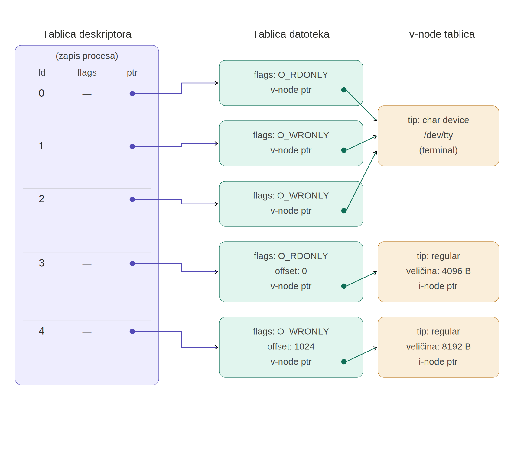
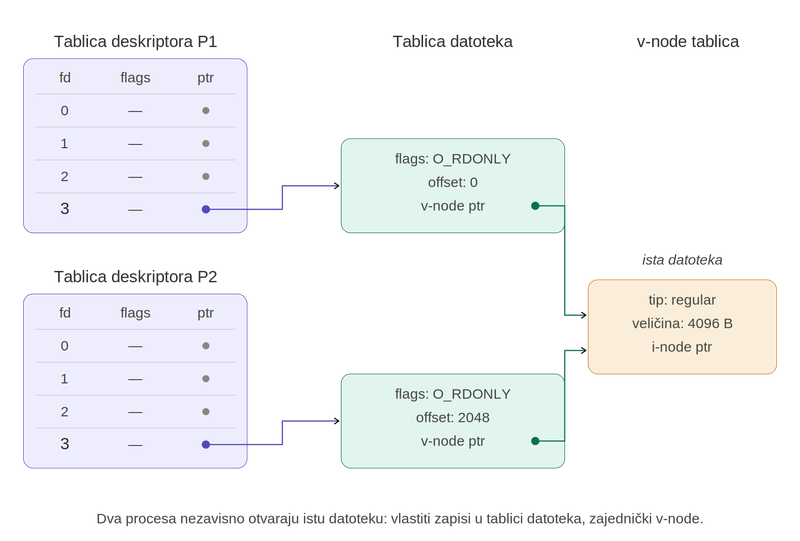
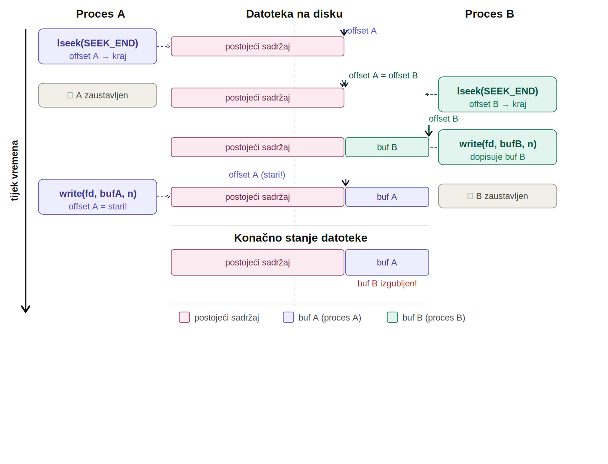
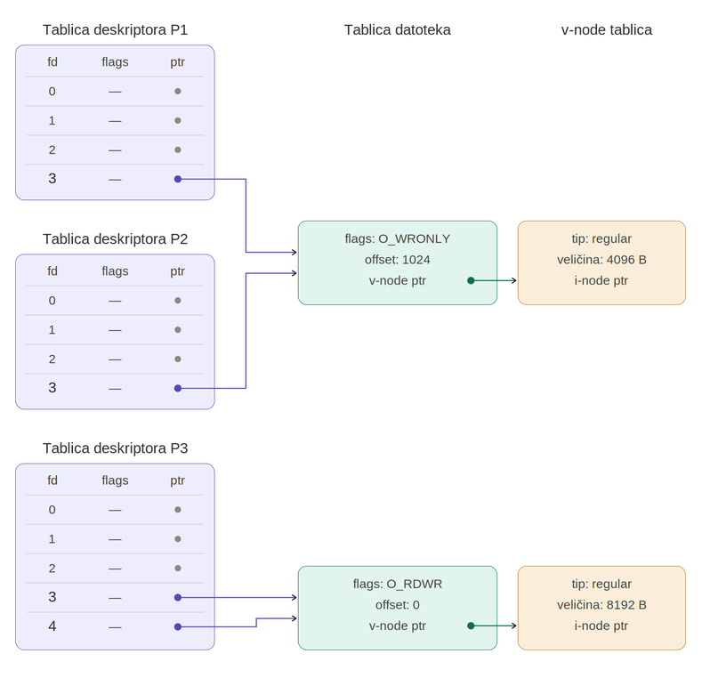

# Ulazno/izlazne operacije

Prije nego što krenemo s tehničkim detaljima, zapitajmo se jedno jednostavno pitanje: **što sve možemo s datotekom?** Odgovori na ovo pitanje često uključuju: možemo je obrisati, promijeniti joj ime, kopirati i slično. Naravno, ni jedna od ovih tvrdnji nije pogrešna — ali je jednako točna kao da kažemo da stolicu možemo prebojati, premjestiti u drugu sobu, ili je nacijepati sjekirom ako nam više nije potrebna. Sve navedeno je točno, ali ne otkriva temeljnu namjenu stolice: na stolicu možemo **sjesti**.

Ako istu logiku primijenimo na datoteku, jedine dvije stvari za koje datoteku zapravo koristimo su: u datoteku možemo nešto **upisati**, ili možemo nešto iz nje **pročitati**. I to je to. Stoga svaki programski jezik, ali i svaki operacijski sustav putem sistemskih poziva, mora osigurati najmanje te dvije funkcije. Da bi ovo bilo moguće, potrebno nam je još svega nekoliko funkcionalnosti: **otvaranje** i **zatvaranje** datoteke te **pozicioniranje** unutar datoteke.

U ovom poglavlju obrađene su upravo ove osnovne funkcionalnosti za rad s datotekama koje svaki operacijski sustav mora osigurati da bi bio iole upotrebljiv za ozbiljniji rad: otvaranje, čitanje, pisanje i zatvaranje datoteka, uz pozicioniranje unutar datoteke. Obrađeni su i **deskriptori datoteke** — apstraktna referenca putem koje proces upravlja svojim otvorenim datotekama — te strukture podataka u kojima UNIX jezgra čuva informacije o procesima i datotekama koje su u njima otvorene. Iako ovaj posljednji dio ulazi nešto dublje u detalje implementacije UNIX-a, čitatelju svakako savjetujemo da odvoji malo vremena i pokuša "povezati konce" — razumijevanje ovih mehanizama kasnije će bitno olakšati korištenje naprednih koncepata koji omogućuju da se složene stvari postignu relativno jednostavnim kodom. Za one nestrpljivije, tu su brojni primjeri na kojima su opisane funkcionalnosti ilustrirane.

Na kraju poglavlja dan je osvrt na odnos između sistemskih poziva i funkcija standardne C biblioteke, s ciljem da budući programer razumije kada i zašto koristiti koje. Svi primjeri pisani su u programskom jeziku C i pretpostavljaju UNIX (Linux) okruženje.

U ovom direktoriju nalaze se programi koji ilustriraju UNIX sistemske pozive za rad s datotekama: `open()`, `creat()`, `close()`, `read()`, `write()`, `lseek()` i `umask()`. Svi primjeri pisani su izravno korištenjem sistemskih poziva (bez uporabe funkcija standardne C biblioteke poput `fopen`, `fread`, `fprintf`), s ciljem da se prikaže kako operacijski sustav zapravo obavlja ulazno/izlazne operacije i na kojoj razini počiva koncept **"sve je datoteka"** — temeljno UNIX načelo prema kojem se datoteke, uređaji, terminali, cijevi i mrežni sockets svi koriste kroz isto skučeno sučelje file deskriptora.

Vrijedi napomenuti: funkcije standardne C biblioteke (`fopen`, `fread`, `fprintf`, `fputs`, ...) **na UNIX sustavima u konačnici se svode na ove iste sistemske pozive**. Funkcije više razine pružaju zgodne dodatke poput interno upravljanog međuspremnika za smanjenje broja sistemskih poziva, formatiran ulaz/izlaz (`printf`, `fprintf`, `scanf`, ...), ili portabilnost između operacijskih sustava — ali fizička komunikacija s jezgrom uvijek se odvija kroz `read()`, `write()`, `open()` i ostale poziva opisane u nastavku. Razumijevanje sistemskih poziva otkriva što se zapravo događa "ispod" funkcija standardne biblioteke koje ste do sada vjerojatno koristili.

## Deskriptori datoteka

Jezgra operacijskog sustava sve otvorene datoteke referencira pomoću nenegativnih cijelih brojeva koje nazivamo **deskriptorima datoteke** (engl. *file descriptors*). Deskriptor je apstraktna referenca koju proces dobiva u trenutku otvaranja datoteke i koristi za sve daljnje operacije na njoj (čitanje, pisanje, pozicioniranje), do njezinog zatvaranja.

Pri tom proces ne mora znati ništa o samoj datoteci otvorenoj na nekom deskriptoru: gdje se fizički nalazi, radi li se uopće o datoteci na disku, ili je možda riječ o standardnom izlazu na koji program ispisuje poruke korisniku, ili o otvorenom portu na mreži. Zahvaljujući konceptu *"sve je datoteka"*, svim tim resursima upravlja se na isti način, korištenjem malog skupa standardiziranih sistemskih poziva. Naravno, upisivanje u datoteku na lokalnom disku fizički se ne odvija na isti način kao komunikacija s udaljenim računalom putem mreže — jezgra čuva informacije o svakom otvorenom deskriptoru i na temelju toga odabire odgovarajuću komunikacijsku rutinu. Programer te detalje ne vidi: sučelje je jedinstveno za sve tipove datoteka.

Pri pokretanju novog programa, najčešće su već zauzeti file deskriptori 0, 1 i 2. Ovi deskriptori koriste se za komunikaciju s korisnikom putem naredbenog retka:

| Deskriptor | Naziv | Izvor / odredište |
|---|---|---|
| 0 | standardni ulaz (*standard input*) | naredbeni redak — unos korisnika putem tipkovnice |
| 1 | standardni izlaz (*standard output*) | naredbeni redak — ispis u korisnički terminal |
| 2 | standardni izlaz za greške (*standard error*) | naredbeni redak — ispis u korisnički terminal |

Ova konvencija datira iz ranih UNIX sustava 1970-ih i danas je neodvojiv dio POSIX standarda. Budući da su deskriptori 0, 1 i 2 pri pokretanju programa u pravilu već zauzeti, novokreirani deskriptori — oni koje vraća `open()` ili `creat()` — u pravilu imaju vrijednost 3 ili veću. Sama jezgra pri otvaranju nove datoteke uvijek dodjeljuje **najniži slobodan deskriptor**.

Vrijednosti deskriptora 0, 1 i 2 definirane su u zaglavlju `<unistd.h>` kao simboličke konstante `STDIN_FILENO`, `STDOUT_FILENO` i `STDERR_FILENO`. Preporuka je u kodu koristiti ove konstante umjesto golih brojeva 0, 1 i 2 — kod time postaje čitljiviji.

## Sistemski pozivi za rad s datotekama

### Funkcija `open()`

Osnovna UNIX funkcija za otvaranje (i po potrebi kreiranje) datoteka.

```c
#include <sys/types.h>
#include <sys/stat.h>
#include <fcntl.h>

int open(const char *pathname, int oflag, /* mode_t mode */);
```

**Povratna vrijednost:** file deskriptor otvorene datoteke (nenegativni cijeli broj), ili `-1` u slučaju greške.

**Argumenti:**

- **`pathname`** — putanja do datoteke koja se otvara ili kreira.
- **`oflag`** — kombinacija bitovnih konstanti koja specificira način otvaranja. Mora sadržavati **točno jednu** od sljedeće tri konstante:
  - `O_RDONLY` — otvori samo za čitanje,
  - `O_WRONLY` — otvori samo za pisanje,
  - `O_RDWR` — otvori za čitanje i pisanje.
  
  Uz tu obaveznu konstantu može se kombinacijom bitovnog *OR*-a (`|`) dodati jedna ili više opcionalnih:
  - `O_CREAT` — kreiraj datoteku ako ne postoji (zahtijeva treći argument `mode`),
  - `O_APPEND` — pri svakom pisanju pomakni offset na kraj datoteke, bez obzira na trenutni file offset,
  - `O_TRUNC` — ako je datoteka otvorena za pisanje, izbriši njezin sadržaj (dužina postaje 0),
  - `O_EXCL` — u kombinaciji s `O_CREAT`: vrati grešku ako datoteka već postoji; provjera i kreiranje izvode se kao **atomska operacija**,
  - `O_NONBLOCK` — postavi neblokirajući način rada za I/O operacije,
  - `O_SYNC` — čekaj da se svaka operacija pisanja fizički dovrši na disku.

  Tipične kombinacije zastavica koje ćete često sresti u UNIX kodu:

  | Kombinacija | Značenje |
  |---|---|
  | `O_WRONLY \| O_TRUNC` | otvori za pisanje i skrati na 0 (obriši postojeći sadržaj) |
  | `O_WRONLY \| O_CREAT` | otvori za pisanje; ako datoteka ne postoji, stvori je |
  | `O_WRONLY \| O_CREAT \| O_TRUNC` | otvori za pisanje i obriši postojeći sadržaj; ako datoteka ne postoji, stvori je |
  | `O_WRONLY \| O_CREAT \| O_EXCL` | stvori novu datoteku i otvori je za pisanje; ako datoteka već postoji, vrati grešku |
  | `O_WRONLY \| O_APPEND` | otvori za pisanje; svako pisanje dodaje se na kraj datoteke, bez obzira na trenutni file offset |

- **`mode`** — opcionalni treći argument koji se navodi pri kreiranju nove datoteke (uz zastavicu `O_CREAT`). Specificira prava pristupa novostvorene datoteke. Može se zadati kao troznamenkasti oktalni broj (svaka znamenka definira prava za vlasnika, grupu i ostale korisnike), ili kombinacijom konstanti tipa `mode_t` definiranih u zaglavlju `<sys/stat.h>`:

  | Konstanta | Oktalna vrijednost | Značenje |
  |---|---|---|
  | `S_IRUSR` | `0400` | čitanje za vlasnika |
  | `S_IWUSR` | `0200` | pisanje za vlasnika |
  | `S_IXUSR` | `0100` | izvršavanje za vlasnika |
  | `S_IRGRP` | `0040` | čitanje za grupu |
  | `S_IWGRP` | `0020` | pisanje za grupu |
  | `S_IXGRP` | `0010` | izvršavanje za grupu |
  | `S_IROTH` | `0004` | čitanje za ostale |
  | `S_IWOTH` | `0002` | pisanje za ostale |
  | `S_IXOTH` | `0001` | izvršavanje za ostale |

  Tako je primjerice `S_IRUSR | S_IWUSR | S_IRGRP | S_IROTH` ekvivalentno oktalnom zapisu `0644` — vlasnik smije čitati i pisati, grupa i ostali samo čitati.

### Funkcija `creat()`

Namijenjena je kreiranju novih datoteka.

```c
#include <sys/types.h>
#include <sys/stat.h>
#include <fcntl.h>

int creat(const char *pathname, mode_t mode);
```

**Povratna vrijednost:** file deskriptor otvorene datoteke, ili `-1` u slučaju greške.

**Argumenti:**

- **`pathname`** — putanja do datoteke koja se kreira.
- **`mode`** — prava pristupa novostvorene datoteke (kombinacija konstanti tipa `mode_t`, kako je opisano kod `open()`-a).

Ova funkcija ekvivalentna je pozivu:

```c
open(pathname, O_WRONLY | O_CREAT | O_TRUNC, mode);
```

Iz definicije slijede dva ograničenja: `creat()` datoteku otvara **samo za pisanje**, a ako datoteka već postoji, njezin sadržaj se briše (`O_TRUNC`). Zato je `creat()` jednostavno kratki oblik za vrlo čest slučaj korištenja `open()`-a — u modernom kodu obično se ide direktno preko `open()`-a koji nudi punu kontrolu.

### Funkcija `close()`

Zatvara datoteku otvorenu na file deskriptoru `filedes`, čime jezgra oslobađa deskriptor za ponovnu upotrebu.

```c
#include <unistd.h>

int close(int filedes);
```

**Povratna vrijednost:** `0` u slučaju uspjeha, `-1` u slučaju greške.

**Argumenti:**

- **`filedes`** — deskriptor otvorene datoteke koju treba zatvoriti.

Kada proces završi s radom, automatski se zatvaraju sve otvorene datoteke, pa eksplicitno pozivanje `close()` nije *strogo* nužno. Ipak, preporučuje se eksplicitno zatvaranje jer sustav ima ograničen broj deskriptora po procesu, a za neke tipove datoteka (npr. mrežne sockete) zatvaranje pokreće važne završne operacije.

### Funkcija `read()`

Čita podatke iz datoteke i upisuje ih u memorijski prostor na koji pokazuje `buff`.

```c
#include <unistd.h>

ssize_t read(int filedes, void *buff, size_t nbytes);
```

**Povratna vrijednost:** broj stvarno pročitanih bajtova (može biti manji od `nbytes`), `0` po dosizanju kraja datoteke (*EOF*), ili `-1` u slučaju greške.

Povratni tip `ssize_t` (*signed size*) je POSIX-om definiran ekvivalent `size_t` koji može imati i negativnu vrijednost — neophodan da bi funkcija mogla vratiti `-1` kao oznaku greške.

**Argumenti:**

- **`filedes`** — deskriptor otvorene datoteke.
- **`buff`** — pokazivač na statički ili dinamički alociran memorijski blok u koji se upisuju pročitani podaci. `read()` ne alocira memoriju sam — to je zadaća programera.
- **`nbytes`** — maksimalan broj bajtova koji će se pokušati pročitati.

Čitanje počinje na trenutnom file offsetu. Ova vrijednost je nakon otvaranja datoteke uvijek `0`, tj. pokazuje na početak datoteke. Nakon svakog uspješnog poziva `read()`-a offset se automatski pomiče za broj pročitanih bajtova. Razlozi zbog kojih stvarno pročitani broj može biti manji od traženog uključuju dostignut kraj datoteke, čitanje s terminala (koji vraća redak koji je korisnik utipkao odjednom), ili čitanje s mrežnog socketa.

### Funkcija `write()`

Upisuje podatke iz memorijskog bloka u datoteku identificiranu deskriptorom `filedes`.

```c
#include <unistd.h>

ssize_t write(int filedes, const void *buff, size_t nbytes);
```

**Povratna vrijednost:** broj stvarno upisanih bajtova (po POSIX-u garantirano jednak `nbytes` u uspješnom slučaju za obične datoteke; može biti manji za neke tipove datoteka poput mrežnih socketa), ili `-1` u slučaju greške.

**Argumenti:**

- **`filedes`** — deskriptor otvorene datoteke.
- **`buff`** — pokazivač na memorijski blok koji se upisuje.
- **`nbytes`** — broj bajtova koji se piše.

Pisanje počinje na trenutnom file offsetu, a nakon uspješnog upisa offset se pomiče za broj upisanih bajtova. Iznimka je kad je datoteka otvorena s `O_APPEND` zastavicom — tada jezgra prije svakog pisanja postavlja offset na kraj datoteke.

## Primjeri

### Otvaranje, čitanje i pisanje

- [**`read_file.c`**](read_file.c) — otvara datoteku `moja_datoteka.txt` i ispisuje njen sadržaj na standardni izlaz.

  ```c
  #include <sys/types.h>
  #include <sys/stat.h>
  #include <fcntl.h>
  #include <unistd.h>
  #include <stdio.h>

  int main() {
      int n, fd;
      char s;

      fd = open("moja_datoteka.txt", O_RDONLY);
      if (fd == -1) {
          perror("open");
          return 1;
      }

      while ((n = read(fd, &s, 1)) > 0) {
          if (write(STDOUT_FILENO, &s, 1) != 1) {
              perror("write");
              return 1;
          }
      }

      close(fd);
      return 0;
  }
  ```

  Datoteka se otvara sistemskim pozivom `open()` u načinu samo za čitanje (`O_RDONLY`), čita se znak po znak pozivima `read()`, a svaki znak se prosljeđuje na standardni izlaz pozivom `write()`. Program demonstrira osnovni slijed rada s datotekom (`open` → `read`/`write` → `close`) i rukovanje greškama preko povratnih vrijednosti sistemskih poziva.

  ```sh
  ./read_file
  ```

- [**`io_copy.c`**](io_copy.c) — kopira standardni ulaz na standardni izlaz, čitajući u međuspremnik konstantne veličine (`BUFFSIZE`).

  ```c
  #include <sys/types.h>
  #include <sys/stat.h>
  #include <fcntl.h>
  #include <unistd.h>
  #include <stdio.h>

  #define BUFFSIZE 1024

  int main() {
      int n;
      char buf[BUFFSIZE];

      while ((n = read(STDIN_FILENO, buf, BUFFSIZE)) > 0) {
          if (write(STDOUT_FILENO, buf, n) != n) {
              perror("write");
              return 1;
          }
      }

      if (n < 0)
          perror("read");

      return 0;
  }
  ```

  Za razliku od `read_file.c` koji čita znak po znak, ovdje se u jednom pozivu `read()` pokušava pročitati cijeli blok bajtova, čime se višestruko smanjuje broj sistemskih poziva potrebnih za istu količinu prenesenih podataka. Primjer ujedno ilustrira koncept "sve je datoteka": pri pokretanju bez preusmjeravanja, standardni ulaz vezan je na tipkovnicu, a standardni izlaz na terminal — isti `read()` i `write()` koji bi radili s običnim datotekama na disku ovdje rade s terminalom. Svaki redak koji korisnik utipka program odmah ispiše natrag, a petlja se prekida pritiskom `Ctrl+D` (oznaka kraja ulaza, EOF):

  ```
  $ ./io_copy
  Prvi red teksta
  Prvi red teksta
  Drugi red teksta
  Drugi red teksta
  ^D
  $
  ```

  U kombinaciji s preusmjeravanjem standardnog izlaza, isti program može poslužiti kao jednostavan alat za upis teksta u datoteku — sve što korisnik utipka do `Ctrl+D` završi kao sadržaj datoteke, a terminal u međuvremenu ne prikazuje ništa dodatno jer je standardni izlaz preusmjeren:

  ```
  $ ./io_copy > datoteka.txt
  Prvi red teksta
  Drugi red teksta
  ^D
  $ cat datoteka.txt
  Prvi red teksta
  Drugi red teksta
  ```

### Pozicioniranje unutar datoteke (`lseek`)

Sistemski poziv `lseek()` mijenja file offset otvorene datoteke. Koristi se kad želimo čitati ili pisati na specifičnoj poziciji bez sekvencijalnog prolaska.

```c
#include <sys/types.h>
#include <unistd.h>

off_t lseek(int filedes, off_t offset, int whence);
```

**Povratna vrijednost:** novi file offset (broj bajtova od početka datoteke), ili `(off_t)-1` u slučaju greške.

**Argumenti:**

- **`filedes`** — deskriptor otvorene datoteke.
- **`offset`** — pomak; tumači se relativno prema vrijednosti `whence`.
- **`whence`** — referentna točka:
  - `SEEK_SET` — pomak je apsolutni, mjeren od početka datoteke,
  - `SEEK_CUR` — pomak je relativan u odnosu na trenutni offset,
  - `SEEK_END` — pomak je relativan u odnosu na kraj datoteke (može biti i negativan da se vrati unazad).

`lseek()` se zove "seek" jer pomiče glavu za čitanje na proizvoljnu poziciju u datoteci — ali to "pomicanje" je samo logičko, na razini jezgrinog file offseta. Stvarni pristup disku događa se tek pri sljedećem `read()`-u ili `write()`-u.

- [**`f_strip.c`**](f_strip.c) — demonstrira `lseek()` s `SEEK_SET` (apsolutno pozicioniranje od početka datoteke).

  ```c
  #include <stdio.h>
  #include <string.h>
  #include <stdlib.h>
  #include <unistd.h>
  #include <sys/types.h>
  #include <sys/stat.h>
  #include <fcntl.h>

  int main() {
      char buf1[] = "Prvi redak teksta";
      char buf2[] = "Drugi redak teksta";
      int fd;

      fd = open("file.strip", O_WRONLY | O_CREAT | O_TRUNC, (mode_t)0644);
      if (fd == -1) {
          perror("open");
          return 1;
      }

      if (write(fd, buf1, strlen(buf1)+1) != strlen(buf1)+1) {
          perror("write buf1");
          return 1;
      }

      if (lseek(fd, 15, SEEK_SET) == -1) {
          perror("lseek");
          return 1;
      }

      if (write(fd, buf2, strlen(buf2)+1) != strlen(buf2)+1) {
          perror("write buf2");
          return 1;
      }

      close(fd);
      exit(0);
  }
  ```

  Program otvara datoteku za pisanje, upisuje prvi niz znakova, `lseek`-om postavlja offset na 15. bajt i upisivanjem drugog niza **prepisuje** dio postojećeg sadržaja. Rezultat pokazuje da se pozicioniranje unutar otvorene datoteke može slobodno kombinirati s čitanjem i pisanjem — offset koji jezgra pamti nije povezan s fizičkim rasporedom blokova na disku.

  Rezultat se može provjeriti UNIX naredbom `cat`, koja ispisuje sadržaj jedne ili više datoteka na standardni izlaz:

  ```
  $ ./f_strip
  $ cat file.strip
  Prvi redak teksDrugi redak teksta
  ```

  Prvih 15 bajtova (`Prvi redak teks`) ostalo je netaknuto iz prvog upisa, a od 15. bajta nadalje vidljiv je sadržaj drugog niza koji je `lseek` + `write` upisao preko ostatka prethodnog teksta.

- [**`f_hole.c`**](f_hole.c) — demonstrira `lseek()` s `SEEK_CUR` (relativno pomicanje od trenutne pozicije).

  ```c
  #include <stdio.h>
  #include <string.h>
  #include <stdlib.h>
  #include <unistd.h>
  #include <sys/types.h>
  #include <sys/stat.h>
  #include <fcntl.h>

  int main() {
      char buf1[] = "Prvi redak teksta";
      char buf2[] = "Drugi redak teksta";
      int fd;

      fd = creat("file.hole", (mode_t)0644);
      if (fd == -1) {
          perror("creat");
          return 1;
      }

      if (write(fd, buf1, strlen(buf1)+1) != strlen(buf1)+1) {
          perror("write buf1");
          return 1;
      }

      if (lseek(fd, 15, SEEK_CUR) == -1) {
          perror("lseek");
          return 1;
      }

      if (write(fd, buf2, strlen(buf2)+1) != strlen(buf2)+1) {
          perror("write buf2");
          return 1;
      }

      close(fd);
      exit(0);
  }
  ```

  Nakon upisa prvog niza, offset se pomiče 15 bajtova naprijed — **iza** trenutnog kraja datoteke — i tek se tada upisuje drugi niz. Petnaest bajtova između prve i druge linije ostaje kao **rupa**, područje koje pri čitanju iščitava kao bajtovi s vrijednošću 0 (null terminator), iako `write()` ondje ništa nije upisao.

  ```
  $ ./f_hole
  $ ls -l file.hole
  -rw-r--r-- 1 dkrst users 52 Apr 22 12:54 file.hole
  $ du -h file.hole
  4.0K    file.hole
  $ od -c file.hole
  0000000   P   r   v   i       r   e   d   a   k       t   e   k   s   t
  0000020   a  \0  \0  \0  \0  \0  \0  \0  \0  \0  \0  \0  \0  \0  \0  \0
  0000040  \0   D   r   u   g   i       r   e   d   a   k       t   e   k
  0000060   s   t   a  \0
  0000064
  ```

  Tri naredbe daju pogled na datoteku iz tri različita kuta:

  - `ls -l` prijavljuje **logičku veličinu** datoteke — 52 bajta. To je raspon od početka datoteke do posljednjeg upisanog bajta, uključujući i bajtove kroz rupu koje `write()` nikad nije dotaknuo. Isti broj vratio bi i `lseek(fd, 0, SEEK_END)` u programu.

  - `du -h` prijavljuje **stvarno zauzeće diska** — 4.0K (odnosno 4096 bajtova, tipična veličina bloka Linux datotečnih sustava poput *ext4*; na drugim sustavima može biti 512 B, 8 KB ili više). Razlog zašto datoteka od 52 bajta zauzima puni 4 KB blok leži u činjenici da su tvrdi diskovi u UNIX-u **blok specijalni uređaji** (vidi poglavlje *Osnove UNIX-a*): podaci se na njima prenose i adresiraju u blokovima fiksne veličine, ne bajt po bajt. Datotečni sustav slijedi tu granularnost — najmanja jedinica alokacije za svaku datoteku je jedan cijeli blok, pa i datoteka od jednog jedinog bajta zauzima koliko i puni blok.

  - `od -c` otkriva unutarnju strukturu — niz od 15 uzastopnih `\0` bajtova između dva upisana niza točno je područje rupe. S gledišta procesa, tih 15 bajtova postoji i čitanjem bi se dobile nule; jezgra ih pri čitanju transparentno popunjava bez da su ti podaci ikad bili fizički upisani na disk.

### Prava pristupa i maska (`umask`)

Sistemski poziv `umask()` postavlja masku kreiranja datoteka za trenutni proces. Maska predstavlja bitove **koji će biti uklonjeni** iz prava pristupa kada proces stvara nove datoteke (npr. preko `open()`-a s `O_CREAT` ili `creat()`-a).

```c
#include <sys/types.h>
#include <sys/stat.h>

mode_t umask(mode_t cmask);
```

**Povratna vrijednost:** prethodna vrijednost maske.

**Argumenti:**

- **`cmask`** — nova vrijednost maske; kombinacija istih konstanti kao za `mode` u `open()`-u.

Algoritam je jednostavan: za svako kreiranje datoteke, jezgra uzima `mode` koji je program tražio i **iz njega ukloni** sve bitove koji su postavljeni u maski. Tako je rezultantni način pristupa `mode & ~cmask`. Maska se nasljeđuje od roditelja procesa; tipična vrijednost u shellu je `0022` (oduzima pravo pisanja grupi i ostalima).

- [**`perm_mask.c`**](perm_mask.c) — ilustrira djelovanje maske kreiranja datoteke (`umask`) na prava pristupa pri pozivu `creat()`.

  ```c
  #include <sys/types.h>
  #include <sys/stat.h>
  #include <fcntl.h>
  #include <stdio.h>
  #include <stdlib.h>

  #define PRAVA S_IRUSR | S_IWUSR | S_IRGRP | S_IWGRP | S_IROTH

  int main() {
      umask(0);
      if (creat("datoteka1", PRAVA) < 0)
          perror("creat datoteka1");

      umask(S_IRGRP | S_IWGRP | S_IROTH | S_IWOTH);
      if (creat("datoteka2", PRAVA) < 0)
          perror("creat datoteka2");

      return 0;
  }
  ```

  Program dva puta stvara datoteku s istim zatraženim pravima (`rw-rw-r--`), jednom s maskom postavljenom na 0 (nikakva prava se ne oduzimaju), a jednom s maskom koja eksplicitno isključuje pisanje za grupu i čitanje/pisanje za ostale. Usporedbom stvarno dobivenih prava vidi se učinak maske:

  ```
  $ ./perm_mask
  $ ls -al datoteka1 datoteka2
  -rw-rw-r-- 1 dkrst users 0 Jan 16 16:23 datoteka1
  -rw------- 1 dkrst users 0 Jan 16 16:23 datoteka2
  ```

  Datoteka `datoteka1` zadržala je sva zatražena prava jer je maska bila 0, dok su u slučaju datoteke `datoteka2` maskom isključena sva prava za grupu i ostale korisnike.

### Argumenti naredbenog retka

Naredbe i programi na UNIX sustavu često prihvaćaju **argumente naredbenog retka** — niz tokena koje korisnik upisuje uz ime programa kako bi izmijenio njegovo ponašanje, ili da bi mu predao ulaz (npr. ime datoteke nad kojom program radi). Primjer iz svakodnevnog rada s ljuskom je `cp izvor.txt cilj.txt`, gdje `cp` prima dva argumenta. Da bi C program mogao iščitati te argumente, `main` se deklarira u proširenom obliku:

```c
int main(int argc, char *argv[])
```

Ovdje `argc` sadrži broj argumenata, a `argv` je polje nizova znakova u kojemu je svaki argument zaseban niz. Bitno je naglasiti da `argc` uključuje i samu naredbu, ne samo argumente koje korisnik dodaje uz nju. Po konvenciji, `argv[0]` je ime kojim je program pokrenut (uključujući i putanju ako je upisana), a stvarni argumenti slijede od `argv[1]` nadalje. Tako pri pozivu `./f_write izlaz.txt`, vrijednosti će biti `argc = 2`, `argv[0] = "./f_write"`, `argv[1] = "izlaz.txt"` — `argc` je 2 jer broji i samo ime programa i jedan argument koji mu je dan. Programi obično odmah na početku provjeravaju je li `argc` u očekivanom rasponu i ako nije, ispišu uputu o korištenju te uredno završe.

- [**`f_write.c`**](f_write.c) — čita sa standardnog ulaza i upisuje u novokreiranu datoteku čije se ime zadaje kao argument naredbenog retka.

  ```c
  #include <stdio.h>
  #include <sys/types.h>
  #include <sys/stat.h>
  #include <fcntl.h>
  #include <unistd.h>

  #define FMODE S_IRUSR | S_IWUSR | S_IRGRP | S_IROTH

  int main(int argc, char *argv[]) {
      int fd, n;
      char s;

      if (argc != 2) {
          printf("koristenje: %s <ime_datoteke>\n", argv[0]);
          return 0;
      }

      fd = creat(argv[1], FMODE);
      if (fd == -1) {
          perror("creat");
          return 1;
      }

      while ((n = read(STDIN_FILENO, &s, 1)) > 0)
          if (write(fd, &s, 1) < 0) {
              perror("write");
              return 1;
          }

      close(fd);
      return 0;
  }
  ```

  Odmah na početku programa provjerava se `argc != 2` — očekuje se točno jedan argument (ime izlazne datoteke) uz ime programa. Ako korisnik program pozove bez argumenta ili s previše njih, program javlja uputu o korištenju i završava. Konverzija `%s` zamjenjuje se upravo vrijednošću `argv[0]` — imenom kojim je program pokrenut — pa poruka korisniku uvijek automatski odražava točan naziv pod kojim je program bio zvan, neovisno o tome je li preimenovan ili pozvan preko simboličke veze. Ovakva provjera ulaznih argumenata uobičajen je uzorak u svim UNIX programima.

  Program se poziva s imenom izlazne datoteke kao jedinim argumentom; nakon toga sve što korisnik utipka do oznake kraja ulaza (`Ctrl+D`) zapisuje se u tu datoteku:

  ```
  $ ./f_write izlaz.txt
  Prvi red teksta
  Drugi red teksta
  ^D
  $ cat izlaz.txt
  Prvi red teksta
  Drugi red teksta
  ```

- [**`f_cat.c`**](f_cat.c) — pojednostavljena implementacija UNIX naredbe `cat`.

  ```c
  #include <stdio.h>
  #include <sys/types.h>
  #include <sys/stat.h>
  #include <fcntl.h>
  #include <unistd.h>

  int rw(int fdin, int fdout) {
      int n;
      char s;
      while ((n = read(fdin, &s, 1)) > 0)
          write(fdout, &s, 1);

      return n;
  }

  int main(int argc, char **argv) {
      int k, fd;
      if (argc < 2) {
          rw(STDIN_FILENO, STDOUT_FILENO);
      } else {
          for (k = 1; k < argc; k++) {
              fd = open(argv[k], O_RDONLY);
              if (fd < 0)              /* ne mogu otvoriti */
                  perror("open");
              else {
                  rw(fd, STDOUT_FILENO);
                  close(fd);
              }
          }
      }

      return 0;
  }
  ```

  Osnovna petlja čitanja i pisanja enkapsulirana je u pomoćnoj funkciji `rw(fdin, fdout)` koja čita s jednog deskriptora i piše na drugi. Ponašanje programa ovisi o argumentima naredbenog retka:

  - **Bez argumenata** program poziva `rw(STDIN_FILENO, STDOUT_FILENO)` i tako praktički radi istu stvar kao `io_copy`: čita sa standardnog ulaza i ispisuje na standardni izlaz.
  - **S jednim ili više argumenata** program redom otvara svaku navedenu datoteku pozivom `open()` i njezin sadržaj prosljeđuje na standardni izlaz pozivom iste funkcije `rw()`, ali sad s file deskriptorom otvorene datoteke umjesto standardnog ulaza.

  Program time u bitnome reproducira funkcionalnost UNIX naredbe `cat` i ujedno sažima sve koncepte iz prethodnih primjera: otvaranje datoteka s provjerom grešaka, jedinstveno sučelje preko file deskriptora, rad s argumentima naredbenog retka, i uniformno korištenje istih sistemskih poziva bez obzira na izvor (datoteka ili standardni tok).

  Pokretanje:

  ```
  $ ./f_cat
  ```

  Bez argumenata, program se ponaša kao `io_copy` — čita sa standardnog ulaza i ispisuje na standardni izlaz, sve dok ne dobije EOF.

  ```
  $ ./f_cat f_cat.c
  ```

  S jednim argumentom, program ispisuje sadržaj te datoteke na standardni izlaz. U gornjem primjeru program ispisuje vlastiti izvorni kod — i to bez ičega posebnoga: jednako bi ispisao bilo koju drugu tekstualnu datoteku navedenu kao argument.

  ```
  $ ./f_cat datoteka1.txt datoteka2.txt
  ```

  Sa više argumenata, program ispisuje navedene datoteke jednu za drugom — u ovom slučaju najprije sadržaj `datoteka1.txt`, a odmah za njim sadržaj `datoteka2.txt` (naravno, pod uvjetom da obje datoteke postoje u radnom direktoriju). Time se reproducira ponašanje UNIX naredbe `cat` po kojoj je program i nazvan: spaja (engl. *concatenate*) sadržaje više datoteka u jedinstveni izlazni tok. Ako neka od navedenih datoteka ne postoji, program će za nju ispisati poruku o grešci pozivom `perror()`, ali **neće prekinuti izvođenje** — sve ostale datoteke koje postoje uredno će biti ispisane.

## Ulazno-izlazne strukture podataka

U primjerima iznad držali smo se praktične razine — otvorimo datoteku, dobijemo deskriptor, čitamo i pišemo. U tekstu koji slijedi dat ćemo malo više "teorije": objasnit ćemo kako UNIX upravlja otvorenim datotekama, koje interne strukture jezgra pri tom koristi i kako su one međusobno povezane. Detaljniji prikaz ovih internih struktura, kao i mnogih drugih tema iz ovog poglavlja, čitatelj će pronaći u temeljnom djelu *Advanced Programming in the UNIX Environment*, Stevens & Rago [1] — knjizi koja prati gotovo svako poglavlje ove skripte; istu materiju, ali iz šire perspektive datotečnog podsustava operacijskih sustava, obrađuje i sveučilišni udžbenik *Operacijski sustavi*, Budin, Golub, Jakobović & Jelenković [2]. Nestrpljiv čitatelj koji želi što prije vidjeti dodatne primjere može nastaviti dalje, ali valja naglasiti da je razumijevanje ovih struktura važno ne samo za rad s datotekama, nego i za razumijevanje UNIX-a kao operacijskog sustava u cjelini. Mnogi koncepti koje ćemo susresti kasnije (dijeljenje datoteka među procesima, nasljeđivanje deskriptora, preusmjeravanje ulaza i izlaza, kao i temeljno UNIX načelo *"sve je datoteka"*) izravno proizlaze iz organizacije struktura opisanih u nastavku.

Govorit ćemo o **tablici procesa**, **tablici datoteka** i **v-node tablici** — internim strukturama UNIX jezgre. Bitno je odmah naglasiti da korisnički proces tim strukturama ne može pristupati izravno, putem varijable ili pokazivača, jer se radi o internim strukturama smještenim u memoriji jezgre; jedini način na koji proces može s njima komunicirati jesu sistemski pozivi.

### Tablica procesa, tablica datoteka i v-node tablica

Jezgra operacijskog sustava svakom aktivnom procesu dodjeljuje jedan zapis u **tablici procesa** (engl. *process table*). Taj zapis sadrži sve informacije koje jezgra treba o procesu — od identifikatora i stanja do informacija o memoriji i otvorenim datotekama. Uz tablicu deskriptora, o kojoj govorimo u nastavku, u zapis procesa spada i niz atributa koji utječu na ulazno-izlazne operacije — među njima i trenutna vrijednost maske `umask`, koju smo obradili ranije. Upravo zato svaki proces može neovisno mijenjati svoju masku, a novostvoreni proces nasljeđuje vrijednost od procesa koji ga je stvorio (tzv. **procesa roditelja**, engl. *parent process*). Tablicu procesa, kao i mehanizam stvaranja novih procesa, detaljnije ćemo razraditi u poglavlju o procesima; ovdje nas zanima samo jedan dio tablice procesa: **tablica deskriptora** (engl. *descriptor table*) unutar zapisa procesa, u kojoj se čuva informacija o svim otvorenim datotekama promatranog procesa, odnosno o svim njegovim deskriptorima datoteka. Podsjetimo se — pri pokretanju programa na deskriptorima 0, 1 i 2 u pravilu su otvoreni standardni ulaz, standardni izlaz i standardni izlaz za greške; svi kasnije otvoreni deskriptori dobivaju vrijednosti 3 i veće.

Svaki zapis u tablici deskriptora sadrži dvije stavke: zastavice deskriptora specifične za proces (*fd flags*) te pokazivač na odgovarajući zapis u globalnoj tablici datoteka. Polje *fd flags* privatno je za pojedini proces i u praksi sadrži samo jednu zastavicu, `FD_CLOEXEC`, koja određuje hoće li se deskriptor (tj. datoteka koja je na njemu otvorena) automatski zatvoriti ukoliko unutar ovog procesa pokrenemo novi program — odnosno učitamo s diska novu izvršnu datoteku i započnemo izvršavanje od prve naredbe u njezinu kodu. Pokretanje novog programa u postojećem procesu postiže se jednim od sistemskih poziva iz obitelji `exec`, kojima se detaljnije bavimo u poglavlju o okruženju procesa.

Bitno je odmah razlikovati ove zastavice od **statusnih zastavica datoteke** (*file status flags*) o kojima ćemo govoriti u nastavku: *fd flags* nalaze se u tablici deskriptora i privatne su za proces, dok su *file status flags* dio zapisa u tablici datoteka i dijele ih svi deskriptori koji pokazuju na isti zapis.

Dok je tablica deskriptora privatna za svaki proces, **tablica datoteka** (engl. *file table*) je globalna — jezgra održava jednu takvu tablicu u koju se upisuje zapis za svako otvaranje neke datoteke. Svaki takav zapis sadrži:

- **statusne zastavice datoteke** — postavljaju se pri otvaranju datoteke pozivima `open` ili `creat` i određuju način pristupa datoteci (npr. `O_RDONLY`, `O_WRONLY`, `O_RDWR`, `O_APPEND`, `O_NONBLOCK` i sl.). Za razliku od ranije spomenutih *fd flags*, ove zastavice nisu vezane uz pojedini deskriptor već uz otvorenu instancu datoteke, pa ih dijele svi deskriptori koji pokazuju na isti zapis u tablici datoteka;
- **file offset** — trenutnu poziciju unutar datoteke, koja se automatski pomiče pri svakom pozivu `read` ili `write`, a može se eksplicitno postaviti pozivom `lseek`;
- **pokazivač na zapis u v-node tablici** — referencu na strukturu koja opisuje samu datoteku.

**v-node tablica** (engl. *v-node table*) predstavlja apstrakciju same datoteke. Riječ je o dinamičkoj strukturi koja nastaje u trenutku prvog otvaranja datoteke i oslobađa se kad ju zatvori posljednji proces koji ju drži otvorenom. Svaki zapis u v-node tablici sadrži informacije kao što su tip datoteke (obična datoteka, direktorij, simbolička veza, uređaj, socket, ...). Uz to, v-node zapis obično sadrži i kopiju podataka poput vlasnika, prava pristupa i veličine datoteke; ti se podaci u trenutku otvaranja datoteke čitaju iz **i-node** zapisa, gdje su trajno pohranjeni. Najvažnije — v-node zapis sadrži **pokazivače na stvarne funkcije za rad s datotekom** koje odgovaraju tipu te datoteke. Upravo ovaj mehanizam omogućuje da kad program pozove `read` ili `write` na nekom deskriptoru, jezgra zna koju stvarnu rutinu treba izvršiti da bi se pristupilo podacima, bez obzira na to radi li se o datoteci na disku, terminalu, mrežnom socketu ili komunikacijskoj točki između dva aktivna procesa. Štoviše, programer ne mora ni znati kakva se datoteka krije iza deskriptora — v-node tablica stvara sloj apstrakcije koji omogućuje da se svim tipovima datoteka pristupa na isti način. Ovo je tehnička osnova temeljnog UNIX načela *"sve je datoteka"*.

Za datoteke koje se nalaze na datotečnom sustavu (obične datoteke, direktoriji, simboličke veze, uređaji, imenovane cijevi) v-node zapis dodatno sadrži pokazivač na odgovarajući **i-node** (engl. *index node*) zapis. I-node tablica trajno (statički) čuva implementacijske detalje vezane uz stvarnu datoteku: vlasnika, prava pristupa, veličinu, vremena pristupa, kao i — kod običnih datoteka — točne adrese blokova podataka od kojih je datoteka sastavljena na jedinici za pohranu. Kod posebnih datoteka (uređaja, imenovanih cijevi) i-node umjesto pokazivača na blokove podataka sadrži podatke koji jezgri omogućuju da identificira odgovarajući uređaj, odnosno mehanizam komunikacije s datotekom. Za datoteke koje nisu smještene na datotečnom sustavu (npr. mrežne utičnice — *socketi*, ili anonimne cijevi — dinamički stvorene komunikacijske strukture za razmjenu podataka među procesima) i-node ne postoji — u tom slučaju v-node zapis pokazuje izravno na odgovarajuće interne strukture jezgre koje opisuju taj resurs.

Važno je naglasiti da je većina opisanih struktura **dinamička**: kreiraju se u trenutku otvaranja datoteke i grade se od v-node tablice prema višim razinama apstrakcije (tablica datoteka, pa zatim tablica deskriptora u zapisu procesa). Kad se datoteka zatvori, odgovarajući zapisi u tim tablicama se oslobađaju. I-node tablica je, za razliku od njih, statična struktura koja čuva informaciju o stvarnim podacima datoteke na disku — ona postoji i onda kad datoteka nije otvorena ni u jednom procesu. Kad se datoteka po prvi put otvori, jezgra kopira odgovarajući i-node zapis s diska u memoriju (u takozvanu *in-core i-node tablicu*) i u tom trenutku se on ponaša kao dinamička struktura — sve dok datoteka ostaje otvorena.

Opisane strukture i njihove međusobne veze za jedan proces s dvije otvorene datoteke shematski su prikazane na sljedećoj slici:



Slika prikazuje stanje internih struktura jezgre za jedan proces koji je sistemskim pozivima `open` ili `creat` otvorio dvije datoteke — jednu za čitanje (deskriptor 3) i jednu za pisanje (deskriptor 4). Uz njih, u tablici deskriptora postoje i zapisi za standardne tokove na deskriptorima 0, 1 i 2 koji su otvoreni automatski pri pokretanju procesa. Svih pet deskriptora ima vlastite zapise u tablici datoteka, no zanimljivo je primijetiti da svi zapisi za standardne tokove pokazuju na isti v-node zapis — onaj koji predstavlja korisnički terminal (znakovni uređaj `/dev/tty`). Zapisi u tablici datoteka za standardne tokove ne sadrže file offset jer kod znakovnog uređaja apstrakcija apsolutne pozicije unutar datoteke nema smisla — podaci pristižu (ili se šalju) onim redoslijedom kojim ih korisnik unosi (odnosno program ispisuje), bez mogućnosti vraćanja ili preskakanja. Nasuprot tome, deskriptori 3 i 4 pokazuju na zasebne v-node zapise koji predstavljaju regularne datoteke na disku, a u njihovim zapisima u tablici datoteka čuvaju se i odgovarajući file offseti.

Ovakva troslojna organizacija struktura podataka ima nekoliko važnih posljedica. Dva različita deskriptora unutar istog procesa mogu pokazivati na iste ili različite zapise u tablici datoteka — ovisno o tome kako su nastali. Procesi koji dijele istu datoteku mogu, ovisno o načinu na koji su je otvorili, imati ili vlastite zapise u tablici datoteka (a samim time i neovisne file offsete) ili dijeliti isti zapis u tablici datoteka (i samim time isti file offset). Konačno, zastavice deskriptora (*fd flags* u tablici procesa) vidljive su samo unutar jednog procesa i odnose se samo na taj deskriptor, dok statusne zastavice u tablici datoteka vrijede za sve deskriptore koji pokazuju na isti zapis u toj tablici. Sve ove posljedice obrađujemo u nastavku.

## Dijeljenje datoteka između procesa

UNIX-ova troslojna organizacija struktura podataka prirodno omogućuje različite oblike dijeljenja datoteka između procesa. Dva procesa mogu pristupati istoj fizičkoj datoteci dijeleći samo v-node zapis, ali uz vlastite, neovisne file offsete. S druge strane, dva procesa (ili dva deskriptora unutar istog procesa) mogu dijeliti i sam zapis u tablici datoteka, pa tako i zajednički file offset. U nastavku ćemo razmotriti oba slučaja.

### Dijeljenje na razini v-node tablice

Najjednostavniji i najosnovniji oblik dijeljenja prikazan je na sljedećoj slici: dva procesa, P1 i P2, neovisno jedan o drugome otvaraju istu datoteku, svaki vlastitim pozivom `open`. Zanimljivo je primijetiti da bi i u slučaju kad isti proces pozove `open` dva puta s imenom iste datoteke, rezultat bila dva nezavisna zapisa u tablici datoteka, od kojih svaki ima svoje statusne zastavice i svoj file offset.



Iako se radi o istoj datoteci, jezgra svakom procesu dodjeljuje zaseban zapis u tablici datoteka — a samim time i vlastiti, neovisni file offset i vlastite statusne zastavice. Dijeljenje se događa na razini v-node tablice: v-node predstavlja apstrakciju same fizičke datoteke, koja je samo jedna. Praktična posljedica je da svaki proces čita ili piše po istoj datoteci nezavisno — pomak jednog procesa u datoteci ne utječe na poziciju drugoga — dok eventualne izmjene sadržaja postaju vidljive obama procesima jer dijele istu fizičku datoteku.

Ovakav način dijeljenja sasvim dobro funkcionira ukoliko procesi datoteku samo čitaju. Međutim, problemi mogu nastati ukoliko procesi datoteku otvore za pisanje. Budući da svaki proces ima vlastiti file offset koji se čuva u zasebnom zapisu u tablici datoteka, pisanje u datoteku jednog procesa nema nikakvog efekta na offset drugog procesa. Vrlo lako se može dogoditi da podaci koje je jedan proces upisao u datoteku budu "pregaženi" podacima koje nakon toga upiše drugi proces. Ovaj problem detaljnije ćemo razmotriti u nastavku.

### Race condition

Razmotrimo sada detaljnije problem koji smo nagovijestili na kraju prethodnog odjeljka. Dva nezavisna procesa otvorila su istu datoteku za pisanje pozivima `open`; svaki proces ima vlastiti zapis u tablici datoteka, s vlastitim file offsetom i vlastitim statusnim zastavicama, dok dijele isti v-node jer se radi o jednoj te istoj fizičkoj datoteci.

Zamislimo scenarij u kojem oba procesa, primjerice, u istu log datoteku upisuju informacije o vlastitom statusu, ili svaki od njih upisuje rezultate obrade dijela nekog velikog skupa podataka. Oba procesa žele svoje nove podatke dopisati na kraj datoteke, tako da se ne prepisuju postojeći podaci. Uobičajeni način da se to postigne je da se prije svakog pisanja eksplicitno pozicioniraju na kraj datoteke pomoću `lseek`:

```c
lseek(fd, 0, SEEK_END);    /* pozicioniranje na kraj datoteke */
write(fd, buf, n);          /* upisivanje podataka */
```

Kao što smo ranije rekli, UNIX je višekorisnički, višezadaćni operacijski sustav, a naši procesi odvijaju se u tzv. **dijeljenom vremenu** (engl. *time-sharing*): svaki proces dobiva računalne resurse na raspolaganje određeni dio vremena, nakon čega biva pauziran i čeka svoj red dok se ostali procesi izvršavaju. Ovo upravljanje resursima, naravno, obavlja jezgra, odnosno njezin specijalizirani dio koji nazivamo **raspoređivač** (engl. *scheduler*). Same izmjene procesa koji se izvršava događaju se u pravilu jako brzo — proces ni u jednom trenutku nema spoznaju o tome da je njegovo izvršavanje nakratko bilo zaustavljeno, a korisnik to obično niti ne primjećuje. Tek u slučaju značajno opterećenog sustava može doći do vidljivog usporavanja i primjetnog čekanja.

Važno je naglasiti da do zaustavljanja procesa može doći u bilo kojem trenutku — na to proces nema nikakav utjecaj i zaustavljanje će nastupiti kad jezgra odluči da je vrijeme da proces prepusti resurse nekom drugom. Konkretno u scenariju koji razmatramo, to znači da raspoređivač može prekinuti izvođenje našeg procesa i između poziva `lseek` i `write`, što može dovesti do sljedećeg scenarija, ilustriranog na slici:

1. Proces A poziva `lseek(fd, 0, SEEK_END)` i pozicionira svoj offset na kraj datoteke, recimo na offset 200.
2. Raspoređivač prekida proces A i aktivira proces B.
3. Proces B poziva `lseek(fd, 0, SEEK_END)` — budući da ima vlastiti offset, i on se pozicionira na kraj datoteke, također na offset 200.
4. Proces B poziva `write` i upisuje svoje podatke na offset 200, čime pomiče svoj offset dalje.
5. Raspoređivač vraća kontrolu procesu A.
6. Proces A poziva `write` — ali njegov offset još uvijek pokazuje na 200, jer se nije ažurirao nakon što je proces B pisao u datoteku (offset procesa A čuva se u zasebnom zapisu u tablici datoteka).
7. Posljedica: podaci koje je upisao proces B prepisani su podacima procesa A.



Ključna spoznaja je da problem ne leži u samom pisanju — problem je što između `lseek` i `write` raspoređivač može aktivirati drugi proces koji mijenja sadržaj datoteke. U tom trenutku offset koji je sačuvao proces A više ne pokazuje na kraj datoteke. Ovakvu situaciju — u kojoj konačni ishod ovisi o tome kojim se redoslijedom odvijaju operacije dvaju ili više procesa — nazivamo **race condition**.

Rješenje ovog problema leži u mehanizmu **atomskih operacija**, o kojima govorimo u nastavku.

### Atomske operacije

**Atomska operacija** jest niz koraka koji se ili u potpunosti izvode ili se ne izvodi niti jedan korak — nema mogućnosti da operacija bude prekinuta na pola.

Rješenje race condition problema opisanog u prethodnom odjeljku jest spriječiti da proces bude zaustavljen između pozicioniranja i pisanja. Ovo možemo osigurati ukoliko datoteku otvorimo s uključenom zastavicom `O_APPEND`. U tom slučaju jezgra svaki poziv `write` pretvara u dvije operacije:

1. pomicanje offseta na kraj datoteke,
2. upisivanje podataka.

Ono što je ključno — jezgra u ovom slučaju garantira da naš proces neće biti prekinut između pozicioniranja i pisanja. Ova složena operacija koja se sastoji od dva koraka izvodi se atomski, kao jedna nedjeljiva operacija koju nije moguće prekinuti.

```c
/* Bez O_APPEND -- nesigurno pri paralelnom radu: */
int fd = open("log.txt", O_WRONLY | O_CREAT, 0644);
lseek(fd, 0, SEEK_END);    /* korak 1: pozicioniranje */
/* mogucnost prekida izmedju naredbi! */
write(fd, buf, n);          /* korak 2: pisanje */

/* S O_APPEND -- atomska garancija: */
int fd = open("log.txt", O_WRONLY | O_CREAT | O_APPEND, 0644);
write(fd, buf, n);          /* pozicioniranje + pisanje, atomski */
```

Drugi primjer atomske operacije u radu s datotekama jest zastavica `O_EXCL` u kombinaciji s `O_CREAT`. Sjetimo se da kombinacijom ovih zastavica osiguravamo da se datoteka kreira **samo ako već ne postoji** — u suprotnom poziv `open` vraća grešku. Iako na prvi pogled ovo možda izgleda sigurno, ukoliko operacija provjere postojanja datoteke i kreiranja datoteke ne bi bila atomska, može doći do race conditiona: kao i u ranijem primjeru, raspoređivač može zaustaviti naš proces nakon što jezgra provjeri da datoteka ne postoji, a prije nego je stigne stvoriti. Ako u međuvremenu drugi proces sa svoje strane stvori datoteku s istim imenom (jer je i kod njega provjera završila s rezultatom "ne postoji"), oba bi procesa mislila da su uspješno stvorila novu datoteku, a zapravo bi jedan od njih nesvjesno otvorio postojeću datoteku drugog procesa. Zastavica `O_EXCL` jezgri govori da se provjera postojanja datoteke i njezino kreiranje moraju izvesti atomski — bez ikakve mogućnosti prekida između ova dva koraka — čime se opisani race condition u potpunosti izbjegava.

### Dijeljenje na razini tablice datoteka

Vratimo se sad na priču o dijeljenju datoteka između procesa. Osim dijeljenja na razini v-node tablice, koje smo obradili u prethodnoj podsekciji, do dijeljenja datoteka u UNIX-u može doći i na razini same tablice datoteka: više deskriptora pokazuje na isti zapis u tablici datoteka, pa tako dijele i isti file offset i iste statusne zastavice. Kao što ćemo vidjeti, ovo ujedno predstavlja i drugi način izbjegavanja race condition problema — uz atomske operacije obrađene u prethodnoj podsekciji.

Postoje dva načina na koja do ovog oblika dijeljenja može doći.

**Prvi način** vezan je uz nastanak procesa. Svaki proces u UNIX-u nastaje na način da ga proces roditelj kopira sistemskim pozivom `fork`. Ovim sistemskim pozivom detaljno ćemo se baviti u poglavlju o procesima; ovdje je dovoljno znati da novostvoreni proces nasljeđuje sve otvorene deskriptore roditeljskog procesa, a naslijeđeni deskriptori u djetetu pokazuju na **iste zapise** u tablici datoteka kao i kod roditelja.

**Drugi način** je dupliciranje deskriptora unutar istog procesa korištenjem funkcija `dup` ili `dup2`. Rezultat je da dva (ili više) deskriptora unutar istog procesa pokazuju na isti zapis u tablici datoteka.



Oba slučaja prikazana su na slici. Gornji dio ilustrira prvi slučaj: procesi P1 i P2 dijele jedan zapis u tablici datoteka — P2 je dijete od P1, stvoreno opisanim mehanizmom. Iako se radi o dva odvojena procesa, oni dijele isti file offset, što znači da pisanje jednog procesa pomiče offset koji vidi i drugi proces. Upravo zato ovakav mehanizam predstavlja jedan od načina rješavanja problema prepisivanja podataka opisanog u podsekciji o race conditionu: umjesto da svaki proces ima vlastiti offset koji može "zaostati" za stvarnim krajem datoteke, svi procesi dijele jedan zajednički offset koji se ažurira pri svakoj operaciji pisanja.

Donji dio slike prikazuje drugi slučaj: proces P3 ima dva deskriptora — fd 3 i fd 4 — koji pokazuju na isti zapis u tablici datoteka. Do ove situacije dolazi pozivom `dup` ili `dup2`, funkcija koje detaljno opisujemo u nastavku.

### Dupliciranje deskriptora — `dup()` i `dup2()`

Iako na prvi pogled nije jasno čemu bi unutar istog procesa služila dva deskriptora koja pokazuju na isti zapis u tablici datoteka, ovaj mehanizam ima vrlo važnu praktičnu primjenu — koristi se za **preusmjeravanje standardnog ulaza i izlaza**.

U UNIX-u postoje dvije funkcije za dupliciranje deskriptora — `dup` i `dup2`. Obje stvaraju novi deskriptor koji dijeli isti zapis u tablici datoteka s originalnim, uključujući isti file offset i statusne zastavice.

```c
#include <unistd.h>

int dup(int filedes);
int dup2(int filedes, int filedes2);
```

**Povratna vrijednost:** novi deskriptor datoteke, ili `-1` u slučaju greške.

**Argumenti:**

- **`filedes`** — otvoreni deskriptor koji se duplicira.
- **`filedes2`** (samo za `dup2`) — ciljni deskriptor na koji se duplicira `filedes`. Ako je `filedes2` već otvoren, `dup2` ga **atomski zatvara** prije dupliciranja. Ako je `filedes2 == filedes`, poziv nema učinka i `dup2` vraća `filedes` bez promjene.

Funkcija `dup` jednostavniji je način dupliciranja deskriptora datoteke: postojeći deskriptor, koji je zadan kao argument funkcije, duplicira se na **najniži slobodni deskriptor**. Na primjer, ukoliko je datoteka otvorena na deskriptoru 3 (sjetimo se da su deskriptori 0, 1 i 2 najčešće zauzeti već pri pokretanju procesa), poziv funkcije `dup` vratit će vrijednost 4, što je ujedno i novi deskriptor datoteke koji je povezan s istim zapisom u tablici datoteka na koji je prethodno pokazivao deskriptor 3. Upravo ova situacija prikazana je na donjem dijelu slike u prethodnoj podsekciji.

Promislimo što bi bio rezultat ako prije pozivanja funkcije `dup` zatvorimo neki od nižih deskriptora datoteke. Ova situacija prikazana je u sljedećem primjeru:

- [**`dup_redirect.c`**](dup_redirect.c) — preusmjerava standardni izlaz na datoteku korištenjem `close` + `dup`.

  ```c
  #include <stdio.h>
  #include <unistd.h>
  #include <fcntl.h>

  int main() {
      int fd, newfd;

      fd = open("izlaz.txt", O_WRONLY | O_CREAT | O_TRUNC, 0644);
      if (fd == -1) {
          perror("open");
          return 1;
      }

      close(STDOUT_FILENO);    /* zatvori standardni izlaz */
      newfd = dup(fd);         /* dup vraća najnižu slobodnu vrijednost = 1 */

      if (newfd != fd)
          close(fd);

      printf("Ovaj tekst nece zavrsiti u terminalu!\n");

      return 0;
  }
  ```

  Nakon što smo pozivom `close(1)` zatvorili standardni izlaz (deskriptor 1 time postaje slobodan), poziv `dup(fd)` duplicira `fd` upravo na deskriptor 1 (`STDOUT_FILENO`), koji je u tom trenutku najniži slobodni deskriptor. Posljedica je da deskriptor 1, koji se po konvenciji koristi za standardni izlaz procesa, sad pokazuje na isti zapis u tablici datoteka kao i `fd` — tj. na za pisanje otvorenu fizičku datoteku na disku. Nakon dupliciranja originalni deskriptor `fd` više nam ne treba: oba deskriptora pokazuju na isti zapis u tablici datoteka, pa je dovoljno zadržati samo jedan. Stari `fd` zatvaramo pozivom `close(fd)`, ali tek uz provjeru `if (newfd != fd)` — njome se štitimo od posebnog slučaja u kojem je novi deskriptor vraćen na istom mjestu kao stari, pa bi bezuvjetan `close(fd)` zatvorio jedini preostali deskriptor.

  ```
  $ ./dup_redirect
  $ cat izlaz.txt
  Ovaj tekst nece zavrsiti u terminalu!
  ```

  Svako pisanje na standardni izlaz zbog toga efektivno završava u datoteci na disku. Čak i ako se u programu koriste funkcije standardne C biblioteke poput `printf`, one se u procesu prevođenja prevode u niz poziva `write` s deskriptorom `STDOUT_FILENO` (tj. `1`) kao prvim argumentom — `write` je jedini sistemski poziv kojim se podaci mogu slati na bilo koji izlazni komunikacijski tok na UNIX-u. Tekst koji je programer namjeravao ispisati u terminal korisnika u ovom slučaju završava u datoteci `izlaz.txt`.

  Upravo ovaj "trik" koristi se za preusmjeravanje standardnih ulaza i izlaza: programer koji je napisao program ne mora znati ništa o tome gdje će njegov ispis završiti — dovoljno je da prije pokretanja programa opisanom tehnikom "podmetnemo" datoteku na deskriptor 1 i svi ispisi nakon toga, umjesto u terminal korisnika, završavaju u toj datoteci. Ovu tehniku koristi UNIX ljuska kad korištenjem operatora `<` ili `>` preusmjeravamo standardne ulaze ili izlaze.

  Iako program funkcionalno obavlja zadatak, u programima s više niti **nije siguran**: uzastopni pozivi `close(1)` i `dup(fd)` čine **dvije odvojene operacije**. O osnovama UNIX niti više ćemo govoriti u zasebnom poglavlju, no ovdje je ključno naglasiti da niti unutar istog procesa dijele iste deskriptore. Niti unutar procesa, kao i procesi međusobno, dijele računalne resurse, a resursima upravlja raspoređivač. Slično kao u ranije razmatranom primjeru race conditiona kod kojeg su dva procesa pisala u istu datoteku, i ovdje se može dogoditi situacija da nit koja je pozvala `close(1)` bude zaustavljena prije pozivanja funkcije `dup(fd)`. Ukoliko nakon toga neka druga nit unutar istog procesa pozove funkcije `open` ili `creat`, ove će funkcije traženu datoteku otvoriti na najnižem slobodnom deskriptoru i preuzeti upravo oslobođeni deskriptor 1 za sebe.

  Rješenje je u korištenju naprednijeg poziva `dup2`, koji ima dva argumenta: deskriptor koji dupliciramo i deskriptor na koji želimo duplicirati postojeći deskriptor. Za razliku od funkcije `dup`, **`dup2` je atomska operacija** i sigurni smo da ju raspoređivač neće prekinuti. Ako je zadani odredišni deskriptor već otvoren, `dup2` ga atomski zatvara prije dupliciranja. Štoviše, eksplicitno se navodi i deskriptor na koji želimo duplicirati postojeći pa se ne moramo oslanjati na pretpostavku da je to ujedno i najniži slobodni deskriptor. Upravo iz ovih razloga `dup2` je preferirana funkcija.

- [**`dup2_redirect.c`**](dup2_redirect.c) — isti zadatak, samo s `dup2`.

  ```c
  #include <stdio.h>
  #include <unistd.h>
  #include <fcntl.h>

  int main() {
      int fd;

      fd = open("izlaz.txt", O_WRONLY | O_CREAT | O_TRUNC, 0644);
      if (fd == -1) {
          perror("open");
          return 1;
      }

      if (dup2(fd, STDOUT_FILENO) != fd)
          close(fd);

      printf("Ovaj tekst zavrsava u datoteci izlaz.txt!\n");

      return 0;
  }
  ```

  Pozivom funkcije `dup2` atomski se zatvara datoteka otvorena na deskriptoru 1 (standardni izlaz), nakon čega se na njega duplicira `fd` — što efektivno povezuje deskriptor 1 sa zapisom u tablici datoteka koji je povezan s otvorenom fizičkom datotekom na disku. I u ovom slučaju izvodi se više koraka potrebnih da se cijela operacija zatvaranja i dupliciranja deskriptora izvrši, ali koncept atomske operacije osigurava da taj postupak neće biti prekinut dok se ne izvrši u cijelosti.

  Kao i u prethodnom slučaju, nakon dupliciranja zatvaramo deskriptor koji nam više ne treba, uz prethodnu provjeru. Uočite da u ovom primjeru ne koristimo privremenu varijablu `newfd` — povratna vrijednost poziva `dup2` ispituje se izravno unutar `if` uvjeta, bez potrebe da je pamtimo. Isti pristup mogli smo upotrijebiti i u prethodnom primjeru.

  ```
  $ ./dup2_redirect
  $ cat izlaz.txt
  Ovaj tekst zavrsava u datoteci izlaz.txt!
  ```

## Sistemski pozivi i funkcije C biblioteke

Kroz cijelo ovo poglavlje koristili smo isključivo sistemske pozive za sve ulazno-izlazne operacije. Vrijedi se osvrnuti na odnos između sistemskih poziva i funkcija C standardne biblioteke te razjasniti zašto je poznavanje sistemskih poziva temeljno znanje svakog UNIX programera — čak i kad se u svakodnevnom radu koriste funkcije više razine.

Cilj ove skripte jest upoznati budućeg programera s logikom UNIX-a: kako jezgra organizira procese, datoteke i komunikaciju između njih. Sistemski pozivi su sučelje između korisničkih programa i jezgre — sve što se događa na razini operacijskog sustava prolazi kroz njih. Razumijevanjem sistemskih poziva razumijemo što se zapravo događa kad program čita datoteku, ispisuje tekst na zaslon ili komunicira s drugim procesom. Upravo iz ovih razloga, u većini primjera u ovoj skripti koristimo sistemske pozive izravno.

Međutim, ovo ne znači da je takav pristup jedini ispravan, ili čak uopće smislen u svakodnevnom radu — upravo suprotno. Uzmimo za primjer ispis formatiranog teksta koji u sebi može sadržavati varijable i specijalne znakove (kontrolne sekvence kao npr. `\n`). Sistemski poziv `write` jednostavan je i izravan — upisuje točno određeni broj bajtova iz memorijskog međuspremnika u datoteku:

```c
write(STDOUT_FILENO, "Pozdrav!!", 9);
```

Ako želimo ispisati, primjerice, vrijednost varijable zajedno s tekstom, `write` sam po sebi to ne podržava. Morali bismo ručno u memorijskom međuspremniku formatirati niz znakova u koji bismo ugradili vrijednost varijable. Pri tom bi bilo potrebno vrlo pažljivo analizirati samu varijablu i njenu vrijednost, npr. broj znamenaka, ili decimala kod brojeva. Dodajmo na to još formatiranje ispisa korištenjem kontrolnih sekvenci i potpuno je jasno koliko bi nam truda trebalo za formatiranje iole složenijeg ispisa.

Funkcija `printf` sve ovo za nas rješava u jednom pozivu:

```c
printf("Rezultat: %d (hex: 0x%x)\n", vrijednost, vrijednost);
```

`printf` je složena funkcija koja pruža bogat skup mogućnosti formatiranja — decimalni, heksadecimalni i oktalni ispis brojeva, poravnanje, preciznost za decimalne vrijednosti, ispis nizova znakova i mnogo više. Implementacija iste funkcionalnosti korištenjem samog `write`-a zahtijevala bi niz poziva i bila bi nefleksibilna i podložna greškama.

S druge strane, `printf` i ostale funkcije C biblioteke u pozadini se oslanjaju upravo na `write` — one su samo praktičan, prenosiv sloj iznad sistemskog poziva. Pored toga, funkcije C biblioteke tipično koriste vlastiti međuspremnik (engl. *buffering*) kako bi smanjile broj skupih sistemskih poziva: umjesto poziva `write` za svaki znak, akumuliraju podatke i šalju ih u jednom bloku.

Sistemski pozivi i funkcije C biblioteke dakle nisu konkurenti — oni se nadopunjuju. Sistemski pozivi daju nam kontrolu i uvid u rad operacijskog sustava; funkcije biblioteke daju nam produktivnost i prenosivost. Iskusan UNIX programer zna kad koristiti koje.

## Prevođenje

Direktorij dolazi s priloženim `Makefile`-om koji prati iste konvencije kao i Makefile u `osnove_programiranja/` (varijable `CC`, `CFLAGS`, `LDFLAGS`, `TARGETS`; implicitno pravilo `.c.o`; pravila `default`, `all`, `clean`). Detaljan opis strukture i korake gradnje Makefilea vidjeti u [`../osnove_programiranja/README.md`](../osnove_programiranja/README.md).

Tipična uporaba:

```sh
make              # gradi zadani cilj (perm_mask)
make all          # gradi sve primjere
make f_strip      # gradi samo zadani primjer
make clean        # briše izvršne, objektne i generirane datoteke
```

Pravilo `clean` briše sve izvršne datoteke, objektne datoteke, privremene `*~` datoteke, `a.out`, kao i datoteke koje primjeri sami stvaraju pri pokretanju — `file.strip`, `file.hole`, `datoteka1`, `datoteka2` — kako bi se radni direktorij vratio u čisto stanje.

## Bibliografija

[1] W. R. Stevens and S. A. Rago, *Advanced Programming in the UNIX Environment*, 3rd ed. Boston, MA, USA: Addison-Wesley Professional, 2013.

[2] L. Budin, M. Golub, D. Jakobović, and L. Jelenković, *Operacijski sustavi*, 3. izd. Zagreb, Hrvatska: Element, 2013.
