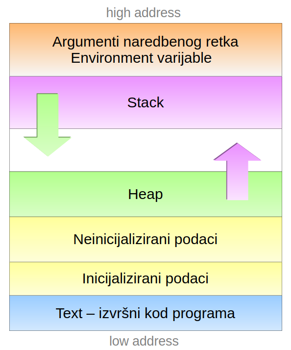
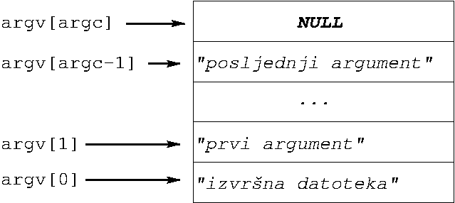
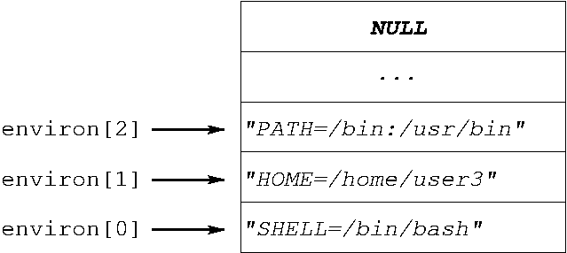

# Okruženje procesa

Primjeri uz poglavlje **Okruženje procesa** iz knjige *Programiranje za UNIX*.

U ovom poglavlju dani su primjeri koji demonstriraju upravljanje procesima na UNIX-u: dohvaćanje argumenata naredbenog retka i okruženja UNIX procesa, stvaranje procesa, pokretanje programa i upravljanje limitima. Svaki od ovih mehanizama vezan je uz jedan ili više sistemskih poziva — `fork()`, `exec` obitelj, `wait()`, `dup2()`, `setrlimit()` — koji zajedno tvore jezgru UNIX-ove filozofije upravljanja procesima. Primjeri su poredani tako da se teme grade postupno — od najjednostavnijih (ispis primljenih argumenata) prema složenijima (kombinacija `fork`, `exec`, `dup2` i `wait` u jednom programu).

### Argumenti naredbenog retka

Funkcija `main` prema ISO C standardu može imati dva osnovna oblika:

```c
int main(void)
int main(int argc, char *argv[])
```

Prvi oblik koristimo kada program ne očekuje dodatne opcije i argumente koje korisnik može zadati prilikom pokretanja programa. Međutim, često je korisniku ostavljena mogućnost da putem dodatnih argumenata, koji se zadaju kao stringovi u naredbenom retku iza same naredbe kojom je program pozvan, usmjerava način izvršavanja našeg programa. U ovom slučaju koristimo drugi oblik funkcije `main`, kako bi mogli pristupiti svim argumentima koji su u naredbenom retku zadani.

Prilikom pozivanja bilo koje naredbe u UNIX ljusci, ljuska analizira niz znakova kojim korisnik želi pokrenuti naredbu i dijeli ga na podnizove odvojene razmacima. Ovaj postupak nazivamo **tokenizacija**, a rezultat je niz **tokena** — stringova koji redom sadrže pozvanu naredbu i sve argumente koje je korisnik naveo. Ukoliko ovim stringovima želimo pristupiti iz našeg programa, koristimo drugi oblik funkcije `main`, kod kojeg funkcija prima dva argumenta: cjelobrojni `argc` u kojem je pohranjen ukupan broj stringova navedenih u naredbenom retku (uključujući i naredbu kojom je program pozvan), i polje pokazivača na znakovni niz `argv`, u kojem su ovi stringovi redom pohranjeni.

Argumenti naredbenog retka nalaze se na samom vrhu adresnog prostora procesa, kako je prikazano na slici:

<p align="center">
  
</p>

Najjednostavniji način pristupa je iteriranje kroz polje pokazivača `argv`, od prvog elementa (indeks 0) koji pokazuje na samu naredbu, do posljednjeg s indeksom `argc-1`.

Uzmimo za primjer hipotetski program `mojprogram` kod kojeg korisnik može prilikom pokretanja zadati argumente naredbenog retka. Neka je naš program pozvan s:

```
./mojprogram prvi argument      drugi_argument
```

Vrijednost argumenta `argc` bila bi 4 i odgovarala bi broju tokena koji čine naredbeni redak. Polje pokazivača `argv` redom bi pokazivalo na adrese pri vrhu adresnog prostora procesa, na kojima bi bile sljedeće vrijednosti:

```
argv[0] = "./mojprogram"
argv[1] = "prvi"
argv[2] = "argument"
argv[3] = "drugi_argument"
argv[4] = NULL
```

Uočimo dva detalja: ljuska tokenizira naredbeni redak tako da tokene razdvaja temeljem razmaka (*space*) — praznog prostora između njih. Pri tom je svejedno koristimo li jedan ili više razmaka (više puta pritisnuta tipka *space* prilikom unosa). Dodatno, pored pokazivača `argv[0]` do `argv[argc-1]`, uvijek postoji i posljednji pokazivač u nizu s indeksom `argc`, koji pokazuje na vrijednost `NULL`, tj. `(void*)0`. Organizacija polja `argv` u memoriji shematski je prikazana na sljedećoj slici:

<p align="center">
  
</p>

- [**`argumenti.c`**](argumenti.c) — najjednostavniji mogući primjer rada s argumentima naredbenog retka. Program u petlji prolazi kroz polje `argv[0], ..., argv[argc-1]` i ispisuje indeks i vrijednost svakog argumenta. Koristi se za vizualnu provjeru kako ljuska prenosi naredbeni redak programu — posebno korisno za razumijevanje razdvajanja riječi po razmacima, ponašanja navodnika, ili kako `argv[0]` uvijek nosi ime kojim je program pokrenut.

  ```
  $ ./argumenti jedan dva tri
  0:	 ./argumenti
  1:	 jedan
  2:	 dva
  3:	 tri
  ```

- [**`zbroji.c`**](zbroji.c) — program koji dva argumenta naredbenog retka tumači kao cijele brojeve i ispisuje njihov zbroj. Uvodi praksu **provjere broja argumenata** na početku programa (`argc < 3` → ispis upute za korištenje i izlaz) te funkciju `atoi()` iz standardne C biblioteke za konverziju stringa u `int`. Uobičajeni UNIX obrazac: poruka o korištenju uvijek koristi `argv[0]` kako bi točno odražavala naziv pod kojim je program pozvan.

  ```
  $ ./zbroji
  koristenje: ./zbroji <1.broj> <2.broj>
  $ ./zbroji 17 25
  17 + 25 = 42
  ```

### Varijable okruženja

Pored argumenata naredbenog retka, svaki UNIX proces u svom memorijskom prostoru sadrži i drugu vrstu konteksta — **varijable okruženja** (engl. *environment variables*). Ovaj skup vrijednosti proces nasljeđuje od svog roditelja — procesa koji je inicirao njegovo stvaranje korištenjem sistemskog poziva `fork()`, a može se mijenjati tijekom izvršavanja procesa.

Varijable okruženja nalaze se u memoriji procesa, pri samom vrhu adresnog prostora (odmah "ispod" argumenata naredbenog retka), a zadane su u formi niza parova oblika `"IME=vrijednost"`. Ove vrijednosti procesu prenose informacije o sistemskoj konfiguraciji i korisničkim postavkama, bez potrebe da se eksplicitno zadaju kao argumenti naredbenog retka. Vrijednosti pojedinih varijabli postavljaju se u inicijalizacijskim skriptama ljuske, a sve naredbe pokrenute iz iste sesije ih dijele kao zajednički kontekst.

Najčešće varijable okruženja na svakom UNIX sustavu su:

| Varijabla | Značenje |
|---|---|
| `HOME` | Apsolutna putanja korisničkog *home* direktorija. |
| `PATH` | Popis direktorija (odvojenih dvotočkom) u kojima ljuska traži izvršne datoteke. |
| `USER` | Korisničko ime trenutno prijavljenog korisnika. |
| `SHELL` | Apsolutna putanja korisnikove zadane ljuske. |
| `LANG` | Lokalizacijske postavke (jezik, kodna stranica). |
| `PWD` | Trenutno radni direktorij. |
| `TERM` | Tip terminala u kojem se sesija odvija. |

Vrijednostima varijabli okruženja možemo pristupati i mijenjati ih direktno iz UNIX ljuske. Vrijednost varijable okruženja čitamo korištenjem prefiksa `$` ispred imena. Na primjer, ukoliko želimo saznati koji je naš korisnički direktorij, dovoljno je izvršiti:

```sh
$ echo $HOME
/home/dkrst
```

Za promjenu vrijednosti postojeće, ili dodavanje nove varijable okruženja koristimo naredbu `export`:

```sh
$ export MOJA_VAR="neka vrijednost"
$ echo $MOJA_VAR
neka vrijednost
```

Naredba `env` (bez argumenata) ispisuje sve varijable okruženja trenutne sesije.

Iz programa pisanih u **C**-u, varijablama okruženja pristupa se kroz funkcije iz standardne C biblioteke deklarirane u `<stdlib.h>`:

```c
char *getenv(const char *name)
int   setenv(const char *name, const char *value, int overwrite)
int   unsetenv(const char *name)
int   putenv(char *string)
```

Funkcija `getenv` vraća pokazivač na string s vrijednošću tražene varijable, ili `NULL` ako varijabla nije postavljena. Funkcije `setenv`, `unsetenv` i `putenv` koriste se za izmjenu okruženja samog procesa — promjene se **ne** propagiraju natrag u roditeljski proces (ljusku), nego ostaju lokalne tekućem procesu i njegovim potomcima.

- [**`readenv.c`**](readenv.c) — čita vrijednost jedne varijable okruženja čije se ime zadaje kao argument naredbenog retka, pozivom `getenv()` iz standardne C biblioteke. `getenv()` vraća pokazivač na string s vrijednošću varijable, ili `NULL` ako varijabla nije postavljena. Program razlikuje ta dva slučaja i prikazuje odgovarajuću poruku. Ilustrira temeljni način na koji program pristupa okolini koju je naslijedio od ljuske — varijable poput `HOME`, `PATH`, `USER` ili vlastite varijable postavljene naredbom `export`.

  ```
  $ ./readenv HOME
  HOME = /home/dkrst
  $ ./readenv NEPOSTOJECA
  NEPOSTOJECA: environment varijabla ne postoji
  ```

#### Treći argument funkcije `main` — `envp`

Pored dva standardna oblika funkcije `main` opisana ranije, na UNIX sustavima česta je i sljedeća, proširena varijanta:

```c
int main(int argc, char *argv[], char *envp[]) {
    // envp je ovdje lokalni parametar funkcije
}
```

Treći argument `envp` je polje pokazivača na stringove oblika `"IME=vrijednost"`, završeno `NULL`-om — i sadrži kompletno okruženje koje je proces naslijedio pri pokretanju.

Treba imati na umu da **`envp` nije dio ISO C standarda** — ISO/IEC 9899:2018 u Annexu J.5.1 (*Common extensions*) spominje ovaj treći argument samo kao uobičajenu implementacijsku ekstenziju, što znači da je implementacije smiju ali nisu dužne podržavati. Ni POSIX.1-2017 ne propisuje `envp` kao standardni oblik — naprotiv, izričito preporučuje korištenje varijable `environ` (opisane u nastavku). U praksi je ipak treći argument `main`-a podržan na praktički svim modernim UNIX i Linux distribucijama, kao i u Microsoft C kompajleru.

#### Vanjska varijabla `environ`

Drugi način pristupa okolini iz programa pisanog u jeziku C jest preko vanjske globalne varijable `environ`. Za razliku od `envp`, koji je lokalni parametar funkcije `main`, `environ` je dostupna iz bilo koje funkcije programa nakon što se na nju prethodno deklarira:

```c
#include <unistd.h>
extern char **environ;     // deklaracija vanjske varijable

int main(int argc, char *argv[]) {
    // environ je dostupan ovdje iako nije u zagradama main-a
}
```

Pokazivač `environ` pokazuje na isti niz pokazivača kao i `envp` u trenutku pokretanja procesa — drugim riječima, oba mehanizma daju početno isti pogled na okruženje. Razlika postaje vidljiva tek nakon poziva funkcija `setenv()`, `putenv()` ili `unsetenv()`: te funkcije ažuriraju varijablu `environ` (eventualno realocirajući memoriju), dok `envp` ostaje pokazivati na izvornu, sada zastarjelu kopiju. Drugim riječima, `envp` je "snapshot" okoline u trenutku ulaska u `main`, a `environ` je "živa" referenca.

Organizacija varijabli okruženja u memoriji procesa shematski je prikazana na sljedećoj slici. Bez obzira pristupa li se okruženju kroz `environ` ili kroz `envp`, sama struktura u memoriji uvijek je ista — niz pokazivača na stringove oblika `"IME=vrijednost"` završen `NULL`-om. Razlikuje se samo ime varijable kroz koju mu pristupamo.

<p align="center">
  
</p>

Za razliku od `envp`, varijabla `environ` **jest** standardizirana — propisuje je POSIX.1-2017. Zanimljivo, to je jedini objekt u POSIX-u kojeg ne deklarira nijedna sistemska zaglavna datoteka, pa korisnik mora sam navesti deklaraciju `extern char **environ;` u svom programu (kao u primjeru iznad). ISO C, ponovo, ovu varijablu uopće ne spominje.

#### Koji oblik koristiti?

Preferirani oblik je `environ`, iz nekoliko razloga:

- **Standardiziran je u POSIX-u**, dok je `envp` samo implementacijska ekstenzija u Annexu ISO C standarda.
- **Uvijek odražava trenutno stanje okoline** — promjene napravljene pozivima `setenv()`/`putenv()`/`unsetenv()` reflektiraju se u `environ`-u, ali ne i u `envp`-u, pa korištenje `envp`-a nakon takvih izmjena vodi u nedefinirano ponašanje.
- **Dostupna je iz bilo koje funkcije programa**, ne samo iz `main`. Predaja `envp`-a niz funkcijske pozive zahtijeva da ga svaka funkcija koja ga treba primi kao argument.

U sljedećem ćemo paru primjera (`listenv1.c` i `listenv2.c`) prikazati oba mehanizma — funkcionalno daju isti rezultat, ali ilustriraju razliku u načinu pristupa okruženju iz koda.

- [**`listenv1.c`**](listenv1.c) — ispisuje sve varijable okruženja procesa korištenjem trećeg argumenta funkcije `main` (`envp`):

  ```c
  int main(int argc, char *argv[], char *envp[])
  ```

  Petlja iterira kroz polje `envp` sve dok ne naiđe na završni `NULL`. Funkcionalno je ekvivalentan UNIX naredbi `env`:

  ```
  $ ./listenv1
  SHELL=/bin/bash
  HOME=/home/dkrst
  PATH=/usr/local/bin:/usr/bin:/bin
  LANG=hr_HR.UTF-8
  ...
  ```

- [**`listenv2.c`**](listenv2.c) — ista funkcionalnost kao `listenv1.c`, ali umjesto trećeg argumenta `main`-a koristi vanjsku varijablu `environ`:

  ```c
  extern char **environ;

  int main(int argc, char *argv[])
  ```

  Funkcija `main` koristi standardni dvoargumentni oblik, a okruženju se pristupa preko globalne varijable. Ispis je identičan onom iz `listenv1`. Ovaj oblik je preporučen za stvarne programe iz razloga navedenih u prethodnom odjeljku.

  U `listenv2.c` smo se uz to malo poigrali s pokazivačkom aritmetikom — umjesto da koristimo brojač i indeksiramo polje kao u `listenv1.c` (`envp[k]`), ovdje izravno pomičemo sam pokazivač `environ` izrazom `*environ++` u svakoj iteraciji petlje. Funkcionalno je rezultat potpuno isti — petlja redom prolazi kroz sve elemente niza dok ne naiđe na završni `NULL` — samo što sada uloga "indeksa" više nije zasebna varijabla `k`, nego sam pokazivač koji se pomiče po nizu.

### Životni ciklus procesa

Životni ciklus UNIX procesa započinje sistemskim pozivom `fork`, što je jedini način za stvaranje novog procesa na UNIX-u. U ovom trenutku proces dobija **PID**, koji predstavlja jedinstveni identitet procesa i nepromjenjiv je za cijelo vrijeme njegovog postojanja, te memorijski prostor u kojem se proces izvršava — nakon čega je spreman za izvršavanje.

```c
#include <unistd.h>

pid_t fork(void);
```

**Povratna vrijednost:** u roditeljskom procesu `fork()` vraća PID novostvorenog djeteta (pozitivna cjelobrojna vrijednost); u djetetu vraća `0`; u slučaju greške (npr. kada je dosegnut sistemski limit broja procesa), vraća `-1` (samo u parent procesu — nije stvoren child proces).

Sistemski poziv `fork()` nema argumenata i jednostavno kopira memorijsku sliku postojećeg procesa — procesa roditelja koji je pozvao `fork()`. Ova funkcija **poziva se jednom, a vraća dva puta**: u postojećem procesu (proces roditelj, *parent process*) i u novonastalom procesu (proces dijete, *child process*), koji je identična kopija roditeljskog procesa — uključujući stanje stoga, hrpe i svih varijabli, ali i **brojača instrukcija** (engl. *program counter*, PC) — posebnog registra u UNIX procesu koji pokazuje na sljedeću instrukciju u strojnom kodu koja se treba izvršiti. Ovo efektivno znači da proces dijete nastavlja točno tamo gdje se proces roditelj nalazio u trenutku poziva funkcije `fork()` — kao da su se do tog trenutka oba procesa izvršavala na potpuno jednak način i nalaze se u identičnom stanju, iako je zapravo postojao samo jedan proces. Od tog trenutka dva procesa počinju živjeti odvojene živote — promjena bilo koje varijable u jednom od njih ne utječe na vrijednost varijabli u drugom procesu, jer se svaki proces izvršava u svom memorijskom prostoru.

- [**`nproc.c`**](nproc.c) — ilustrira upravo opisano svojstvo `fork()`-a: novi proces dobiva vlastitu kopiju memorijskog prostora roditelja, uključujući sve varijable na stogu i hrpi, te nastavlja izvršavanje točno tamo gdje se roditelj nalazio u trenutku poziva. Program u petlji poziva `fork()` tri puta. Nakon završetka petlje program ispisuje svoj jedinstveni process ID (PID) i proces ID procesa roditelja koristeći funkcije `getpid()` i `getppid()`. Ova informacija ispisuje se **8 puta** — što znači da izvršavanje petlje rezultira s ukupno 8 procesa, iako bi na prvu mogli pomisliti da je logičan broj procesa nakon izvršavanja petlje 4 (jedan izvorni i tri kopije, stvorene u tri iteracije petlje).

  Ovo je posljedica upravo gore opisanog načina funkcioniranja sistemskog poziva `fork()` — kopiranjem memorijske slike procesa kopira se i varijabla `k`, ali i brojač instrukcija (PC) koji pokazuje na sljedeću instrukciju koja se treba izvršiti. U svakoj iteraciji petlje iz jednog procesa nastaju dva potpuno identična procesa, koja se od te točke izvršavaju nezavisno — oba procesa nalaze se usred petlje i nastavljaju dalje kroz istu petlju. Razvoj kroz iteracije, uz broj procesa i vrijednost varijable `k` koja nakon `fork`-a postoji nezavisno u svakome:

  ```
  prije petlje:                          1 proces,  k=0

  iteracija k=0:
      fork() klonira postojeći proces  → 2 procesa, k=0 u svakom
      k++                              → 2 procesa, k=1 u svakom

  iteracija k=1:
      fork() klonira sva 2 procesa     → 4 procesa, k=1 u svakom
      k++                              → 4 procesa, k=2 u svakom

  iteracija k=2:
      fork() klonira sva 4 procesa     → 8 procesa, k=2 u svakom
      k++                              → 8 procesa, k=3 u svakom

  uvjet k<3 neistinit u svima          → izlazak iz petlje
  printf() izvršava se u svih 8
  ```

  Stablo procesa nakon tri iteracije, s oznakama `P0` (izvorni proces) do `P7` (posljednje stvoreno dijete). Svaki `fork()` poziv udvostručuje skup aktivnih procesa — u svakoj iteraciji svi postojeći procesi paralelno kloniraju sebe, tako da nakon tri iteracije imamo 8 procesa:

  ```
  prije petlje:       P0

  nakon k=0:          P0   P1
                      ↓    ↓            (svaki se u k=1 forka)
  nakon k=1:          P0   P1   P2   P3
                      ↓    ↓    ↓    ↓   (svaki se u k=2 forka)
  nakon k=2:          P0   P1   P2   P3   P4   P5   P6   P7
  ```

  Odnos roditelj–dijete u stablu:

  ```
                                  P0
                            ┌─────┴─────┐
                            P0          P1         (nakon k=0)
                         ┌──┴──┐      ┌──┴──┐
                         P0    P2     P1    P3     (nakon k=1)
                       ┌─┴─┐ ┌─┴─┐  ┌─┴─┐ ┌─┴─┐
                       P0  P4 P2 P6 P1  P5 P3  P7  (nakon k=2)
  ```

  Formula za broj procesa nakon `n` uzastopnih `fork()` poziva je **2ⁿ** — svaki `fork()` udvostručuje broj aktivnih procesa. U ovom primjeru u petlju ulazi 1 proces, a iz nje izlazi 8. Iz ispisanih PPID-ova moguće je rekonstruirati cijelo stablo — svaki proces zna tko mu je neposredni roditelj.

- [**`novi.c`**](novi.c) — korištenje povratne vrijednosti `fork()`-a za razlikovanje uloge roditelja i djeteta. Iako su oba procesa identične kopije jedan drugog, njih dva trebaju se u nastavku ponašati različito: roditelj obično nastavlja svoj prethodni posao, a dijete izvršava neki novi zadatak. Jedini mehanizam po kojem dva procesa mogu razaznati tko je tko jest upravo povratna vrijednost `fork()`-a — roditelj dobiva PID djeteta, a dijete dobiva 0. Program to iskorištava za granjanje logike — istim `printf`-om ispisuje različit tekst ovisno o tome tko ga izvršava:

  ```
  $ ./novi
  PARENT (25017)	 PID: 25016	 PPID: 14567
  CHILD  (0)	 PID: 25017	 PPID: 25016
  ```

  PID djeteta (25017) koji je roditelj dobio kao povratnu vrijednost `fork()`-a točno odgovara PID-u koji dijete prijavljuje pozivom `getpid()`; istovremeno dijete vidi PPID jednak PID-u roditelja, što potvrđuje odnos roditelj–dijete u procesnom stablu. Redoslijed ispisa između roditelja i djeteta nije određen — ovisi o raspoređivaču koji odlučuje koji će od dva spremna procesa dobiti procesor prvi.

#### Izlazni status procesa — sistemski poziv `wait`

Nakon stvaranja novog procesa sistemskim pozivom `fork`, jezgra zapisuje informacije o novonastalom procesu u **tablicu procesa** — istu onu u kojoj se čuva i informacija o svim otvorenim deskriptorima datoteka. Ovaj zapis u tablici procesa čuva se sve dok ima potrebe za tim — sve dok proces postoji, ali ponekad i duže. Sjetimo se da funkcija `main` ima povratnu vrijednost `int`. Vjerojatno ste se već zapitali čemu ova vrijednost služi i kome se uopće vraća, s obzirom da je `main` prva funkcija koja se poziva u novopokrenutom programu i ne postoji funkcija koja bi ju pozivala.

Upravo ova vrijednost osigurava mehanizam putem kojeg proces roditelj može saznati što se dogodilo s njegovim procesom djetetom: je li izvršio svoju zadaću ili je došlo do greške, i što je tu grešku uzrokovalo? Naime, poziv `return` u funkciji `main`, isto kao i poziv sistemskog poziva `exit` u bilo kojoj drugoj funkciji, prekidaju izvršavanje procesa i predaju jezgri **izlazni status procesa** — cjelobrojnu vrijednost od 0 do 255. Jezgra ovu vrijednost pohranjuje u slog u tablici procesa koji odgovara procesu koji je upravo završio. Zadatak procesa roditelja je da ovu vrijednost pročita i na temelju nje sazna sudbinu svog djeteta, a to može napraviti sistemskim pozivom `wait`:

```c
#include <sys/wait.h>

pid_t wait(int *wstatus);
```

**Povratna vrijednost:** PID djeteta koje je završilo, ili `-1` u slučaju greške (npr. proces nema djece koja bi mogla završiti). Izlazni status child procesa upisuje se u cjelobrojnu varijablu na koju pokazuje argument `wstatus`.

`wait()` blokira pozivajući proces sve dok jedno od njegove djece ne završi izvršavanje. Kad se to dogodi, jezgra puni varijablu na koju pokazuje `wstatus` informacijama o tome kako je dijete završilo: je li završilo normalno (npr. pozivom `return` ili `exit()`), je li prekinuto signalom, te koja je njegova povratna vrijednost odnosno koji je signal uzrokovao prekid. Ako pozivatelja zanima samo to da pričeka dijete, ali ne i sam status, kao argument se može proslijediti `NULL`.

Ovaj statusni broj **nije izravno** povratna vrijednost djeteta — riječ je o pakiranom cjelobrojnom polju u kojem su različite informacije o završetku procesa smještene u različite skupove bitova. Konkretno, izlazni status (vrijednost koju je dijete vratilo iz `main`-a ili predalo `exit()`-u, u rasponu **0 do 255**) zapisuje se u bitove 8–15 statusne riječi. Da bi se ta vrijednost izvukla, koristi se makro `WEXITSTATUS()` iz iste zaglavne datoteke `<sys/wait.h>`.

Posljedica je da bezuvjetan ispis statusnog broja kao cijele vrijednosti ne daje povratnu vrijednost djeteta, nego njezino "pomaknuto" prikazivanje: ako dijete vrati `5`, raw status bit će `5 << 8 = 1280`; ako vrati `255`, raw status bit će `65280`.

- [**`ret_stat.c`**](ret_stat.c) — minimalan primjer koji ilustrira upravo opisani odnos između raw statusnog broja i `WEXITSTATUS`-a. Roditelj pozivom `fork()` stvara dijete koje jednostavno vrati cjelobrojnu vrijednost zadanu kao argument naredbenog retka:

  ```c
  } else if (pid == 0) {
      return atoi(argv[1]);   // child: vrati zadanu vrijednost
  } else {
      wait(&rv);
      printf("CHILD EXIT STATUS: %d\n", rv);
      // printf("CHILD EXIT STATUS: %d\n", WEXITSTATUS(rv));
  }
  ```

  Pokrenimo program s nekoliko različitih vrijednosti u rasponu 0–255 (sve dopuštene povratne vrijednosti procesa):

  ```
  $ ./ret_stat 0
  CHILD EXIT STATUS: 0
  $ ./ret_stat 1
  CHILD EXIT STATUS: 256
  $ ./ret_stat 5
  CHILD EXIT STATUS: 1280
  $ ./ret_stat 255
  CHILD EXIT STATUS: 65280
  ```

  Samo prva vrijednost (`0`) odgovara onome što je dijete uistinu vratilo. Ostali brojevi su pomnoženi sa 256 — odnosno, gledano kao niz bitova, izvorna vrijednost je pomaknuta osam mjesta ulijevo. To su upravo bitovi 8–15 statusne riječi, gdje jezgra po POSIX konvenciji pohranjuje izlazni status. Ostali bitovi statusnog broja rezervirani su za druge informacije (signal koji je prekinuo proces, oznaka core-dumpa itd.) — te ćemo informacije iskoristiti u sekciji **Pokretanje novog programa**.

  Da bismo dobili izvornu povratnu vrijednost, koristi se makro `WEXITSTATUS()`. U primjeru `ret_stat.c` zakomentirajte prvi `printf` i otkomentirajte drugi:

  ```c
  // printf("CHILD EXIT STATUS: %d\n", rv);
  printf("CHILD EXIT STATUS: %d\n", WEXITSTATUS(rv));
  ```

  Nakon ponovnog prevođenja, ispis je upravo onakav kakav očekujemo:

  ```
  $ ./ret_stat 5
  CHILD EXIT STATUS: 5
  $ ./ret_stat 255
  CHILD EXIT STATUS: 255
  ```

  Makro `WEXITSTATUS(s)` ne radi ništa "magično" — interno samo izvuče bitove 8–15 iz statusnog broja, što je ekvivalentno izrazu `(s >> 8) & 0xFF`. Korištenje makroa, međutim, čini kod jasnijim, neovisnim o konkretnoj implementaciji statusne riječi i prenosivim na različite UNIX sustave.

#### Zombi procesi

Slijed događaja koji smo upravo opisali — proces završi pozivom `exit()` ili `return` iz funkcije `main`, a njegov proces roditelj njegov izlazni status preuzme pozivom `wait()` — otvara jedno suptilno pitanje: **kada točno jezgra može osloboditi zapis o procesu u tablici procesa?** Resursi koje je proces koristio (memorija, otvoreni file deskriptori, itd.) oslobađaju se odmah po prekidu izvršavanja, ali to se ne odnosi na sam zapis u tablici procesa: u njemu je pohranjen izlazni status koji jezgra još mora moći predati procesu roditelju kad on (u nekom budućem trenutku) pozove `wait()`. Ako bi taj zapis bio izbrisan u trenutku prekida izvršavanja procesa djeteta, poziv `wait()` ne bi imao odakle pročitati izlazni status.

Rješenje koje UNIX koristi je sljedeće: kad dijete završi, jezgra **zadržava** njegov zapis u tablici procesa, ali u posebnom stanju u kojem proces više ne troši resurse — postoji samo zapis o tome koji PID je imao i koji je njegov izlazni status. U uredno napisanim programima, ovaj period je vrlo kratak. Problem nastaje kad roditelj iz nekog razloga ne pozove `wait()` za svoju djecu. U ovom slučaju, imamo proces koji više nije živ, ali je još uvijek tu negdje i jezgra mora čuvati odgovarajući slog u tablici procesa. Štoviše, procesa u ovom stanju ne možemo se ni prisilno riješiti, npr. slanjem signala `KILL` koji bezuvjetno ubija proces kojem je poslan — jer ionako više nije živ. U UNIX terminologiji ovakvi procesi nazivaju se (prigodno) **zombi procesima** (engl. *zombie process*).

Zombi proces moguće je vidjeti naredbom `ps`: u stupcu `STAT` (status) prikazana je oznaka **`Z`**, a uz ime procesa stoji oznaka `<defunct>`. Problem nastaje ako se ovakvi procesi počnu gomilati: svaki od njih troši jedan slog u tablici procesa i koristi jedan PID — iako više nije aktivan. Kako tablica procesa ima ograničenu veličinu, kontinuirano stvaranje zombi procesa može dovesti do iscrpljenja sistemskih resursa — sustav neće moći pokrenuti nove procese sve dok netko ne "pokupi" zombije.

Stoga je dobra programerska praksa voditi računa o procesima koje ste stvorili: obavezno se pobrinite da po završetku izvršavanja vašeg child procesa pozovete `wait`, makar s argumentom `NULL` ukoliko vas njegov izlazni status ne zanima — ovo je jezgri potrebno da bi znala da ne mora više čuvati izlazni status procesa koji je završio s izvršavanjem.

Što se događa ako roditelj umre prije nego pozove `wait()`? Tu na scenu stupa mehanizam koji ćemo upoznati u sljedećem poglavlju, kod **osirotjelih procesa**. Jezgra preuzme nadležnost nad svim sirotanima — uključujući i zombije — i prebacuje ih procesu `init` (PID 1, ili u modernim Linux distribucijama `systemd`). `init` je dizajniran tako da neprestano poziva `wait()` na bilo koju djecu koja mu se prikače; time čisti sve preuzete zombije i pušta jezgru da oslobodi njihove zapise.

### Pokretanje novog programa

Proces i program su dva povezana ali različita koncepta. **Proces** je aktivna instanca izvršavanja — entitet koji ima svoj PID, memorijski prostor i resurse. **Program** je statičan zapis: strojni kod pohranjen u izvršnoj datoteci, niz instrukcija koje proces izvršava.

Odnos između programa i procesa možemo usporediti s receptima i kuhanjem ručka. Svaki recept u osnovi predstavlja "program" za kuhanje: niz precizno definiranih koraka i postupaka s naredbama kontrole toka (`if (nedovoljno_slano): dodaj_soli`), petljama (`while(meso_tvrdo): nastavi_kuhanje`) i svim ostalim instrukcijama potrebnim da dobijemo očekivani rezultat u vidu ukusnog ručka. Sam postupak kuhanja u osnovi je pokretanje procesa koji izvršava program, tj. prati zadani recept korak po korak. Pri tom ne postoji nikakva prepreka da više kuhara istovremeno ne pokrene proces kuhanja po istom receptu. Tada svaki od kuhara zapravo nezavisno izvršava svoj "proces", ali svi kuhaju po istom receptu, tj. u svim procesima izvršava se isti "program".

Na UNIX-u proces "kuhanja" započinje s pripremom: stvaranjem novog procesa i pripadajućeg memorijskog prostora u kojem će se proces izvršavati — pozivom funkcije `fork()`, kao što smo vidjeli u prethodnoj sekciji. Nakon toga krećemo s kuhanjem po odgovarajućem receptu — programu zapisanom u izvršnoj datoteci — korištenjem sistemskog poziva `exec`, koji kao argument uzima izvršnu datoteku koju želimo pokrenuti. Valja napomenuti da je `exec` zapravo **obitelj funkcija**, koje imaju istu funkcionalnost (učitavanje programa-recepta), a razlikuju se u načinu kako se zadaju argumenti naredbenog retka i put do izvršne datoteke:

```c
#include <unistd.h>

int execl (const char *path,  const char *arg0, ... /*, NULL */);
int execlp(const char *file,  const char *arg0, ... /*, NULL */);
int execle(const char *path,  const char *arg0, ... /*, NULL, char *const envp[] */);
int execv (const char *path,  char *const argv[]);
int execvp(const char *file,  char *const argv[]);
int execve(const char *path,  char *const argv[], char *const envp[]);
```

Razlike među varijantama kodirane su u sufiksima iza `exec`:

- **`l`** (*list*) — argumenti nove naredbe prenose se kao redom navedena **lista** pojedinačnih stringova, završena `NULL`-om (npr. `execlp("ls", "ls", "-al", NULL)`). Sjetimo se da polje pokazivača `argv` u funkciji `main` uvijek završava `NULL` pokazivačem — upravo zato i u pozivu `execl` `NULL` moramo navesti kao posljednji argument.
- **`v`** (*vector*) — argumenti se prenose kao **polje pokazivača** na stringove, završeno `NULL`-om (npr. `execvp("ls", argv)`). Prikladno kad broj argumenata nije poznat u trenutku pisanja koda, odnosno kada se argumenti dobivaju u istom obliku (kao u `argv`) od samog pozivatelja.
- **`p`** (*path*) — izvršna datoteka pronalazi se pretragom direktorija iz varijable okoline `PATH`, pa se umjesto pune putanje može navesti samo ime (npr. `"ls"` umjesto `"/bin/ls"`). Varijante bez `p` očekuju punu putanju.
- **`e`** (*environment*) — poziv prima dodatni posljednji argument `envp`, niz pokazivača na stringove `"IME=vrijednost"` završen `NULL`-om, čime se novoj naredbi može eksplicitno zadati drugačije okruženje od onog koje ima trenutni proces. Varijante bez `e` ne mijenjaju trenutno okruženje procesa.

Svih šest funkcija u pozadini završava u sistemskom pozivu `execve()` — ostalih pet je omotač koji pogodnije pakira argumente. Zajedničko svim varijantama je da **ne stvaraju novi proces**: PID ostaje isti, mijenja se samo kod koji se izvršava. Ako `exec` uspije, poziv se nikad ne vraća — izvorni kod programa zamijenjen je novim, učitanim iz izvršne datoteke, varijable na stogu i hrpi se brišu, a brojač instrukcija (PC) postavlja se na prvu instrukciju u novom programu. Vraćanje iz `exec`-a znači grešku (npr. izvršna datoteka nije pronađena ili nemamo pravo izvršavanja).

- [**`myls.c`**](myls.c) — prvi primjer funkcija iz `exec` obitelji: poziv `execlp()` zamjenjuje trenutni programski kod procesa kodom nekog drugog programa — u ovom slučaju UNIX naredbe `ls`. Za razliku od `fork()`, koji stvara novi proces, `exec()` **ne stvara novi proces** — PID ostaje isti, promijeni se samo programski kod koji se izvršava.

  ```c
  execlp("ls", "ls", "-al", NULL);
  ```

  Primijetite da su **prva dva argumenta poziva `execlp` identična**: prvi (`"ls"`) je ime izvršne datoteke koju treba naći i pokrenuti, a drugi (`"ls"`) je ono što će nova naredba dobiti kao svoj `argv[0]`. Podsjetimo se da po konvenciji svaka naredba u svom `argv[0]` očekuje vlastito ime (upravo iz tog razloga poruke o korištenju koriste `argv[0]`). Teoretski je moguće proslijediti i različito ime — tako bi program vidio da je pokrenut pod drugim imenom — ali u normalnoj uporabi oba se argumenta podudaraju.

  Ako `execlp()` uspije, poziv se nikad ne vraća — zato će se `perror("execlp")` izvršiti samo u slučaju greške (npr. naredba `ls` nije pronađena u `PATH`-u). Stoga nije potrebno provjeravati povratnu vrijednost funkcije `execlp`. Za razliku od poziva `fork()`, koji se poziva jednom a vraća dva puta, `execlp` (kao i ostale funkcije iz obitelji `exec`) ne vraća se nikad — osim u slučaju greške.

  ```
  $ ./myls
  ukupno 24
  drwxr-xr-x 2 dkrst users 4096 Apr 23 15:10 .
  drwxr-xr-x 8 dkrst users 4096 Apr 23 15:09 ..
  -rwxr-xr-x 1 dkrst users 8760 Apr 23 15:10 myls
  -rw-r--r-- 1 dkrst users  256 Apr 23 15:09 myls.c
  ...
  ```

- [**`pokreni.c`**](pokreni.c) — uopćena verzija prethodnog primjera: program prima proizvoljnu naredbu s argumentima kao svoje argumente naredbenog retka i pokreće je pozivom `execvp()`. Kako funkcija `main` već dobiva argumente u obliku polja pokazivača (`argv`), upravo takav oblik očekuje i `execvp` — dovoljno je proslijediti pokazivač na `argv[1]`:

  ```c
  execvp(argv[1], &argv[1]);
  ```

  Izraz `&argv[1]` je pokazivačka aritmetika — `argv` je polje pokazivača na stringove, a `&argv[1]` daje adresu **drugog elementa** tog polja, tj. pokazivač na pod-polje koje počinje od `argv[1]` i ide dalje. Funkcija `execvp` će to pod-polje tretirati kao svoje vlastito `argv`: `argv[1]` iz perspektive `pokreni`-ja postaje `argv[0]` nove naredbe (njezino ime), `argv[2]` postaje `argv[1]`, i tako redom. Ovako jednostavnim obrascem dobivamo zametak vlastite ljuske — program koji može pokrenuti bilo koju drugu UNIX naredbu.

  Preporuka je pokušati razne kombinacije i promotriti ponašanje:

  ```
  $ ./pokreni ls
  $ ./pokreni ls -al
  $ ./pokreni ls -al /root
  $ ./pokreni asdhasd
  ```

  Prva dva poziva rade očekivano. Treći poziv (`ls -al /root`) ovisi o tome je li korisnik root — ako nije, `ls` će ispisati poruku o greški jer nema pravo pristupa direktoriju `/root`. Zanimljivo je odgovoriti na pitanje: **tko ispisuje tu poruku?** U ovom slučaju to nije `pokreni` — `pokreni` je svoj posao obavio kad je pozvao `execvp`, koji je uspješno zamijenio njegov kod kodom naredbe `ls`. `pokreni` u doslovnom smislu više ne postoji kao program u tom procesu; poruku o grešci ispisuje sama naredba `ls`, nad svojim otvorenim standardnim izlazom za greške. U četvrtom pozivu (`./pokreni asdhasd`), poruku o grešci ispisuje `pokreni` sam — `execvp` je neuspješno pokušao pronaći izvršnu datoteku `asdhasd`, vratio se u `pokreni`, i idući redak koda je upravo `perror("execvp")`:

  ```
  $ ./pokreni asdhasd
  execvp: No such file or directory
  ```

  Razlika je suptilna ali ključna: kad `exec` uspije, program koji je pozvao `exec` prestaje postojati; kad `exec` ne uspije, izvršavanje se nastavlja s naredbom iza njega.

  Zabavan primjer rekurzivne zamjene:

  ```
  $ ./pokreni ./pokreni ./pokreni ls -al
  ```

  Jedan isti proces redom mijenja svoj sadržaj tri puta: prvi `pokreni` kod je zamijenjen drugim pozivom `pokreni`, taj pozivom trećeg `pokreni`-a, i on na kraju pozivom `ls -al`. PID ostaje isti kroz sve četiri metamorfoze, a ono što korisnik vidi kao rezultat — ispis sadržaja direktorija — potpuno je isto kao da smo `ls -al` pozvali direktno. Ova rekurzija ilustrira što `exec` zapravo jest: ne pokretanje novog procesa, nego **zamjena tijela postojećeg procesa drugim kodom**.

- [**`pokreni2.c`**](pokreni2.c) — pokretanje programa u novom procesu: **kombinacija `fork()` i `exec()`**. U prethodnom primjeru `pokreni` je nakon `execvp()` prestao postojati kao `pokreni` — njegov je kod zamijenjen kodom pokrenute naredbe, pa nakon završetka naredbe nema ničeg na što bi se vratilo. U praksi često želimo zadržati roditelja živim kako bi nastavio izvršavati svoju primarnu zadaću, ili čak pokrenuo novu naredbu nakon što se program pokrenut s `exec` u child procesu završi. Ovaj obrazac slijedi UNIX ljuska svaki put kada korisnik utipka naredbu: ljuska pozivom `fork` stvori novi proces (kopiju same sebe), potom u tom novom procesu pozivom `exec` pokrene traženu naredbu, a u roditeljskom procesu čeka njen završetak pozivom `wait`. Ljuska ovo radi u petlji — nakon svakog `wait`-a korisniku daje novu ljuskinu oznaku (*prompt*) i mogućnost da unese sljedeću naredbu.

  U prethodnom odjeljku, kod primjera `ret_stat.c`, već smo se susreli s makroom `WEXITSTATUS()` koji iz statusne riječi izvlači izlazni status djeteta. U `pokreni2` koristimo dva dodatna makroa iz `<sys/wait.h>` koji nam pomažu razlikovati **na koji način** je dijete završilo:

  ```c
  WIFEXITED(status)    // istina ako je dijete završilo normalno (return / exit)
  WIFSIGNALED(status)  // istina ako je dijete prekinuto signalom
  WTERMSIG(status)     // broj signala koji je prekinuo dijete
  ```

  Ovi makroi ispituju različite skupove bitova iste statusne riječi: `WIFEXITED` provjerava bit koji označava "uredan izlazak", `WIFSIGNALED` ispituje bit "prekinut signalom", a `WTERMSIG` izvlači broj signala iz dijela rezerviranog za signale (bitovi 0–6). Za bilo koji statusni broj točno jedan od `WIFEXITED` i `WIFSIGNALED` vratit će istinu — proces ne može istovremeno završiti i normalno i biti prekinut signalom. `pokreni2` na temelju toga ispisuje različitu poruku:

  ```c
  if (WIFEXITED(s))
      printf("Noramaln izlaz, izlazni status: %d\n", WEXITSTATUS(s));
  else if (WIFSIGNALED(s))
      printf("Prekid signalom, signal: %d\n", WTERMSIG(s));
  ```

  Povratna vrijednost 127, koju `pokreni2` koristi u grani kad `execvp()` ne uspije, je UNIX konvencija za "naredba nije pronađena".

  Isprobajmo s različitim naredbama koje **uredno završavaju**:

  ```
  $ ./pokreni2 ls
  argumenti  argumenti.c  listenv1  listenv1.c  ...
  Noramaln izlaz, izlazni status: 0

  $ ./pokreni2 asdasdasd
  execvp: No such file or directory
  Noramaln izlaz, izlazni status: 127

  $ ./pokreni2 ls sdfsdfsdf
  ls: cannot access 'sdfsdfsdf': No such file or directory
  Noramaln izlaz, izlazni status: 2
  ```

  **Zašto se izlazni status razlikuje** među tri slučaja? U prvom slučaju `ls` je uspješno obavio svoj posao i `exit`-ao s 0 — to je UNIX konvencija "sve je prošlo dobro". U drugom slučaju `execvp` u djetetu nije uspio (naredba `asdasdasd` ne postoji u `PATH`-u), pa se dijete vratilo na idući redak koda — `perror` i zatim `return 127`. U trećem slučaju `ls` se uspješno pokrenuo, ali je pri otvaranju datoteke `sdfsdfsdf` utvrdio da ne postoji, ispisao poruku o grešci na standardni izlaz za greške i vratio 2 — što je specifična konvencija same naredbe `ls` za "ozbiljnija greška". Sva tri scenarija su uredan izlazak; razlikuje se samo vrijednost koju je dijete vratilo.

- [**`ptr_err.c`**](ptr_err.c) — primjer koji namjerno izaziva grešku u rukovanju memorijom. Sav posao programa svodi se na nekoliko redaka koda:

  ```c
  int main() {
      int *val = (int*)99;
      *val = 3;
      return 0;
  }
  ```

  Pokazivač `val` postavlja se na potpuno proizvoljnu numeričku vrijednost (`99`) koja sigurno nije valjana adresa u memorijskom prostoru procesa, a zatim se kroz njega pokušava upisati. Jezgra to detektira i procesu šalje signal `SIGSEGV` (signal broj 11). Ako `ptr_err` pokrenemo korištenjem našeg `pokreni2`, dobit ćemo sljedeći rezultat:

  ```
  $ ./pokreni2 ./ptr_err
  Prekid signalom, signal: 11
  ```

  Za razliku od svih prethodnih primjera, `WIFEXITED` ovdje vraća laž — dijete nije završilo normalno — pa se izvršava `else if (WIFSIGNALED(s))` grana, a `WTERMSIG(s)` vraća `11`, što je broj signala `SIGSEGV`.

  Ako `ptr_err` pokušate pokrenuti direktno iz ljuske, dobit ćete ispis `Segmentation fault` — ljuska na isti način kao i naš primjer sazna razlog prekida izvršavanja naredbe koju smo zadali, provjeri koji je signal uzrok prekida te, temeljem te informacije, ispisuje odgovarajuću poruku.

- [**`preusmjeri.c`**](preusmjeri.c) — povezuje koncepte iz ovog poglavlja s mehanizmom preusmjeravanja ulaza/izlaza obrađenim u poglavlju o ulazno-izlaznim operacijama. Program prima dva ili više argumenata: prvi je ime datoteke u koju želimo preusmjeriti standardni izlaz, a ostatak je naredba koju želimo pokrenuti. Redoslijed koraka je:

  1. Pozivom `creat()` otvori se izlazna datoteka s pravima `0644`.
  2. Pozivom `dup2(fd, STDOUT_FILENO)` file deskriptor datoteke se duplicira na deskriptor 1 — upravo onaj koji proces koristi za standardni izlaz. Od tog trenutka svaki `write` ili `printf` kojemu je odredište `STDOUT_FILENO` efektivno piše u otvorenu datoteku.
  3. Stari deskriptor `fd` više nije potreban pa se zatvara, uz uobičajenu zaštitnu provjeru (`fd != STDOUT_FILENO`) za rijedak slučaj kad je `creat()` slučajno vratio baš 1.
  4. Pozivom `execvp()` program se zamjenjuje traženom naredbom. Ključno zapažanje: **otvoreni file deskriptori nasljeđuju se kroz `exec()`** — nova naredba naslijedi preusmjerenje na datoteku, iako ona sama nema pojma o tome.

  Dobivamo funkcionalni ekvivalent ljuskinog operatora `>`:

  ```
  $ ./preusmjeri izlaz.txt ls -la
  $ cat izlaz.txt
  ukupno 24
  drwxr-xr-x 2 dkrst users 4096 Apr 23 15:10 .
  ...
  ```

  Na istom principu radi i sama UNIX ljuska kad obrađuje `naredba > datoteka`: prije `exec`-a naredbe, ljuska otvori datoteku i pozivom `dup2` podmetne je na deskriptor 1.

### Ograničavanje resursa (`setrlimit`)

- [**`limitraj.c`**](limitraj.c) i [**`potrosac.c`**](potrosac.c) — ilustriraju sistemski poziv `setrlimit()`, kojim proces može postaviti ograničenje na različite resurse koje mu sustav dopušta koristiti. `limitraj` postavlja `RLIMIT_CPU` na 3 sekunde (i tvrdo i meko ograničenje), što znači da sljedeći proces smije potrošiti najviše 3 sekunde procesorskog vremena; nakon toga jezgra mu šalje signal koji ga prekida. Nakon postavljanja limita, `limitraj` pozivom `execvp()` pokreće naredbu zadanu argumentima. Kako se limiti resursa — kao i file deskriptori — **nasljeđuju kroz `exec()`**, pokrenuta naredba nasljeđuje i ograničenje. Ovo je osnovna ideja iza mehanizma ugrađene naredbe `ulimit` u ljusci, kao i alata poput `timeout` i različitih "sandbox" okruženja.

  Program `potrosac.c` je pratilac koji služi samo za demonstraciju djelovanja `limitraj`-a — sastoji se od jedne jedine beskonačne petlje `while(1);`, bez ijednog sistemskog poziva ili I/O operacije. Kad se pokrene samostalno, trošio bi procesor neograničeno dugo. Pokrenut kroz `limitraj`, nasljeđuje njegov CPU limit:

  ```
  $ ./limitraj ./potrosac
  Killed
  ```

  Ljuska nakon prekida procesa signalom ispisuje `Killed` (na Linux sustavima s engleskom lokalizacijom; na nekim drugim sustavima ispis može biti `CPU time limit exceeded` ili izostati sasvim). Bitno je zapaziti koliko dugo program traje — oko **tri sekunde**, a ne više.

  **Procesorsko i stvarno vrijeme.** Limit `RLIMIT_CPU` broji isključivo **procesorsko vrijeme** (*CPU time*) — ukupno vrijeme tijekom kojeg je proces zaista izvršavao instrukcije na nekom procesoru. To nije isto što i **stvarno vrijeme** (*wall-clock time* ili *real time*) koje mjeri koliko je proteklo vremena od pokretanja do kraja procesa, uključujući sve periode kad je proces bio pauziran od strane raspoređivača, kad je čekao na I/O, ili kad je sustav izvršavao druge procese. Ova dva vremena razlikuju se po tome da **procesorsko vrijeme nikad nije duže od stvarnog** — proces ne može utrošiti više procesorskih sekundi nego što je sekundi proteklo u stvarnosti. Najčešće je procesorsko vrijeme **kraće** od stvarnog: čim proces počne čekati na nešto (pritisak tipke, čitanje s diska, poruku preko mreže), stvarni sat nastavlja kucati, a procesorski stoji jer proces ne radi. U slučaju `potrosac`-a razlika između ta dva vremena je minimalna jer proces zaista cijelo vrijeme samo okreće procesor; kod realnih programa koji komuniciraju s korisnikom ili diskom razlika zna biti vrlo velika. Razlika je vidljiva i korisniku — UNIX naredba `time` ispisuje sva tri vremena (stvarno/*real*, korisničko procesorsko/*user*, sistemsko procesorsko/*sys*):

  ```
  $ time ./limitraj ./potrosac
  Killed

  real    0m3.012s
  user    0m3.000s
  sys     0m0.001s
  ```

### Osirotjeli procesi

- [**`noparent.c`**](noparent.c) — detaljniji primjer `fork()` mehanizma koji prikazuje što se dogodi kada **roditelj završi prije djeteta**. Program stvara stablo od tri procesa — `PARENT 1`, `CHILD 1` i `CHILD 2` — pri čemu `CHILD 2` (unuk po odnosu prema `PARENT 1`) namjerno spava duže od svog direktnog roditelja (`CHILD 1`). Zbog toga `CHILD 1` završi dok njegovo dijete još radi, a time `CHILD 2` postaje **osirotjeli proces** (*orphan*). U takvoj situaciji jezgra automatski preuzima ulogu novog roditelja — tradicionalno je to proces `init` s PID-om 1.

  Očekivani ispis s konkretnim PID-ovima (skraćeno; `SH` je PID ljuske iz koje je program pokrenut, npr. 14567; `PARENT 1` dobiva PID 25016, `CHILD 1` 25017, `CHILD 2` 25018):

  ```
  CHILD 2:	 PID: 25018	 PPID: 25017
  CHILD 1:	 PID: 25017	 PPID: 25016
  PARENT 1:	 PID: 25016	 izlazi: 25017
  PARENT 1:	 PID: 25016	 PPID: 14567
  CHILD 2:	 PID: 25018	 PPID: 1
  ```

  U prvom ispisu `CHILD 2` vidi svog pravog roditelja `CHILD 1` (PPID = 25017); nakon tri sekunde spavanja, njegov drugi ispis prijavljuje **PPID = 1** — u međuvremenu je `CHILD 1` završio, a jezgra je posvojenje prenijela na `init`.

  **Napomena o modernim sustavima.** Na suvremenim Linux distribucijama koje koriste `systemd` i korisničke sesije (`systemd --user`), posljednji PPID često neće biti 1 nego PID korisničkog `systemd` procesa. Razlog je mehanizam **subreapera** uveden u Linux jezgri 3.4 (2012.): pozivom `prctl(PR_SET_CHILD_SUBREAPER, 1)` proces se može registrirati kao "zamjenski init" za sve svoje potomke. Kad sirotan nastane, jezgra traži najbližeg pretka-subreapera umjesto da ga automatski pošalje na PID 1. Na desktop Linuxu sa `systemd`-om upravo je `systemd --user` takav subreaper, pa se tamo vidi PPID jednak njegovom PID-u. Konkretan iznos može se provjeriti naredbom `ps -p <ppid> -o pid,ppid,comm`. Klasično pravilo (*sirotan → PID 1*) i dalje vrijedi u odsutnosti subreapera — primjerice pri pokretanju iz SSH sesije na minimalnom serveru.

## Prevođenje

Direktorij dolazi s priloženim `Makefile`-om koji prati iste konvencije kao i Makefile datoteke u direktorijima `osnove_programiranja/` i `fileio/` (varijable `CC`, `CFLAGS`, `LDFLAGS`, `TARGETS`; implicitno pravilo `.c.o`; pravila `default`, `all`, `clean`). Detaljan opis strukture i korake gradnje Makefilea vidjeti u [`../osnove_programiranja/README.md`](../osnove_programiranja/README.md).

Tipična uporaba:

```sh
make              # gradi zadani cilj (novi)
make all          # gradi sve primjere
make pokreni2     # gradi samo zadani primjer
make clean        # briše izvršne i objektne datoteke
```
