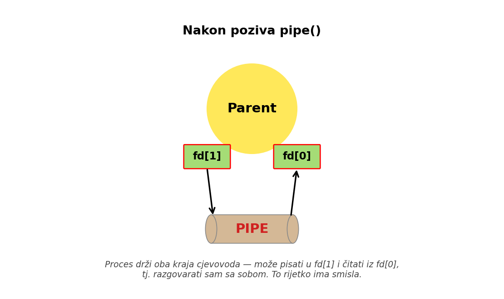
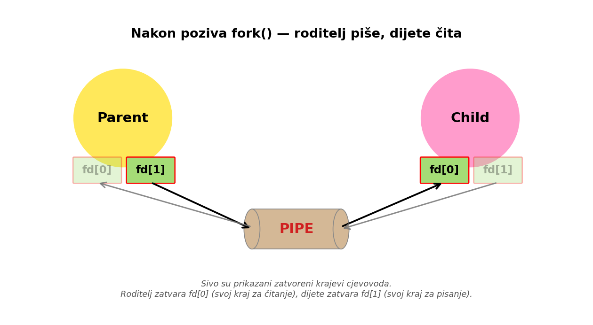
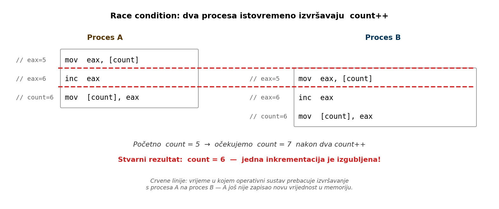

# Komunikacija između procesa

Procesi u UNIX sustavu žive u potpuno odvojenim adresnim prostorima — varijable jednog procesa su nevidljive drugom, čak i ako je jedan proces nastao od drugog pozivom `fork()`, ili ako imaju istog zajedničkog pretka — isti proces-roditelj stvorio ih je s dva poziva `fork()`. Ova izolacija je temeljna značajka modernog operacijskog sustava: ona štiti procese međusobno (jedan ne može srušiti ili neispravno izmijeniti podatke drugog), olakšava paralelno izvršavanje, i čini sustav robusnijim. Međutim, u praksi često želimo da procesi razmjenjuju podatke — bilo da prosljeđuju rezultate, koordiniraju rad, ili dijele zajedničke resurse. Skup mehanizama koji to omogućuju zajedničkim imenom zovemo **međuprocesna komunikacija** (engl. *Inter-Process Communication*, IPC).

UNIX nudi cijelu lepezu IPC mehanizama, od najjednostavnijeg cjevovoda do složenih koncepata dijeljene memorije, ili mrežnih socketa koji omogućavaju ne samo komunikaciju između procesa na istom računalu, već i među procesima koji se izvršavaju na različitim krajevima svijeta. IPC je opsežno područje — sveobuhvatna skripta koja bi pokrila sve mehanizme i ilustrirala ih dovoljnim brojem primjera vjerojatno bi zahtijevala volumen barem jednak ovoj skripti u cjelini. Stoga ćemo se ovdje ograničiti na osnovne mehanizme, dovoljno detaljno obrađene da čitatelj stekne uvid u područje i razumijevanje osnovnih koncepata međuprocesne komunikacije, a zainteresiranog čitatelja potaknemo da sam nastavi s istraživanjem onoga što ostaje izvan dometa ovog poglavlja. Prije nego krenemo, vrijedi se kratko podsjetiti na još jedan oblik komunikacije koji smo već obradili.

## Pregled mehanizama IPC-a

UNIX ima više IPC mehanizama, svaki s vlastitim svojstvima i tipičnom primjenom:

| Mehanizam | Opseg | Tipična primjena |
|---|---|---|
| **Signali** | unutar sustava | obavještavanje procesa o događajima (asinkroni "prekidi") |
| **Anonimni cjevovodi** (engl. *pipe*) | povezani procesi | jednosmjeran tok bajtova roditelj↔dijete |
| **Imenovani cjevovodi** (FIFO) | unutar sustava | jednosmjeran tok bajtova između bilo koja dva procesa |
| **POSIX redovi poruka** (engl. *message queues*) | unutar sustava | strukturirana komunikacija s prioritetima |
| **POSIX dijeljena memorija** | unutar sustava | dijeljenje memorijskog prostora između procesa |
| **POSIX semafori** | unutar sustava | sinkronizacija pristupa zajedničkim resursima |
| **System V IPC** (poruke, semafori, dijeljena memorija) | unutar sustava | starija, ali raširena alternativa POSIX-u |
| **Memory mapping** (`mmap`) | unutar sustava | mapiranje datoteka i anonimne memorijske regije |
| **Socketi** | unutar i između sustava | komunikacija lokalna ili preko mreže |

### Signali kao oblik IPC-a

Signali, koje smo detaljno obradili u prethodnom poglavlju, ujedno su i najjednostavniji oblik međuprocesne komunikacije. Jedan proces može poslati signal drugome (sistemskim pozivom `kill()`), a primatelj na njega reagira ovisno o tome je li definirao vlastiti rukovatelj signalom. Signali su u osnovi vrlo jednostavan komunikacijski kanal — pošiljatelj ne može uz signal poslati nikakve podatke (novije inačice signala kroz `sigqueue` mogu nositi i jednu cijelobrojnu vrijednost). Komunikacija koju signalima možemo ostvariti zapravo se svodi na jednostavne obavijesti: *"dogodilo se nešto"*. Usporedimo ovo s lampicom *"Check engine"* koju često nalazimo u modernim automobilima (a nažalost, često i svijetli): automobil nam signalizira da je nastupilo neko stanje na koje trebamo obratiti pažnju, ali nam ne daje nikakve dodatne informacije i na nama je da s tim postupimo kako najbolje znamo. Za pravu razmjenu podataka trebamo bogatije mehanizme koje obrađujemo u ovom poglavlju.

## Anonimni cjevovodi

Najjednostavniji i najstariji UNIX IPC mehanizam je **anonimni cjevovod** (engl. *pipe*). Cjevovod je jednosmjerni komunikacijski kanal — niz bajtova koji jedan proces piše s jednog kraja, a drugi čita s drugog. Implementiran je kao međuspremnik (engl. *buffer*) u jezgri.

S programerske strane, cjevovod se predstavlja kao **par deskriptora datoteke**: jedan za čitanje, drugi za pisanje. Time se cjevovod uklapa u UNIX-ovu paradigmu *"sve je datoteka"* — čitamo i pišemo iste sistemske pozive (`read`, `write`) koje smo upoznali u poglavlju o ulazno/izlaznim operacijama.

Karakteristike anonimnih cjevovoda:

- **Jednosmjerni** — podaci teku od jednog procesa prema drugom, od pisača prema čitaču (engl. *writer to reader*); za dvosmjernu komunikaciju treba dva cjevovoda.
- **Anonimni** — nemaju ime u datotečnom sustavu; postoje samo dok ih neki proces drži otvorenima preko deskriptora.
- **Samo između povezanih procesa** — pošto su anonimni, jedini način da drugi proces dobije pristup deskriptoru je da ga **naslijedi** od roditelja kroz `fork()`. Cjevovod stoga obično povezuje roditelja i dijete (ili dvoje djece istog roditelja).
- **Ograničen kapacitet** — međuspremnik je konačan (na Linuxu obično 64 KB). Pisanje u puni cjevovod blokira pisača sve dok čitač nešto ne pročita; čitanje iz praznog cjevovoda blokira čitača sve dok pisač nešto ne napiše.

### Sistemski poziv `pipe()`

```c
#include <unistd.h>

int pipe(int fd[2]);
```

**Povratna vrijednost:** `0` u slučaju uspjeha, `-1` u slučaju greške.

**Argumenti:**

- **`fd`** — polje od dva cijela broja u koje funkcija upisuje dva nova deskriptora datoteke: `fd[0]` (kraj za **čitanje**) i `fd[1]` (kraj za **pisanje**). Zgodno mnemoničko pomagalo: `0` se često asocira sa standardnim ulazom (čitanjem), `1` sa standardnim izlazom (pisanjem).

Nakon stvaranja cjevovoda, proces koji je pozvao `pipe()` drži oba kraja — i čitajući i pisajući deskriptor. U principu, ovaj proces sad može pisati u `fd[1]` i sam čitati to što je napisao iz `fd[0]`, dakle, razgovarati sam sa sobom:



Ljude koji govore sami sa sobom obično "čudno" gledamo, a ni kod procesa ovo nema previše smisla. Cjevovod postaje koristan tek kad ga **dijelimo s drugim procesom**, što se postiže pozivom `fork()` neposredno nakon `pipe()`-a.

Tipičan obrazac: pozovemo `pipe()` u roditelju, zatim `fork()`. Proces dijete nasljeđuje sve otvorene deskriptore datoteka roditelja, pa tako oba procesa sada imaju sva četiri "kraja" cjevovoda (dva u roditelju, dva u djetetu — naslijeđeni). S obzirom da su cjevovodi zamišljeni za jednosmjernu komunikaciju, svaki proces trebao bi zatvoriti onaj kraj koji nema namjeru koristiti: npr. ako će informacija putovati od roditelja prema djetetu, tj. ako roditelj piše a dijete čita, roditelj zatvara `fd[0]`, a dijete `fd[1]`.



Time se uspostavlja jednosmjerni kanal: deskriptor `fd[1]` otvoren za pisanje ostaje otvoren samo u roditelju, dok deskriptor `fd[0]` otvoren za čitanje ostaje otvoren samo u djetetu. Komunikacija u suprotnom smjeru, od djeteta prema roditelju, nije više moguća (barem ne kroz ovaj cjevovod), jer su deskriptori koji bi omogućili komunikaciju u tom smjeru zatvoreni s obje strane. Ako trebamo komunikaciju u oba smjera, uobičajeno je rješenje stvoriti dva cjevovoda, svaki za svoj smjer.

### Cjevovod između roditelja i djeteta

- [**`cijev.c`**](cijev.c) — minimalan primjer cjevovoda: roditelj šalje poruku djetetu kroz cjevovod.

  ```c
  #include <stdio.h>
  #include <stdlib.h>
  #include <string.h>
  #include <unistd.h>
  #include <sys/wait.h>

  int main(void) {
      int fd[2];
      pid_t pid;

      /* fd[0] - kraj za citanje
       * fd[1] - kraj za pisanje */
      if (pipe(fd) < 0) {
          perror("pipe");
          return 1;
      }

      pid = fork();
      if (pid < 0) {
          perror("fork");
          return 1;
      }

      if (pid == 0) {
          /* dijete - cita iz cjevovoda */
          char buf[128];
          close(fd[1]);                       /* ne treba nam pisanje */
          ssize_t n = read(fd[0], buf, sizeof(buf) - 1);
          if (n > 0) {
              buf[n] = '\0';
              printf("Dijete primilo: %s\n", buf);
          }
          close(fd[0]);
      } else {
          /* roditelj - pise u cjevovod */
          const char *poruka = "Pozdrav iz roditelja!";
          close(fd[0]);                       /* ne treba nam citanje */
          write(fd[1], poruka, strlen(poruka));
          close(fd[1]);

          wait(NULL);                         /* cekaj da dijete zavrsi */
      }

      return 0;
  }
  ```

  Bitno je primijetiti redoslijed pozivа: prvo se otvara cjevovod (u roditelju), a tek onda se radi `fork()`. Time se osigurava da oba procesa imaju iste deskriptore. Ukoliko bi prvo napravili `fork()`, a tek zatim `pipe()`, dijete ne bi imalo pristup cjevovodu. Još veća greška bila bi napraviti `fork()`, a zatim `pipe()` u oba procesa — ovim bi dobili dva potpuno odvojena cjevovoda, a svaki proces bi mogao jedino pričati sam sa sobom.

  Primijetimo i da su lokalne varijable jasno razdvojene između grana: međuspremnik `buf` deklariran je samo unutar grane djeteta, a varijabla `poruka` (i tekst poruke) zapisana je samo u grani roditelja. Ovo je u primjeru namjerno napravljeno kako bi se dodatno naglasilo da dijete nije imalo mogućnost direktnog pristupa poruci definiranoj u procesu roditelju. Razmjena podataka između roditelja i djeteta moguća je isključivo kroz cjevovod — vrijednost se mora upisati u `fd[1]` na jednoj strani i pročitati iz `fd[0]` na drugoj.

  U praksi smo varijablu mogli definirati samo jednom, na početku programa. Nakon poziva `fork()` adresni prostori roditelja i djeteta se odvajaju, pa smo u roditelju mogli koristiti istu varijablu za definiranje poruke, a u djetetu za primanje poruke kroz cjevovod — ili za bilo što drugo. Nakon poziva `fork()`, dvije naizgled "iste" varijable u dva procesa zapravo pokazuju na dvije odvojene adrese u odvojenim adresnim prostorima. Međutim, kao što smo već ranije rekli, u ovom primjeru namjerno koristimo različita imena varijabli kako bismo dodatno naglasili funkcionalnost primjera.

  Pokretanje:

  ```
  $ ./cijev
  Dijete primilo: Pozdrav iz roditelja!
  ```

  Važno je napomenuti da zatvaranje "nepotrebnog" kraja cjevovoda u svakom od procesa nije korak koji nam služi tek tome da bismo imali pregledniji kod — bez ovog koraka proces koji čita iz cjevovoda može ostati zauvijek blokiran u pozivu `read()`. Naime, nakon što proces koji u cjevovod piše zatvori `fd[1]`, ili završi s izvršavanjem (čime se zatvaraju i svi otvoreni deskriptori datoteka), idući poziv `read()` u čitatelju vratit će `0` (*End of file* — podsjetimo se sistemskog poziva `read()`). Međutim, ukoliko čitatelj sam drži otvorenim svoju kopiju kraja za pisanje (`fd[1]`), `read()` neće vratiti `0` jer je s gledišta jezgre drugi kraj cjevovoda i dalje otvoren — postoji još jedan deskriptor preko kojeg bi netko mogao pisati. Posljedica je vječno blokiranje čitatelja u `read()`-u, čak i nakon što je proces koji bi u cjevovod trebao pisati odavno gotov.

### Preusmjeravanje i cjevovodi

U sljedećem primjeru iskoristit ćemo cjevovode da implementiramo još jednu uobičajenu funkciju ljuske: **preusmjeravanje standardnih ulaza i izlaza i ulančavanje procesa**. Podsjetimo se prvog poglavlja (vidi sekciju o preusmjeravanju u P01) i operatora `|` kojim standardni izlaz jednog procesa možemo povezati izravno na standardni ulaz drugog. Tako, na primjer, ukoliko želimo prebrojati koliko u nekom direktoriju ima datoteka, možemo kombinirati dvije standardne UNIX naredbe: **`ls`** za pregled sadržaja direktorija i **`wc -l`** za brojanje redaka na standardnom ulazu (`wc` bez ikakve opcije ispisuje broj redaka, riječi i znakova; opcija `-l` ograničava ispis samo na broj redaka — pojedinosti nudi `man wc`):

```
$ ls | wc -l
14
```

Isti efekt možemo postići i sami, kombiniranjem dvaju procesa i jednog cjevovoda. Trik se sastoji od nekoliko koraka. Najprije glavni proces stvori cjevovod pozivom `pipe()`, nakon čega pozove `fork()` — sad imamo dva procesa koja imaju pristup krajevima cjevovoda za čitanje i pisanje. Kako nam je cilj da izlaz iz naredbe `ls` završi na ulazu naredbe `wc`, na standardni izlaz procesa koji će izvršiti `ls` dupliciramo `fd[1]` — kraj za pisanje cjevovoda koji smo upravo stvorili. Slično, u procesu koji će izvršiti `wc`, na standardni ulaz dupliciramo `fd[0]` — kraj cjevovoda za čitanje. Za dupliciranje deskriptora služi nam sistemski poziv `dup2()` koji smo već upoznali u poglavlju o ulazno/izlaznim operacijama. Tek nakon ovog preusmjeravanja, svaki proces pozove `exec` i postane `ls` odnosno `wc`. Time `ls`, koji ne zna ništa o našem cjevovodu, jednostavno piše svoje rezultate na svoj standardni izlaz — koji se "magično" završava u cjevovodu; a `wc -l`, isto neupućen u priču, čita s ulaza koji je zapravo drugi kraj istog cjevovoda.

- [**`prebroji.c`**](prebroji.c) — implementacija `ls | wc -l`, korištenjem `pipe`, `fork`, `dup2` i `exec`.

  ```c
  #include <stdio.h>
  #include <stdlib.h>
  #include <unistd.h>
  #include <sys/wait.h>

  int main(void) {
      int fd[2];
      pid_t pid;

      if (pipe(fd) < 0) {
          perror("pipe");
          return 1;
      }

      pid = fork();
      if (pid < 0) {
          perror("fork");
          return 1;
      }

      if (pid == 0) {
          /* preusmjeri standardni izlaz na fd[1] */
          dup2(fd[1], STDOUT_FILENO);
          if (fd[1] != STDOUT_FILENO)
              close(fd[1]);
          close(fd[0]);
          execlp("ls", "ls", (char *)NULL);
          perror("execlp ls");
          return 1;
      } else {
          /* preusmjeri standardni ulaz na fd[0] */
          dup2(fd[0], STDIN_FILENO);
          if (fd[0] != STDIN_FILENO)
              close(fd[0]);
          close(fd[1]);
          execlp("wc", "wc", "-l", (char *)NULL);
          perror("execlp wc");
          return 1;
      }
  }
  ```

  Ključne stvari koje treba primijetiti:

  - **`dup2(fd[1], STDOUT_FILENO)`** u djetetu znači: "neka deskriptor 1 (stdout) sad bude kopija onoga što pokazuje `fd[1]`" — efektivno, sve što `ls` napiše na svoj standardni izlaz zapravo ide u cjevovod.
  - Jednako tome, **`dup2(fd[0], STDIN_FILENO)`** u roditelju preusmjerava `wc`-ov ulaz na čitajući kraj cjevovoda.
  - **Oba procesa zatvaraju izvorne deskriptore cjevovoda** odmah nakon `dup2`-a. Razlog je upravo onaj koji smo opisali u prethodnoj sekciji: ako `wc` (roditelj) drži otvoren `fd[1]`, kraj za pisanje na svojoj strani, on bi sam sebi spriječio kraj toka — `read` na cjevovodu ne bi nikad vratio `0`, i `wc` bi zaglavio. Pažljivi čitatelj primijetit će uvjete `if (fd[1] != STDOUT_FILENO)` i `if (fd[0] != STDIN_FILENO)` prije zatvaranja: oni štite od rubnog slučaja kad bi `pipe()` slučajno vratio `fd[0] == 0` ili `fd[1] == 1` (npr. ako je standardni ulaz/izlaz već ranije bio zatvoren). Tada bismo `close`-om upravo zatvorili kraj cjevovoda koji smo netom postavili kroz `dup2`, čime bi cijela konstrukcija propala.
  - **Nije nužan eksplicitni `wait`** na dijete: nakon što roditelj pozove `exec` i postane `wc`, `wc` će prirodno blokirati u `read`-u dok se cjevovod ne zatvori s druge strane. To se događa kad dijete (`ls`) završi svoj posao i jezgra zatvori njegove deskriptore. Tek tada `read` u `wc`-u vrati `0` i `wc` ispiše broj redaka. Zanimljiva posljedica je da `ls` nakratko postaje **zombie proces** (jer ga njegov roditelj `wc` ne `wait`-a), no čim cijeli naš `prebroji` (koji je u međuvremenu postao `wc`) završi, sirotinjski `ls` zombie usvaja `init` proces (`PID 1`) koji ga uredno počisti pozivom `wait`. Tako smo izbjegli trajno zaglavljivanje zombie procesa, iako u kodu nigdje eksplicitno nismo čekali djecu.

  Pokretanje:

  ```
  $ ./prebroji
  14
  $ ls | wc -l
  14
  ```

  Rezultat je broj zapisa u trenutnom direktoriju — identičan onome što daje `ls | wc -l` u ljusci.

  Ovaj sažeti primjer pokazuje kako je u ljusci implementirano ulančavanje procesa u blokove: za svaku komponentu cjevovoda pokrene zaseban proces, a između njih postavi cjevovod uz odgovarajuća preusmjeravanja. U pravoj ljusci proces bi tekao ovako: ljuska prvo stvori cjevovod, a nakon toga pokrene dva nova procesa — u jednom `ls`, u drugom `wc -l`. U svakom od dva novostvorena procesa odradio bi se postupak koji smo upravo pokazali primjerom (preusmjeravanje deskriptora, zatim `exec`). Proces roditelj — sama ljuska — pak nastavio bi se izvršavati i pozvao `wait` za oba procesa djeteta, nakon čega bi čekao iduću naredbu korisnika. U našem slučaju nema iduće naredbe nakon `prebroji`, pa smo primjer pojednostavnili tako što je sam glavni proces postao jedna od komponenata cjevovoda (`wc -l`).

## Imenovani cjevovodi (FIFO)

Anonimni cjevovodi imaju jedno ozbiljno ograničenje: budući da nemaju ime u datotečnom sustavu, mogu ih koristiti samo srodni procesi (preko `fork`-a). Što ako želimo da dva potpuno nezavisna procesa — pokrenuta od strane različitih korisnika, u različitim trenutcima — komuniciraju cjevovodom?

Odgovor su **imenovani cjevovodi** (engl. *named pipes*) ili **FIFO** (kratica od *First In, First Out* — prvi unesen, prvi pročitan, što opisuje sam način rada cjevovoda: bajt koji se prvi upiše s jednog kraja prvi će biti i pročitan s drugog kraja). Riječ je o cjevovodima koji imaju ime u datotečnom sustavu — vidljivi su naredbom `ls` (gdje su označeni slovom `p` u prvom stupcu prava pristupa, kao u `prw-r--r--` — `p` znači *pipe*), mogu se otvoriti kao i svaka druga datoteka — pozivom `open()`, i obrisati naredbom `rm` ili `unlink()`-om. S programerske strane, koriste se gotovo identično anonimnim cjevovodima: `read` i `write` rade isto, semantika blokiranja je ista, ograničenje smjera (jedan smjer po cjevovodu) je isto.

Ključna razlika u korištenju: FIFO se ne stvara `pipe()`-om, nego **`mkfifo()`** sistemskim pozivom (ili istoimenom naredbom `mkfifo` iz ljuske). Postoji još jedna bitna razlika između ova dva poziva: `pipe()` u jednom koraku stvara cjevovod i vraća deskriptore datoteke za njegova oba kraja — jedan za čitanje, jedan za pisanje. `mkfifo()`, naprotiv, stvara samo datoteku tipa FIFO u datotečnom stablu, i ne vraća nikakve deskriptore. Tek kad tu datoteku potom otvorimo običnim pozivom `open()` (s `O_RDONLY` ili `O_WRONLY`), dobivamo deskriptor datoteke kojim možemo čitati ili pisati. Tip "FIFO" zapisan je u `st_mode` polju i-noda — sjetimo se makroa `S_ISFIFO` iz poglavlja o upravljanju datotekama, koji je upravo ono što provjerava taj bit u i-nodu i daje slovnu oznaku `p` koju vidimo u `ls -l` ispisu.

```c
#include <sys/types.h>
#include <sys/stat.h>

int mkfifo(const char *pathname, mode_t mode);
```

**Povratna vrijednost:** `0` u slučaju uspjeha, `-1` u slučaju greške.

**Argumenti:**

- **`pathname`** — putanja na kojoj će biti stvoren FIFO.
- **`mode`** — prava pristupa (kao za `open` ili `mkdir`); konačna prava se dobiju kombinacijom s `umask` procesa.

Jednom kad imamo datoteku tipa FIFO u datotečnom sustavu — bez obzira jesmo li je upravo napravili s `mkfifo`, ili je tu od ranije (možda ju je napravila sasvim druga aplikacija) — možemo je otvoriti kao bilo koju drugu datoteku, jednostavnim pozivom `open()`. Bitne karakteristike koje treba imati na umu kod FIFO-a:

- **Otvaranje blokira po defaultu**: `open()` na FIFO za čitanje blokira sve dok neki drugi proces ne otvori isti FIFO za pisanje (i obratno). Time se osigurava točka susreta (engl. *rendezvous point*) za procese.
- **Postoje na disku** sve dok ih netko ne obriše (`unlink` ili `rm`). Ovo je ponekad i poželjno — FIFO se može namjerno ostaviti u datotečnom sustavu kao trajna komunikacijska točka koju kasnije koriste razni programi. Ako pak FIFO više nije potreban, treba ga obrisati kako ne bismo gomilali nepotrebne datoteke u datotečnom sustavu.
- **Više čitača/pisača**: na isti FIFO može se istovremeno spojiti više procesa, ali tada poredak primanja nije zajamčen ako više pisača istovremeno piše.

### Primjer: razmjena poruke kroz FIFO

Stvorit ćemo dva mala programa — jedan koji preuzima sa standardnog ulaza i šalje u FIFO, drugi koji čita iz FIFO-a i ispisuje na standardni izlaz — koji komuniciraju kroz FIFO. Kad ih pokrenemo u dvije zasebne ljuske, ovo demonstrira IPC između potpuno **nepovezanih** procesa.

- [**`fifoposalji.c`**](fifoposalji.c) — stvara FIFO ako ne postoji, otvara ga za pisanje, te u petlji prosljeđuje sve što dolazi sa standardnog ulaza u FIFO sve dok `read` ne vrati `0` (npr. korisnik utipka Ctrl+D u terminalu).

  ```c
  #include <stdio.h>
  #include <stdlib.h>
  #include <errno.h>
  #include <fcntl.h>
  #include <unistd.h>
  #include <sys/stat.h>

  #define FIFO_PATH "/tmp/moj_fifo"

  int main(void) {
      int fd;
      char s;
      ssize_t n;

      /* stvori FIFO ako ne postoji */
      if (mkfifo(FIFO_PATH, 0666) < 0 && errno != EEXIST) {
          perror("mkfifo");
          return 1;
      }

      printf("Otvaram FIFO za pisanje (cekam citatelja)...\n");
      fd = open(FIFO_PATH, O_WRONLY);
      if (fd < 0) {
          perror("open");
          return 1;
      }

      /* citaj sa standardnog ulaza i prosljedjuj u FIFO znak po znak,
       * sve dok read ne vrati 0 (korisnik je utipkao Ctrl+D u terminalu) */
      while ((n = read(STDIN_FILENO, &s, 1)) > 0)
          write(fd, &s, 1);

      close(fd);
      return 0;
  }
  ```

- [**`fifoprimi.c`**](fifoprimi.c) — otvara isti FIFO za čitanje i u petlji prosljeđuje sve pročitano na standardni izlaz.

  ```c
  #include <stdio.h>
  #include <stdlib.h>
  #include <errno.h>
  #include <fcntl.h>
  #include <unistd.h>
  #include <sys/stat.h>

  #define FIFO_PATH "/tmp/moj_fifo"

  int main(void) {
      int fd;
      char s;
      ssize_t n;

      /* stvori FIFO ako jos ne postoji */
      if (mkfifo(FIFO_PATH, 0666) < 0 && errno != EEXIST) {
          perror("mkfifo");
          return 1;
      }

      printf("Otvaram FIFO za citanje (cekam pisca)...\n");
      fd = open(FIFO_PATH, O_RDONLY);
      if (fd < 0) {
          perror("open");
          return 1;
      }

      /* citaj iz FIFO-a i ispisuj na standardni izlaz znak po znak,
       * dok read ne vrati 0 (kad pisac zatvori svoj kraj cjevovoda) */
      while ((n = read(fd, &s, 1)) > 0)
          write(STDOUT_FILENO, &s, 1);

      close(fd);
      return 0;
  }
  ```

  Pokrenimo programe u dvije **zasebne** ljuske. U prvoj pokrećemo čitatelja:

  ```
  ## ljuska 1 (citatelj):
  $ ./fifoprimi
  Otvaram FIFO za citanje (cekam pisca)...
  ```

  Program će "blokirati" na pozivu `open()` jer još nema pisca. Sad u drugoj ljusci pokrećemo pisca i utipkavamo nekoliko redaka, završavajući s `Ctrl+D`:

  ```
  ## ljuska 2 (pisac):
  $ ./fifoposalji
  Otvaram FIFO za pisanje (cekam citatelja)...
  pozdrav iz druge ljuske!
  ovo je drugi redak.
  ^D
  $
  ```

  Tek kad je u drugoj ljusci pokrenut `fifoposalji`, čitatelj u prvoj ljusci se odblokira i počinje primati podatke. Svaki redak koji utipkamo u drugoj ljusci ispisuje se u prvoj:

  ```
  ## ljuska 1 (nastavak):
  pozdrav iz druge ljuske!
  ovo je drugi redak.
  $
  ```

  Pokušajte sad pokrenuti programe obrnutim redoslijedom — prvo program koji piše, a tek nakon toga program koji čita iz FIFO-a. Slobodno utipkajte i nekoliko redaka u program-pisac prije nego što pokrenete čitača. Rezultat je uvijek isti: čim pokrenete program koji čita, sve što je upisano u FIFO (koji je u osnovi cjevovod, samo što ima ime u datotečnom stablu) pojavit će se na njegovom drugom kraju.

#### Veličina FIFO datoteke

Provjerimo i datotečni sustav — FIFO je stvarno tu:

```
$ ls -l /tmp/moj_fifo
prw-rw-rw- 1 dkrst users 0 May  7 18:00 /tmp/moj_fifo
```

Veličina FIFO datoteke prikazana korištenjem naredbe `ls` je **uvijek nula**, čak i ako smo pokrenuli program koji piše u FIFO i upisali nekoliko redaka prije nego što smo pokrenuli čitača. Razlog je u tome što se podaci nikada ne zapisuju stvarno na disk — kad ih netko čita, prolaze kroz cjevovod u jezgri; kad još nitko ne čita, čuvaju se u međuspremniku u jezgri. Ovo je bitno naglasiti jer čini ključnu razliku u odnosu na korištenje obične datoteke kao komunikacijske točke između dva procesa: kod obične datoteke podaci se stvarno zapisuju i čitaju s diska, što je višestruko sporiji proces od komunikacije kroz međuspremnik u jezgri. FIFO se na disku očituje samo kao ime i tip — sve "zanimljivo" događa se u memoriji.

#### Pristup FIFO-u iz drugog programa

Pošto je FIFO datoteka vidljiva i dostupna u datotečnom sustavu, možemo je otvoriti i s drugim programima. Pokušajmo našu datoteku `/tmp/moj_fifo` otvoriti s programom `cat` — standardnom UNIX naredbom koja čita datoteku i ispisuje njezin sadržaj na standardni izlaz:

```
## ljuska 1 (citatelj):
$ cat /tmp/moj_fifo
```

U ovom slučaju, `cat` blokira u pokušaju čitanja iz FIFO-a, baš kao što je radio i naš `fifoprimi`. Pokrenimo sad u drugoj ljusci našeg pisca i utipkajmo poruku:

```
## ljuska 2 (pisac):
$ ./fifoposalji
Otvaram FIFO za pisanje (cekam citatelja)...
ne treba nam vlastiti program za citanje!
^D
$
```

Čim utipkamo `Ctrl+D`, `fifoposalji` zatvori svoj kraj cjevovoda, `cat` u prvoj ljusci dobije `0` od `read`-a (kraj toka) i ispiše ono što je primio:

```
## ljuska 1 (nastavak):
ne treba nam vlastiti program za citanje!
$
```

Na sličan način, naš program `fifoposalji` mogli bismo zamijeniti naredbom `cat` (uz preusmjeravanje izlaza, npr. `cat > /tmp/moj_fifo`) ili još jednostavnije, naredbom `echo` (`echo "poruka" > /tmp/moj_fifo`). FIFO datoteci možemo pristupiti bilo kojim alatom koji zna otvarati datoteke — od strane FIFO-a nema nikakve razlike između specijaliziranog programa kao što je naš `fifoposalji` i standardne naredbe poput `echo`-a. To je još jedna ilustracija osnovnog UNIX principa — *sve je datoteka*. Mehanizam IPC-a (FIFO) preko datotečnog sustava postaje dostupan svim postojećim alatima, bez potrebe da znaju išta posebno o cjevovodima. Naši programi `fifoposalji` i `fifoprimi` korisni su prvenstveno kao primjeri koji ilustriraju kako se s FIFO-om radi izravno kroz sistemske pozive; u praksi bi se često koristili upravo `cat`, `echo`, ili neki drugi standardni alat.

Kad više ne trebamo FIFO, brišemo ga kao i bilo koju drugu datoteku:

```
$ rm /tmp/moj_fifo
```

## Dijeljena memorija

Cjevovodi i FIFO-i prirodni su za slijedne tokove podataka — bajt po bajt, jedna strana piše, druga čita. Kad procesi trebaju zajedno raditi nad istim podacima — npr. pet procesa istovremeno ažurira jedan brojač, ili dva procesa dijele veliku tablicu — cjevovod nije idealan način razmjene podataka. Osim što svaka razmjena mora proći kroz međuspremnik u jezgri (uz odgovarajuće sistemske pozive `read` i `write`), svaki proces mora dodatno držati i vlastitu kopiju podataka u svojoj lokalnoj memoriji. Sjetimo se: procesi međusobno ne vide međusobne adresne prostore, pa kad proces A želi obavijestiti proces B o promjeni vrijednosti, A mora poslati svoje lokalne promjene kroz cjevovod, a B ih mora procesirati i ugraditi u svoju lokalnu kopiju podataka. Ovaj postupak, osim što uključuje parsiranje i analizu promjena u odnosu na lokalnu kopiju, zahtijeva i višestruke kopije podataka u memoriji. Za pet procesa koja koordiniraju nad istim brojačem, to bi značilo pet kopija u memoriji + neprestano usklađivanje porukama — neefikasno i sklono greškama.

Dijeljena memorija je drugačiji pristup: dva ili više procesa pristupaju istim podacima u memoriji, izravno i bez kopiranja, putem pokazivača koji predstavlja "prozor" na istu fizičku memorijsku regiju.

Pristupi dijeljenoj memoriji u UNIX-u dolaze u dvije inačice:

- **POSIX dijeljena memorija** — modernija implementacija, preporučena za nove programe. Identifikatori su putanje (počinju s `/`), pa imaju i vlasništvo i prava pristupa kao i obične datoteke.
- **System V dijeljena memorija** — stariji standard, ali još uvijek u širokoj upotrebi, osobito kod starijih programa. Identifikatori su cjelobrojni "ključevi".

U osnovi je riječ o istoj stvari — oba pristupa omogućuju da više procesa pristupi istoj memorijskoj regiji izravno, bez kopiranja kroz jezgru. Razlikuju se uglavnom u API-ju i načinu imenovanja: koje funkcije pozivamo, kako objekte identificiramo i kako njima upravljamo. Konceptualno, ono što naučite za jednu implementaciju lako se prenosi na drugu.

POSIX dijeljena memorija u biti se sastoji od dva koraka: stvori se "objekt dijeljene memorije" (zapravo specijalna datoteka u memorijskom datotečnom sustavu, obično `/dev/shm`), i potom se taj objekt mapira u adresni prostor procesa pomoću `mmap()`. Tako svaki proces dobiva pokazivač kojim može čitati i pisati u dijeljeni dio.

Funkcije za rad s POSIX dijeljenom memorijom su:

```c
#include <sys/mman.h>
#include <sys/stat.h>
#include <fcntl.h>

int   shm_open(const char *name, int oflag, mode_t mode);
int   shm_unlink(const char *name);

void *mmap(void *addr, size_t length, int prot,
           int flags, int fd, off_t offset);
int   munmap(void *addr, size_t length);

int   ftruncate(int fd, off_t length);
```

#### Funkcija `shm_open()`

Stvara novi (ili otvara postojeći) objekt dijeljene memorije. Ponaša se kao `open()` za obične datoteke, samo što "datoteka" živi u memorijskom datotečnom sustavu.

**Povratna vrijednost:** deskriptor datoteke u slučaju uspjeha, `-1` u slučaju greške.

**Argumenti:**

- **`name`** — ime objekta (mora počinjati s `/`, npr. `"/moj_brojac"`).
- **`oflag`** — kombinacija zastavica kao kod `open()`: `O_CREAT`, `O_RDWR`, `O_EXCL`, ...
- **`mode`** — prava pristupa (kao za `open`).

#### Funkcija `ftruncate()`

Postavlja veličinu datoteke (ili shm objekta) na zadanu vrijednost. Novostvoren shm objekt ima veličinu 0, pa ga prije mapiranja moramo "razvući" na željenu veličinu pomoću `ftruncate`. Ovaj korak konceptualno je sličan onome što radimo i kod dinamičke alokacije memorije: kad u **C** programu koristimo `malloc(n)`, jezgra (preko bibliotečne funkcije) rezervira `n` bajtova za naš proces i vraća pokazivač na taj prostor — bez te rezervacije nemamo gdje pisati. Slično, `shm_open` nam vraća rukovatelj (deskriptor datoteke) na novi objekt dijeljene memorije, ali sam objekt još uvijek nema rezervirano nikakvog stvarnog prostora. Tek `ftruncate(fd, n)` rezervira `n` bajtova za taj objekt, a nakon toga možemo pozvati `mmap` da nam jezgra preslika tih `n` bajtova u adresni prostor procesa i vrati pokazivač kojim do njih dolazimo.

**Povratna vrijednost:** `0` u slučaju uspjeha, `-1` u slučaju greške.

#### Funkcija `mmap()`

Mapira datoteku (ili shm objekt) u adresni prostor procesa. Vraćeni pokazivač pokazuje na memorijski blok koji je *zapravo* sadržaj te datoteke — pisanje u njega odmah se reflektira na "datoteku" (a kod shm to je dijeljena memorija). Funkcija ne razlikuje shm objekt od bilo koje druge datoteke u datotečnom sustavu — `mmap` jednako tako može mapirati i regularnu datoteku na disku, čime sadržaj te datoteke postaje izravno dostupan kroz pokazivač. Toj primjeni `mmap`-a vraćamo se u zasebnoj sekciji kasnije u poglavlju.

**Povratna vrijednost:** pokazivač na mapirani blok, ili `MAP_FAILED` (vrijednost `(void *)-1`) u slučaju greške.

**Argumenti:**

- **`addr`** — preferirana adresa za mapiranje; gotovo uvijek se zadaje `NULL`, što znači "neka jezgra odluči gdje".
- **`length`** — broj bajtova koji se mapira.
- **`prot`** — kombinacija dozvoljenih operacija: `PROT_READ`, `PROT_WRITE`, `PROT_EXEC`, `PROT_NONE`.
- **`flags`** — najvažnija je `MAP_SHARED` (promjene su vidljive drugim procesima i, ako je riječ o regularnoj datoteci, zapisuju se na disk) ili `MAP_PRIVATE` (proces dobiva privatnu kopiju, drugi je ne vide).
- **`fd`** — deskriptor datoteke (ili shm objekta) koja se mapira; za **anonimne mape** (mape koje nisu povezane ni s jednom datotekom — koriste se kao "čista" memorijska regija, npr. za dijeljenje memorije između roditelja i djeteta nakon `fork`-a) postavlja se `-1` uz zastavicu `MAP_ANONYMOUS`.
- **`offset`** — pomak unutar datoteke od kojeg počinje mapiranje. Ne moramo dakle mapirati cijelu datoteku ni nužno od početka — kombinacijom `offset` i `length` mapiramo proizvoljan dio (raspon od `length` bajtova počevši od `offset`-a). To je posebno korisno za velike datoteke (npr. baze podataka od više GB) iz kojih nas zanima samo neki dio. Vrijednost `offset`-a mora biti višekratnik veličine stranice virtualne memorije (tipično 4 KB; točnu vrijednost za sustav daje `sysconf(_SC_PAGE_SIZE)`), jer cijela infrastruktura virtualne memorije radi u jedinicama stranica.

#### Funkcija `munmap()`

Oslobađa dodijeljeni raspon memorije i prekida vezu s datotekom ili anonimnim blokom. Pokazivač na blok više ne vrijedi.

**Povratna vrijednost:** `0` u slučaju uspjeha, `-1` u slučaju greške.

#### Funkcija `shm_unlink()`

Briše imenovani shm objekt iz sustava (slično `unlink`-u za datoteke). Ako je objekt još uvijek mapiran u nekom procesu, on i dalje radi sve dok ga taj proces ne `munmap`-a; tek tada se stvarno oslobađa.

**Povratna vrijednost:** `0` u slučaju uspjeha, `-1` u slučaju greške.

### Primjer: dijeljenje memorije između nezavisnih procesa

Pokazat ćemo dva mala programa — jedan koji upisuje tekst u dijeljenu memoriju, i drugi koji ga iz nje čita — slično paru `fifoposalji`/`fifoprimi`. Ključna razlika prema FIFO-u: **podaci ostaju u memoriji i nakon što program završi**, sve dok ih netko ne ukloni pozivom `shm_unlink` ili dok se sustav ne ponovno pokrene. Tako bilo koji proces u međuvremenu može pročitati ono što je tamo upisano.

- [**`shm_pisi.c`**](shm_pisi.c) — stvara (ili otvara) shm objekt `/moja_memorija`, mapira ga, i upisuje tekst zadan kao argument naredbenog retka.

  ```c
  #include <stdio.h>
  #include <stdlib.h>
  #include <string.h>
  #include <unistd.h>
  #include <fcntl.h>
  #include <sys/mman.h>
  #include <sys/stat.h>

  #define SHM_NAME "/moja_memorija"
  #define VELICINA 256

  int main(int argc, char *argv[]) {
      int fd;
      char *podaci;
      const char *poruka;

      if (argc < 2)
          poruka = "Pozdrav iz zajedničke memorije!";
      else
          poruka = argv[1];

      /* stvori (ili otvori postojeci) objekt dijeljene memorije */
      fd = shm_open(SHM_NAME, O_CREAT | O_RDWR, 0666);
      if (fd < 0) { perror("shm_open"); return 1; }

      /* postavi velicinu (rezerviraj prostor) */
      if (ftruncate(fd, VELICINA) < 0) { perror("ftruncate"); return 1; }

      /* mapiraj objekt u adresni prostor */
      podaci = mmap(NULL, VELICINA, PROT_READ | PROT_WRITE,
                    MAP_SHARED, fd, 0);
      if (podaci == MAP_FAILED) { perror("mmap"); return 1; }

      /* upisi poruku; kopiramo najvise VELICINA-1 bajtova kako bi
       * preostao prostor za zavrsni nul-znak (ako je poruka duza,
       * visak se odbacuje, a nikad se ne pise izvan rezerviranog bloka) */
      strncpy(podaci, poruka, VELICINA - 1);
      podaci[VELICINA - 1] = '\0';

      printf("Upisano u %s: %s\n", SHM_NAME, podaci);

      munmap(podaci, VELICINA);
      close(fd);
      return 0;
  }
  ```

- [**`shm_citaj.c`**](shm_citaj.c) — otvara isti shm objekt samo za čitanje, mapira ga, ispisuje sadržaj.

  ```c
  #include <stdio.h>
  #include <stdlib.h>
  #include <unistd.h>
  #include <fcntl.h>
  #include <sys/mman.h>

  #define SHM_NAME "/moja_memorija"
  #define VELICINA 256

  int main(void) {
      int fd;
      char *podaci;

      fd = shm_open(SHM_NAME, O_RDONLY, 0);
      if (fd < 0) { perror("shm_open"); return 1; }

      podaci = mmap(NULL, VELICINA, PROT_READ, MAP_SHARED, fd, 0);
      if (podaci == MAP_FAILED) { perror("mmap"); return 1; }

      printf("Procitano iz %s: %s\n", SHM_NAME, podaci);

      munmap(podaci, VELICINA);
      close(fd);
      return 0;
  }
  ```

  Pokrenimo programe — mogu se izvršavati u istoj ljusci ili u različitima, vremenski razmaknuti, sasvim svejedno:

  ```
  $ ./shm_pisi "Pozdrav iz prvog procesa!"
  Upisano u /moja_memorija: Pozdrav iz prvog procesa!

  $ ./shm_citaj
  Procitano iz /moja_memorija: Pozdrav iz prvog procesa!

  $ ./shm_citaj
  Procitano iz /moja_memorija: Pozdrav iz prvog procesa!
  ```

  Drugi `shm_citaj` u istom primjeru ispisuje istu poruku iako je prvi `shm_citaj` već završio — tekst je i dalje u memoriji. Možemo ga prepisati ponovnim pozivom `shm_pisi`-a:

  ```
  $ ./shm_pisi "Druga poruka"
  Upisano u /moja_memorija: Druga poruka

  $ ./shm_citaj
  Procitano iz /moja_memorija: Druga poruka
  ```

  shm objekt je trajan — vidi se i u datotečnom sustavu pod `/dev/shm`:

  ```
  $ ls -l /dev/shm/
  total 4
  -rw-r--r-- 1 dkrst users 256 May  7 18:00 moja_memorija
  ```

  Ako su u sustavu još i drugi procesi koji koriste POSIX dijeljenu memoriju, pojavit će se i njihovi shm objekti — `/dev/shm/` je zajednički direktorij za sve. Za razliku od FIFO-a, ovdje veličina nije nula — shm objekt rezervira pravi prostor (256 bajtova, kao što smo zatražili `ftruncate`-om), a sav sadržaj koji upisujemo zapravo se nalazi u tom prostoru. Iako `/dev/shm` izgleda kao obični dio datotečnog stabla, njegov sadržaj zapravo ne završi na disku — `tmpfs` je memorijski datotečni sustav koji jezgra drži u RAM-u. To znači da je pristup tim podacima jednako brz kao i pristup bilo kojoj drugoj memorijskoj lokaciji, bez latencije koja je neizbježna kod pisanja na fizičke diskove.

  Kad shm objekt više ne trebamo, brišemo ga pozivom `shm_unlink`, ili u ljusci jednostavno:

  ```
  $ rm /dev/shm/moja_memorija
  ```

  Nakon brisanja, novi pokušaj čitanja više nije moguć — objekt je nestao iz sustava:

  ```
  $ ./shm_citaj
  shm_open: No such file or directory
  ```

  `shm_open` u `shm_citaj` programu pozvan je s `O_RDONLY` (bez `O_CREAT`), pa kad nema postojećeg objekta s tim imenom, vraća grešku. Da smo programu prepustili da sam stvori objekt, dobili bismo prazan blok memorije bez ikakvog sadržaja.

Ovaj jednostavan par programa pokazuje tri ključne osobine POSIX dijeljene memorije:

- **Dijeljenje** — više nezavisnih procesa pristupa istom memorijskom prostoru, jer svi koriste isto ime (`/moja_memorija`) i `mmap` ih sve preslikava u istu fizičku regiju.
- **Perzistentnost** — shm objekt nadživljuje proces koji ga je stvorio. Sadržaj ostaje dostupan dok ga eksplicitno ne uklonimo, ili dok se sustav ne ponovno pokrene.
- **Imenovanost** — pristup ide kroz putanju u datotečnom sustavu, baš kao kod FIFO-a; ne treba `fork` ni nasljeđivanje deskriptora kao kod anonimnih cjevovoda.

Ono što naš primjer ne pokazuje, a što je u praksi vrlo bitno: kako se uskladiti kad više procesa istovremeno piše u istu memoriju. Bez dodatnog mehanizma može doći do situacija u kojima dva procesa istovremeno pišu u isti segment dijeljene memorije, pri čemu jedan proces može "pregaziti" podatke koje je upisao drugi i podatak postaje neispravan. Ovaj problem zovemo *race condition* (utrkivanje za resursom). U sljedećoj sekciji vidjet ćemo kako on nastaje i kako se može riješiti pomoću **semafora**.

## Semafori: upravljanje pristupom dijeljenim resursima

Vratimo se na primjer iz uvoda: dva ili više procesa inkrementira brojač koji se nalazi u dijeljenoj memoriji. Zadatak je naizgled jednostavan — svaki put kada u bilo kojem od procesa nastupi određeno stanje, proces inkrementira brojač. Pri tom nas u ovom primjeru ne zanima koje je to stanje ili događaj koji bi proces trebao detektirati — taj dio odvija se u lokalnom memorijskom prostoru procesa i nema nikakvog utjecaja na varijablu u dijeljenoj memoriji. Jedino što proces mora napraviti u trenutku kada stanje detektira je jednostavna inkrementacija `count++`, pri čemu je varijabla `count` u dijeljenoj memoriji.

Prisjetimo se koncepta atomskih operacija: atomska operacija jest niz koraka koji se ili u potpunosti izvode, ili se ne izvodi niti jedan korak — nema mogućnosti da operacija bude prekinuta na pola. Možete li se sjetiti operacije jednostavnije od `count++` i postoji li uopće šansa da bi ova naredba mogla biti prekinuta, tj. da se ne izvodi atomski?

Zapravo, i te kako postoji, a direktna je posljedica arhitekture digitalnih računala kod kojih se sva aritmetika nad varijablama odvija u procesoru (CPU), a ne izravno u memoriji (RAM). Svaka aritmetička operacija nad bilo kojom varijablom u memoriji zapravo se odvija u tri zasebna koraka:

1. **Učitaj** trenutnu vrijednost iz memorije u registar procesora.
2. **Uvećaj** vrijednost u registru za 1.
3. **Pohrani** novu vrijednost iz registra natrag u memoriju.

Na strojnom jeziku (asembleru) x86 obitelji procesora, ako je `count` varijabla u memoriji a `eax` registar, izraz `count++` prevodi se otprilike u ove tri instrukcije:

```asm
mov  eax, [count]    ; korak 1: ucitaj count iz memorije u eax
inc  eax             ; korak 2: povecaj eax za 1
mov  [count], eax    ; korak 3: pohrani eax natrag u count
```

Operacijski sustav u svakom trenutku može prekinuti izvršavanje procesa — između bilo koja dva koraka — i pustiti drugi proces da nastavi. Ako oba procesa rade nad istim podatkom u dijeljenoj memoriji, lako se dogodi sljedeća situacija:



Oba procesa su izvršila po jedno povećanje, ali konačna vrijednost u memoriji je `6`, a ne `7` kako bismo očekivali. Jedna inkrementacija je **izgubljena**, jer su oba procesa pročitala istu staru vrijednost prije nego što je itko stigao zapisati novu. Dok god se procesi izvršavaju neometano (svaki dovrši sva tri koraka prije nego se prebaci na drugog), sve radi ispravno; problem se javlja samo kad ih se "pogode" preklopiti baš oko iste lokacije u strojnom kodu. To čini ovu vrstu pogreške posebno opasnom — javlja se neredovito, i pojavljuje se baš onda kad sustav ima najviše posla.

#### Demonstracija: dijeljeni brojač bez sinkronizacije

- [**`shm_brojac.c`**](shm_brojac.c) — dva procesa (roditelj i dijete) dijele jedan cjelobrojni brojač u `shm` objektu i svaki ga povećava milijun puta. Očekivani rezultat na kraju je 2 × 1 000 000 = 2 000 000.

  ```c
  #include <stdio.h>
  #include <stdlib.h>
  #include <unistd.h>
  #include <fcntl.h>
  #include <sys/mman.h>
  #include <sys/wait.h>

  #define SHM_NAME "/moj_brojac"
  #define ITERACIJA 1000000

  int main(void) {
      int fd;
      int *brojac;
      pid_t pid;

      fd = shm_open(SHM_NAME, O_CREAT | O_RDWR, 0666);
      if (fd < 0) { perror("shm_open"); return 1; }
      if (ftruncate(fd, sizeof(int)) < 0) { perror("ftruncate"); return 1; }
      brojac = mmap(NULL, sizeof(int), PROT_READ | PROT_WRITE,
                    MAP_SHARED, fd, 0);
      if (brojac == MAP_FAILED) { perror("mmap"); return 1; }

      *brojac = 0;

      pid = fork();
      if (pid < 0) { perror("fork"); return 1; }

      /* oba procesa povecavaju brojac istovremeno - bez sinkronizacije */
      for (int i = 0; i < ITERACIJA; i++)
          (*brojac)++;

      if (pid == 0) {
          /* dijete je gotovo - izlazi (inace bi i ono ispisalo rezultat) */
          munmap(brojac, sizeof(int));
          close(fd);
          return 0;
      }

      /* roditelj ceka dijete kako ne bi ostao zombie proces, pa
       * tek onda procita i ispise konacnu vrijednost brojaca */
      wait(NULL);
      printf("Konacna vrijednost: %d (ocekivano: %d)\n",
             *brojac, 2 * ITERACIJA);

      munmap(brojac, sizeof(int));
      close(fd);
      shm_unlink(SHM_NAME);
      return 0;
  }
  ```

  Pokrenimo nekoliko puta zaredom:

  ```
  $ ./shm_brojac
  Konacna vrijednost: 1141112 (ocekivano: 2000000)
  $ ./shm_brojac
  Konacna vrijednost: 1078418 (ocekivano: 2000000)
  $ ./shm_brojac
  Konacna vrijednost: 2000000 (ocekivano: 2000000)
  $ ./shm_brojac
  Konacna vrijednost: 1115554 (ocekivano: 2000000)
  $ ./shm_brojac
  Konacna vrijednost: 2000000 (ocekivano: 2000000)
  ```

  Različiti pokušaji daju različite rezultate — ponekad točan, ponekad manje od očekivanog. Ovo je race condition u praksi.

  Ako primijetite da na svom sustavu gotovo svaki put dobivate točnu konačnu vrijednost, možete doraditi program tako da pokrene više procesa djece (npr. tri, četiri ili više) koji bi svi paralelno s roditeljem inkrementirali isti brojač. Što više procesa istodobno radi nad istom varijablom, to je veća šansa da se njihove "load → increment → store" sekvence preklope, pa će neispravna konačna vrijednost biti znatno češća. Ostavljamo to čitatelju kao vježbu: izmijenite `shm_brojac.c` tako da umjesto jednog `fork`-a poziv stoji u petlji koja pokrene `N` djece, a roditelj na kraju pričeka sva. Probajte različite vrijednosti `N`-a i različite brojeve iteracija pa promatrajte koliko često rezultat odstupa od očekivanog.

### Semafor kao sinkronizacijski mehanizam

**Semafor** je sinkronizacijska primitiva koja čuva cjelobrojnu vrijednost i podržava dvije atomarne operacije:

- **`wait`** (povijesno ime: `P`) — smanji vrijednost za 1; ako bi rezultat bio negativan, blokiraj dok netko drugi ne pozove `post`.
- **`post`** (povijesno ime: `V`) — povećaj vrijednost za 1; ako su procesi blokirani u `wait`-u, jedan od njih se odblokira.

Inicijaliziramo li semafor na 1 i koristimo li ga kao zaštitu kritične sekcije — dijela koda koji ne smije izvršavati više procesa istovremeno — semafor djeluje kao **mutex** (engl. *mutual exclusion lock*). Prvi proces uđe u kritičnu sekciju (`wait` smanji vrijednost s 1 na 0); svi ostali blokiraju u `wait`-u dok prvi proces ne završi i ne pozove `post` (vrati vrijednost na 1, oslobađa jednog koji je čekao). Drugačije inicijalne vrijednosti omogućuju složenije obrasce sinkronizacije (npr. semafor inicijaliziran na `N` dopušta `N` procesa istodobno u kritičnoj sekciji).

POSIX standard nudi dvije inačice semafora — **imenovane** (identificirani putanjom kao i shm objekti, dostupni nepovezanim procesima) i **anonimne** (žive u memoriji, dostupni samo procesima koji ih dijele). Mi ćemo koristiti imenovane semafore jer su jednostavniji za upotrebu i pristupa im se gotovo identično kao shm objektima.

```c
#include <semaphore.h>

sem_t *sem_open(const char *name, int oflag, mode_t mode, unsigned int value);
int    sem_wait(sem_t *sem);
int    sem_post(sem_t *sem);
int    sem_close(sem_t *sem);
int    sem_unlink(const char *name);
```

#### Funkcija `sem_open()`

Stvara ili otvara imenovani semafor.

**Povratna vrijednost:** pokazivač na `sem_t` u slučaju uspjeha, `SEM_FAILED` u slučaju greške.

**Argumenti:**

- **`name`** — ime semafora (kao kod shm: počinje s `/`).
- **`oflag`** — `O_CREAT`, eventualno `O_EXCL`.
- **`mode`** — prava pristupa (samo pri stvaranju).
- **`value`** — početna vrijednost (samo pri stvaranju). Za "mutex" obrazac koristi se `1`.

#### Funkcije `sem_wait()` i `sem_post()`

`sem_wait` smanjuje vrijednost semafora za 1, blokira ako je već 0. `sem_post` povećava za 1, oslobađa eventualno blokirane procese.

**Povratna vrijednost (obje):** `0` u slučaju uspjeha, `-1` u slučaju greške.

#### Funkcije `sem_close()` i `sem_unlink()`

`sem_close` zatvara *deskriptor* semafora u trenutnom procesu (semafor i dalje postoji u sustavu). `sem_unlink` briše imenovani semafor iz sustava (kao `shm_unlink` za shm objekte).

#### Demonstracija: dijeljeni brojač sa semaforom

Sad ćemo isti `shm_brojac` proširiti tako da je svaka inkrementacija zaštićena binarnim semaforom — drugim riječima, samo jedan proces u jednom trenutku smije ulaziti u "load → increment → store" sekvencu.

- [**`shm_brojac_sem.c`**](shm_brojac_sem.c) — dijeljeni brojač sa sinkronizacijom.

  ```c
  #include <stdio.h>
  #include <stdlib.h>
  #include <unistd.h>
  #include <fcntl.h>
  #include <sys/mman.h>
  #include <sys/wait.h>
  #include <semaphore.h>

  #define SHM_NAME "/moj_brojac"
  #define SEM_NAME "/moj_sem"
  #define ITERACIJA 1000000

  int main(void) {
      int fd;
      int *brojac;
      sem_t *sem;
      pid_t pid;

      fd = shm_open(SHM_NAME, O_CREAT | O_RDWR, 0666);
      if (fd < 0) { perror("shm_open"); return 1; }
      if (ftruncate(fd, sizeof(int)) < 0) { perror("ftruncate"); return 1; }
      brojac = mmap(NULL, sizeof(int), PROT_READ | PROT_WRITE,
                    MAP_SHARED, fd, 0);
      if (brojac == MAP_FAILED) { perror("mmap"); return 1; }
      *brojac = 0;

      /* binarni semafor inicijaliziran na 1 */
      sem = sem_open(SEM_NAME, O_CREAT, 0666, 1);
      if (sem == SEM_FAILED) { perror("sem_open"); return 1; }

      pid = fork();
      if (pid < 0) { perror("fork"); return 1; }

      /* oba procesa povecavaju brojac, pristup zasticen semaforom */
      for (int i = 0; i < ITERACIJA; i++) {
          sem_wait(sem);
          (*brojac)++;
          sem_post(sem);
      }

      if (pid == 0) {
          sem_close(sem);
          munmap(brojac, sizeof(int));
          close(fd);
          return 0;
      }

      wait(NULL);
      printf("Konacna vrijednost: %d (ocekivano: %d)\n",
             *brojac, 2 * ITERACIJA);

      sem_close(sem);
      sem_unlink(SEM_NAME);
      munmap(brojac, sizeof(int));
      close(fd);
      shm_unlink(SHM_NAME);
      return 0;
  }
  ```

  Pokretanje:

  ```
  $ ./shm_brojac_sem
  Konacna vrijednost: 2000000 (ocekivano: 2000000)
  $ ./shm_brojac_sem
  Konacna vrijednost: 2000000 (ocekivano: 2000000)
  $ ./shm_brojac_sem
  Konacna vrijednost: 2000000 (ocekivano: 2000000)
  ```

  Sada je rezultat **uvijek točan**, neovisno o tome kako se procesi međusobno prepleću — `sem_wait` osigurava da samo jedan proces u danom trenutku radi `(*brojac)++`. Cijena je manja brzina (svaki ulazak/izlazak iz kritične sekcije ima trošak), ali kod gdje su podaci točni je gotovo uvijek bolji od bržeg koji daje pogrešne rezultate.

> **Napomena**: u poglavlju o pthread-ima vraćamo se na ovu problematiku, ali sinkronizaciju kritične sekcije rješavamo pomoću **mutex-a** — sinkronizacijske primitive koja je konceptualno identična binarnom semaforu, ali se nalazi u drugoj biblioteci i koristi se u kontekstu dretvi unutar istog procesa.

## POSIX redovi poruka

Cjevovodi i FIFO-i prenose **niz neformatiranih bajtova** — ako primatelj ne zna unaprijed gdje jedna poruka završava i druga počinje, mora si sam izgraditi protokol (npr. zaglavlje s duljinom poruke). **Redovi poruka** rješavaju taj problem: prenose **diskretne, atomarne poruke** s definiranim granicama. Dodatno nude i **prioritete** — poruka višeg prioriteta čita se prije poruke nižeg, neovisno o redoslijedu slanja.

POSIX redovi poruka identificiraju se imenom kao i shm/sem objekti.

```c
#include <fcntl.h>
#include <sys/stat.h>
#include <mqueue.h>

mqd_t   mq_open(const char *name, int oflag, ...);
int     mq_send(mqd_t mqdes, const char *msg_ptr, size_t msg_len, unsigned int msg_prio);
ssize_t mq_receive(mqd_t mqdes, char *msg_ptr, size_t msg_len, unsigned int *msg_prio);
int     mq_close(mqd_t mqdes);
int     mq_unlink(const char *name);
```

#### Funkcija `mq_open()`

Otvara (ili stvara) red poruka. Pri stvaranju treba dodatne argumente: `mode` (prava) i `attr` (atributi reda — najvažniji su `mq_maxmsg` koliko poruka može stati u red, i `mq_msgsize` najveća veličina jedne poruke u bajtovima).

**Povratna vrijednost:** *deskriptor* reda poruka (`mqd_t`) u slučaju uspjeha, `(mqd_t)-1` u slučaju greške.

#### Funkcija `mq_send()`

Stavlja poruku u red. Ako je red pun, blokira (osim ako je red otvoren u neblokirajući mod).

**Povratna vrijednost:** `0` u slučaju uspjeha, `-1` u slučaju greške.

**Argumenti:**

- **`mqdes`** — deskriptor reda.
- **`msg_ptr`** — pokazivač na podatke poruke.
- **`msg_len`** — broj bajtova u poruci (mora biti `≤ mq_msgsize`).
- **`msg_prio`** — prioritet (0 do `MQ_PRIO_MAX`-1; veći broj znači viši prioritet).

#### Funkcija `mq_receive()`

Uzima sljedeću poruku iz reda. Ako je red prazan, blokira (osim ako je red u neblokirajućem modu). **Uvijek se uzima poruka najvišeg prioriteta**; ako više poruka ima isti prioritet, uzima se najstarija.

**Povratna vrijednost:** broj pročitanih bajtova, ili `-1` u slučaju greške.

**Argumenti:**

- **`mqdes`** — deskriptor reda.
- **`msg_ptr`** — međuspremnik za poruku.
- **`msg_len`** — veličina međuspremnika (mora biti `≥ mq_msgsize` koja je upisana u atribute reda — inače se javlja greška).
- **`msg_prio`** — pokazivač u koji se upisuje prioritet primljene poruke (može biti `NULL` ako nas prioritet ne zanima).

### Primjer: razmjena poruka kroz red

- [**`mq_posalji.c`**](mq_posalji.c) — šalje poruku u red, s opcionalno zadanim prioritetom.

  ```c
  #include <stdio.h>
  #include <stdlib.h>
  #include <string.h>
  #include <fcntl.h>
  #include <mqueue.h>
  #include <sys/stat.h>

  #define MQ_NAME "/moj_mq"
  #define MAX_MSG_SIZE 256

  int main(int argc, char *argv[]) {
      mqd_t mq;
      const char *poruka;
      unsigned prioritet = 0;

      if (argc < 2) {
          poruka = "Pozdrav kroz red poruka!";
      } else {
          poruka = argv[1];
          if (argc >= 3) prioritet = (unsigned)atoi(argv[2]);
      }

      struct mq_attr attr;
      attr.mq_flags = 0;
      attr.mq_maxmsg = 10;
      attr.mq_msgsize = MAX_MSG_SIZE;
      attr.mq_curmsgs = 0;

      mq = mq_open(MQ_NAME, O_CREAT | O_WRONLY, 0666, &attr);
      if (mq == (mqd_t)-1) {
          perror("mq_open");
          return 1;
      }

      if (mq_send(mq, poruka, strlen(poruka) + 1, prioritet) < 0) {
          perror("mq_send");
          mq_close(mq);
          return 1;
      }

      printf("Poslana poruka (prioritet=%u): %s\n", prioritet, poruka);
      mq_close(mq);
      return 0;
  }
  ```

- [**`mq_primi.c`**](mq_primi.c) — čita sljedeću poruku iz reda i ispisuje je s prioritetom.

  ```c
  #include <stdio.h>
  #include <stdlib.h>
  #include <string.h>
  #include <fcntl.h>
  #include <mqueue.h>

  #define MQ_NAME "/moj_mq"
  #define MAX_MSG_SIZE 256

  int main(void) {
      mqd_t mq;
      char buf[MAX_MSG_SIZE];
      unsigned prioritet;
      ssize_t n;

      mq = mq_open(MQ_NAME, O_RDONLY);
      if (mq == (mqd_t)-1) {
          perror("mq_open");
          return 1;
      }

      printf("Cekam poruku...\n");
      n = mq_receive(mq, buf, MAX_MSG_SIZE, &prioritet);
      if (n < 0) {
          perror("mq_receive");
          mq_close(mq);
          return 1;
      }

      printf("Primljeno (prioritet=%u): %s\n", prioritet, buf);

      mq_close(mq);
      mq_unlink(MQ_NAME);                    /* ukloni red kad smo gotovi */
      return 0;
  }
  ```

  Demonstracija prioriteta (više poruka, primatelj ih čita po prioritetu):

  ```
  ## posalji vise poruka razlicitih prioriteta:
  $ ./mq_posalji "Niska vaznost" 1
  Poslana poruka (prioritet=1): Niska vaznost
  $ ./mq_posalji "Visoka vaznost" 9
  Poslana poruka (prioritet=9): Visoka vaznost
  $ ./mq_posalji "Srednja vaznost" 5
  Poslana poruka (prioritet=5): Srednja vaznost

  ## primi ih jednu po jednu (najvazniji prvi):
  $ ./mq_primi
  Cekam poruku...
  Primljeno (prioritet=9): Visoka vaznost

  $ ./mq_primi
  Cekam poruku...
  Primljeno (prioritet=5): Srednja vaznost

  $ ./mq_primi
  Cekam poruku...
  Primljeno (prioritet=1): Niska vaznost
  ```

  Iako su poruke poslane redom 1-9-5, primljene su 9-5-1 — **u opadajućem redoslijedu prioriteta**, kao što se i očekuje.

## Mapiranje datoteka u memoriju

Funkciju `mmap()` upoznali smo gore u kontekstu dijeljene memorije. Ona ima i drugu, jednako važnu primjenu: **mapiranje regularnih datoteka** u adresni prostor procesa. Umjesto da datoteku čitamo `read`-om u međuspremnik, dobivamo pokazivač na memorijski blok koji *je* datoteka — pristupamo bajtovima datoteke kao da su elementi polja.

Razmotrimo razliku:

```c
/* klasicni pristup: read u medjuspremnik */
char buf[1024];
int fd = open("podaci.bin", O_RDONLY);
read(fd, buf, sizeof(buf));
char prvi = buf[0];

/* mmap pristup: datoteka mapirana u memoriju */
int fd = open("podaci.bin", O_RDONLY);
struct stat st;
fstat(fd, &st);
char *podaci = mmap(NULL, st.st_size, PROT_READ, MAP_PRIVATE, fd, 0);
char prvi = podaci[0];
```

Prednosti mapiranja:

- **Bez kopiranja** — jezgra "pretvara" stranice datoteke u stranice u memoriji procesa. Pri prvom pristupu nekoj stranici, jezgra je tek tada učita s diska (engl. *demand paging*) — pa ne plaćamo cijenu učitavanja onoga što ne pročitamo.
- **Slučajan pristup** — možemo skočiti u sredinu datoteke (`podaci[ogromni_offset]`) bez `lseek`-a.
- **Više procesa može mapirati istu datoteku** — što omogućuje da se velike datoteke (npr. baze podataka) dijele između više procesa bez dupliciranja u memoriji.

Nedostaci:

- **Veličina mora biti unaprijed poznata** — `mmap` zahtijeva da znamo koliko bajtova mapirati. Za dinamičke datoteke koje rastu (npr. log datoteke) ovo je nezgodno.
- **Pokazivač sjedi na konačnoj veličini** — ako kroz mapu pišemo izvan granica, dobijemo `SIGSEGV`.
- **Greške se manifestiraju kao `SIGBUS`/`SIGSEGV`** — što je teže za debugirati od greške koju vrati `read()`.

Za male datoteke ili kad treba upravljati streaming-om, klasični `read`/`write` ostaju primjereniji. Za velike datoteke kojima se pristupa nasumično, ili koje treba dijeliti između procesa, `mmap` je često znatno brži i elegantniji.

#### Analogija s cjevovodima

Sad kad smo upoznali oba lica `mmap`-a — i mapiranje shm objekta, i mapiranje regularne datoteke — vrijedi povući paralelu s mehanizmima koje smo ranije upoznali. UNIX je vrlo dosljedan u tome kako razdvaja **anonimne** i **imenovane** varijante istog koncepta:

| | Bez imena u datotečnom sustavu | S imenom u datotečnom sustavu |
|---|---|---|
| **Tok bajtova** | anonimni cjevovod (`pipe()`) | FIFO (`mkfifo()`) |
| **Memorijska regija** | `mmap` s `MAP_ANONYMOUS` | `shm_open` + `mmap` (ili `mmap` na regularnu datoteku) |

Anonimna varijanta uvijek se može dijeliti samo između srodnih procesa, jer se prenosi kroz `fork()`. Imenovana varijanta dostupna je svakom procesu koji zna ime u datotečnom sustavu — bez obzira jesu li procesi povezani. Isti obrazac, primijenjen u dva različita konteksta (tokovi bajtova naspram regija memorije).

## System V IPC — kratko upoznavanje

Prije nego što je POSIX standardizirao IPC funkcije koje smo upravo upoznali, AT&T-jev System V UNIX je imao vlastiti skup mehanizama: System V poruke, semafore i dijeljenu memoriju. Iako su POSIX inačice danas preporučene za nove programe, System V API i dalje postoji na svim modernim UNIX sustavima i čest je u starijim kodovima — pa je dobro znati prepoznati ga.

System V mehanizmi imaju jedinstven obrazac:

1. **Identifikator** je cjelobrojni "ključ" (`key_t`), ne putanja. Dobiva se ili pozivom `ftok()` (koji od putanje + brojke generira ključ) ili specijalnom vrijednošću `IPC_PRIVATE` (znači: stvori novi red kojeg će dijeliti samo srodni procesi).
2. **Stvaranje/otvaranje** se radi `*get` funkcijom: `msgget`, `semget`, `shmget`. Vraćaju cjelobrojni "id".
3. **Operacije** koriste taj id: `msgsnd`/`msgrcv`, `semop`, `shmat`/`shmdt`.
4. **Brisanje** se radi `*ctl` funkcijom s naredbom `IPC_RMID`: `msgctl(id, IPC_RMID, NULL)`.

Bitna posebnost koja zna iznenaditi: System V objekti **opstaju i nakon završetka procesa koji ih je stvorio** — dok ih netko eksplicitno ne obriše ili dok se sustav ne ponovno pokrene. Ako program zaboravi pozvati `IPC_RMID`, objekt ostaje u sustavu kao "smeće". Sustav se može pregledati naredbom **`ipcs`**, a ručno čistiti naredbom **`ipcrm`**:

```
$ ipcs                   # prikazi sve aktivne System V IPC objekte
$ ipcrm -q <msqid>       # obrisi red poruka
$ ipcrm -m <shmid>       # obrisi shared memory segment
$ ipcrm -s <semid>       # obrisi semafor
```

### Primjer: System V red poruka

Da bismo ilustrirali drugačiji API, dat ćemo kratki primjer ekvivalentan onomu što smo radili s POSIX redovima — razmjena poruke između roditelja i djeteta. Koristimo `IPC_PRIVATE` kao ključ jer su procesi srodni (povezani `fork`-om).

- [**`msg_demo.c`**](msg_demo.c) — System V red poruka, slanje poruke od roditelja djetetu.

  ```c
  #include <stdio.h>
  #include <stdlib.h>
  #include <string.h>
  #include <unistd.h>
  #include <sys/types.h>
  #include <sys/ipc.h>
  #include <sys/msg.h>
  #include <sys/wait.h>

  #define MAX_TEXT 128

  /* struktura poruke - prvi clan mora biti tipa long (tip poruke) */
  struct moja_poruka {
      long mtype;
      char mtext[MAX_TEXT];
  };

  int main(void) {
      int msqid;
      pid_t pid;

      /* IPC_PRIVATE = stvori novi privatni red poruka koji ce nasljediti
       * djeca preko fork-a; nije dostupan drugim nepovezanim procesima */
      msqid = msgget(IPC_PRIVATE, IPC_CREAT | 0666);
      if (msqid < 0) { perror("msgget"); return 1; }

      pid = fork();
      if (pid < 0) { perror("fork"); return 1; }

      if (pid == 0) {
          /* dijete - prima poruku */
          struct moja_poruka p;
          if (msgrcv(msqid, &p, MAX_TEXT, 0, 0) < 0) {
              perror("msgrcv");
              return 1;
          }
          printf("Dijete primilo (tip=%ld): %s\n", p.mtype, p.mtext);
          return 0;
      }

      /* roditelj - salje poruku */
      struct moja_poruka p;
      p.mtype = 1;
      strcpy(p.mtext, "Pozdrav od roditelja preko System V!");
      if (msgsnd(msqid, &p, strlen(p.mtext) + 1, 0) < 0) {
          perror("msgsnd");
          return 1;
      }

      wait(NULL);

      /* obrisi red - inace ostaje u sustavu! */
      msgctl(msqid, IPC_RMID, NULL);
      return 0;
  }
  ```

  Bitna razlika prema POSIX `mq_*` API-ju: System V poruka nije puki niz bajtova nego **strukturira sa `long mtype` poljem na početku**. To polje koristi se i za "kanale" — u istom redu mogu biti poruke različitih `mtype` vrijednosti, a `msgrcv` može filtrirati po njima (npr. "uzmi prvu poruku tipa 5").

  Pokretanje:

  ```
  $ ./msg_demo
  Dijete primilo (tip=1): Pozdrav od roditelja preko System V!
  ```

  U ovom primjeru roditelj briše red (`IPC_RMID`) na kraju — što je dobra praksa. Ako bismo zaboravili to napraviti, red bi ostao u sustavu i bio bi vidljiv u `ipcs` ispisu.

System V semafori i dijeljena memorija imaju analogan API (`semget`/`semop`/`semctl` za semafore, `shmget`/`shmat`/`shmdt`/`shmctl` za shared memory). Konceptualno rade istu stvar kao POSIX inačice — samo s drugačijim načinom imenovanja i upravljanja.

## Što smo zapravo radili

Vrijedi se na kraju ovog poglavlja na trenutak osvrnuti na sliku koja je nastala. Procesi u UNIX sustavu, ako žele surađivati, imaju na raspolaganju lepezu mehanizama — od najjednostavnijih (signali, cjevovodi) preko sofisticiranih (redovi poruka, dijeljena memorija) do mrežno-orijentiranih (socketi, koje obrađujemo u sljedećem poglavlju). Svaki mehanizam ima svoje mjesto:

- **Signali** za jednostavno obavještavanje — kad nije važan sadržaj, samo da se nešto dogodilo.
- **Cjevovodi i FIFO** za jednosmjeran tok bajtova — klasika za "filterski" stil programa kakav vidimo svaki dan u UNIX ljusci (`ls | grep | wc`).
- **Redovi poruka** kad nam treba strukturirana, atomarna razmjena diskretnih poruka — eventualno s prioritetima.
- **Dijeljena memorija + semafori** za izrazito brzu razmjenu velikih količina podataka — uz oprez da svaki pristup zajedničkim podacima mora biti sinkroniziran.

Kao što su gotovo svi UNIX alati zapravo tanki sloj iznad sistemskih poziva, tako je i lepeza IPC mehanizama u biti zbirka pažljivo dizajniranih primitiva u jezgri. Razumijevanjem ovih primitiva razumijemo i kako rade veći sustavi koje koristimo svakodnevno: bazu podataka, web poslužitelje, procesne arhitekture orkestracijskih alata. Iza svega stoji par desetaka sistemskih poziva, isti već desetljećima.

## Prevođenje

Direktorij dolazi s priloženim `Makefile`-om koji prati iste konvencije kao i u ostalim poglavljima. Posebnost je u tome što **POSIX shm, semafori i redovi poruka traže linkanje s posebnim bibliotekama**:

- POSIX shared memory (`shm_open` itd.) — `-lrt`
- POSIX semafori (`sem_open` itd.) — `-lpthread`
- POSIX redovi poruka (`mq_*`) — `-lrt`

Ove dodatne biblioteke su u Makefile-u već navedene gdje su potrebne. System V IPC nema dodatnih ovisnosti.

```sh
make all          # gradi sve primjere
make cijev        # gradi pojedinačni primjer
make clean        # čisti generirane datoteke
```
