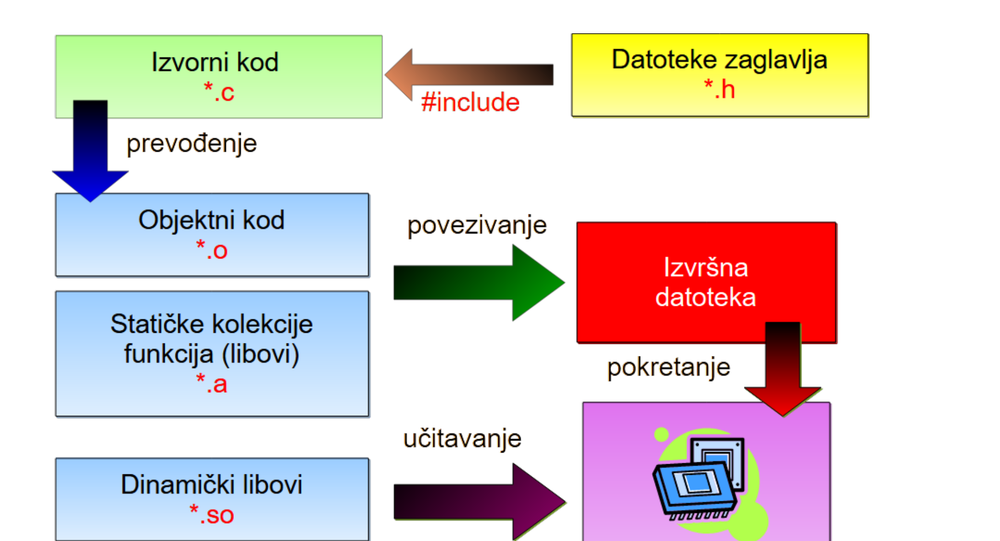

## Prošlo predavanje

\begin{beamercolorbox}[sep=1.5ex, rounded=false]{block body}
\begin{itemize}
\item Ljuska pokreće vanjske programe i vlastite ugrađene naredbe; \texttt{man}: pomoć za bilo koju UNIX naredbu (programe i ugrađene naredbe).
\item Tri standardna toka mogu se preusmjeriti u datoteke ili ulančati operatorom \texttt{|} --- programi se pritom ne mijenjaju.
\item Program je datoteka, proces je program u izvođenju; svaki proces ima PID, roditelja i vlasnika.
\item Procesi nastaju pozivom \texttt{fork()}, mijenjaju kôd pozivom \texttt{exec()} i završavaju pozivom \texttt{exit()}.
\item Signalima upravljamo procesima: \texttt{SIGTERM} pristojno, \texttt{SIGKILL} bezuvjetno.
\item Shell skripta je program: varijable, argumenti, grananje, petlje i izlazni status.
\end{itemize}
\end{beamercolorbox}

## Danas

1. **Od izvornog koda do izvršne datoteke** --- što se zapravo događa pri "buildu".
2. **GCC** --- prevodilac, njegove opcije i tipovi datoteka.
3. **Automatiziranje prevođenja i povezivanja** --- alat `make`.
4. **Biblioteke funkcija --- libovi** --- organizacija objektnog koda u arhive.

# Od izvornog koda do izvršne datoteke

## Prevodilački i interpreterski jezici

- **Prevodilački jezici** (C, C++, Fortran, Go): izvorni kôd se prije pokretanja pretvara u strojni kôd. Program se prevodi jednom, a izvršava mnogo puta i brzo.
- **Interpreterski jezici** (shell, Python): naredbe se analiziraju i izvršavaju **u trenutku izvođenja**. Nema zasebnog koraka prevođenja, ali je izvođenje sporije.
- Shell skripte s prošlog predavanja upravo su primjer interpreterskog pristupa --- prvi redak (*shebang*) određuje tko će ih tumačiti.
- Na ovom kolegiju bavimo se prevodilačkim postupkom za jezik **C**.

## Kako nastaje izvršna datoteka

- Pišemo **izvorni kôd** --- tekst razumljiv čovjeku. Procesor ga ne može izvršiti.
- Postupak dobivanja **izvršne datoteke** sastoji se od dva osnovna koraka i uključuje nekoliko tipova datoteka:
    - `.c` --- datoteke izvornog koda,
    - `.h` --- datoteke zaglavlja,
    - `.o` --- datoteke objektnog koda,
    - `.a`, `.so` --- arhive i biblioteke funkcija.
- Rezultat je izvršna datoteka koju možemo učitati u memoriju i pokrenuti.

## Prevođenje

**Prevođenje** (*compiling*) --- prevodilac analizira izvorni kôd i prevodi ga u objektni:

- postupak započinje obradom **predprocesorom**, koji kôd priprema za prevođenje --- dio toga je uključivanje datoteka zaglavlja (`.h`) u izvorni kôd,
- svaka datoteka izvornog koda prevodi se u **zasebnu** datoteku objektnog koda (`.o`),
- objektna datoteka sadrži strojni kôd te jedne prevodbene jedinice, ali još **nije izvršna**: pozivi funkcija definiranih drugdje ostaju nerazriješeni.

Prevođenje je **sporija** faza --- prevodilac obavlja sintaksnu analizu, provjere i optimizaciju.

## Povezivanje

**Povezivanje** (*linking*) --- objektne datoteke spajaju se u izvršnu datoteku:

- ulazne datoteke su objektne datoteke (`.o`) i arhive funkcija, tj. **statički libovi** (`.a`),
- povezivač razrješava reference: svaki poziv funkcije spaja s njezinom definicijom,
- u **točno jednoj** objektnoj datoteci mora biti definirana funkcija `main` --- ulazna točka programa.

Povezivanje je **brza** operacija. Prevođenje i povezivanje su **dva odvojena procesa**, iako ih `gcc` po potrebi obavlja jednim pozivom.

## Prevođenje i povezivanje

{width=95% height=68%}

## Prevođenje i povezivanje

Razdvajanje na dvije faze ima dvije važne koristi:

- **Objektne datoteke mogu se kombinirati** --- ista `funkcije.o` može završiti u više različitih programa.
- **Kad u jednoj `.c` datoteci promijenimo redak, dovoljno je iznova prevesti samo tu datoteku.** Ostale `.o` datoteke ostaju kakve jesu.

Povezivanje, međutim, treba ponoviti **uvijek** --- ono je obavezan zadnji korak nakon svake izmjene.

Upravo je taj uvid razlog postojanja alata `make`, kojim se bavimo u drugom dijelu predavanja.

## Integrirana razvojna okruženja

- **IDE** (*Integrated Development Environment*) automatski generira datoteku s pravilima za prevođenje i povezivanje; korisnik proces pokreće odabirom opcije *build*.
- Uz to nudi editor, *debugger*, alate za automatsko generiranje koda i izradu grafičkog sučelja.
- Popularni na UNIX sustavima: **Visual Studio Code** (besplatan, mnoštvo dodataka), **CLion** (komercijalan, za C i C++), **Eclipse CDT** (besplatan, otvorenog koda).

\vspace{1ex}
\hrule
\vspace{1.5ex}

**Kod IDE-a su ovi koraci skriveni --- svaki programer koji drži do sebe trebao bi ovladati osnovnim principima prevođenja i povezivanja, kako bi iskoristio punu snagu ovih alata, umjesto da ih promatra kao crnu kutiju.**

# GCC

## GCC --- GNU C i C++ prevodilac

- **GCC** je besplatan prevodilac otvorenog koda, dio GNU paketa prevodilaca.
- Obuhvaća prevodioce za **C**, **C++**, **Fortran**, **Adu**, **Go** i druge jezike, te libove potrebne za povezivanje.
- Objavljen pod licencom **GPL**, dostupan za velik broj platformi --- cilj mu je omogućiti razvoj prenosivog koda za različite arhitekture.
- Koristi se za **prevođenje i povezivanje** C i C++ izvornog koda.
- Uz njega ide i GNU povezivač **`ld`**; `gcc` ga poziva sam, pa ga rijetko koristimo izravno.

## Što je GNU?

- **GNU** (rekurzivni akronim: *GNU's Not UNIX*) --- projekt slobodnog softvera koji je **1983.** pokrenuo **Richard Stallman**, s ciljem stvaranja potpuno slobodnog UNIX-kompatibilnog operacijskog sustava.
- Iz projekta su nastali alati koje svakodnevno koristimo: `gcc`, `make`, `bash`, `gdb`, `emacs`, `coreutils` (`ls`, `cp`, `mv`, ...).
- Kad je 1991. objavljena Linux jezgra, prirodno se kombinirala s GNU alatima --- otuda naziv **GNU/Linux**.
- Iza projekta stoji **Free Software Foundation**, koja održava i licencu **GPL**.

## Sintaksa

```sh
gcc [opcije] ulazne_datoteke
```

- Bez opcije `-c`: `gcc` obavlja **prevođenje i povezivanje** --- rezultat je izvršna datoteka.
- S opcijom `-c`: `gcc` **staje nakon prevođenja** --- rezultat je objektna datoteka.

```sh
gcc -Wall pozdrav.c -o pozdrav     # prevodjenje + povezivanje
gcc -Wall -c pozdrav.c             # samo prevodjenje -> pozdrav.o
```

Detaljna uputa: `man gcc`.

## Osnovne opcije

| Opcija | Značenje |
|--------------|--------------------------------------------------|
| `-c` | samo prevođenje, bez povezivanja |
| `-o` *ime* | naziv izlazne datoteke |
| `-Wall` | prikaži sva upozorenja (*warning all*) |
| `-g` | generiraj informacije za *debugger* |
| `-O`*razina* | razina optimizacije (0--3) |
| `-I`*dir* | dodaj `dir` u popis direktorija sa zaglavljima |
| `-L`*dir* | dodaj `dir` u popis direktorija s arhivama |

## Izlazne datoteke

- Ako ime izlazne datoteke **nije** navedeno opcijom `-o`, izvršna datoteka zove se **`a.out`**.
- Uz opciju `-c` izlaz je objektna datoteka: iz `ime.c` nastaje **`ime.o`**.

```sh
gcc pozdrav.c              # -> a.out
gcc pozdrav.c -o pozdrav   # -> pozdrav
gcc -c pozdrav.c           # -> pozdrav.o
```

Ime `a.out` (*assembler output*) povijesni je ostatak iz ranih dana UNIX-a --- i danas iznenadi svakoga tko zaboravi `-o`.

## Ulazne datoteke

`gcc` prema ekstenziji zaključuje što treba učiniti s datotekom:

| Datoteka | Značenje |
|-----------------|-------------------------------------------------|
| `datoteka.c` | C izvorni kôd, predprocesira se |
| `datoteka.i` | C izvorni kôd koji se **ne** predprocesira |
| `datoteka.h` | C ili C++ zaglavlje, obrađuje se pri predprocesiranju |
| `datoteka.cc`, `.cpp`, `.cxx`, `.C` | C++ izvorni kôd |
| `datoteka.o` | objektni kôd, koristi se pri povezivanju |
| `datoteka.a` | arhiva objektnog koda (statički lib) |

Sve datoteke koje ne prepozna kao poznati ulazni tip `gcc` tretira kao **objektni kôd**.

## Primjer: pozdrav.c

```c
#include <stdio.h>

int main() {
    printf("Dobar jutar!\n");

    return 0;
}
```

Najmanji smisleni C program: `#include`, `main` i `printf`. Datoteka `pozdrav.c` nalazi se u repozitoriju skripte, poglavlje 2.

## Prevođenje u jednom koraku

```sh
$ gcc -Wall pozdrav.c -o pozdrav
```

- `-Wall` uključuje tipična upozorenja prevodioca --- **koristite ga uvijek**.
- `-o pozdrav` određuje ime izlazne izvršne datoteke.
- Bez `-o` rezultat bi se zvao `a.out`.

Ovaj jedan poziv obavlja **obje** faze: prevođenje i povezivanje. Za program u jednoj datoteci to je sasvim dovoljno.

## Prevođenje u dva koraka

```sh
$ gcc -Wall -c pozdrav.c           # prevodjenje: pozdrav.c -> pozdrav.o
$ gcc -Wall pozdrav.o -o pozdrav   # povezivanje: pozdrav.o -> pozdrav
```

- Prvi poziv staje nakon prevođenja jer je zadana opcija `-c`.
- Drugi poziv nema `.c` datoteka na ulazu --- samo povezuje objektni kôd.

Rezultat je **identičan** onome iz jednog koraka. Razdvajanje ima smisla tek kod programa iz više datoteka.

## Pokretanje programa

```sh
$ ./pozdrav
Dobar jutar!
```

- Zašto `./`? Ljuska program traži isključivo u direktorijima navedenima u varijabli okruženja **`PATH`**.
- Trenutni direktorij (`.`) **nije** u `PATH`-u, pa ga navodimo izričito --- `./pozdrav` znači "program `pozdrav` u ovom direktoriju".

```sh
$ echo $PATH
/usr/local/bin:/usr/bin:/bin:/home/dkrst/bin
```

- To nije nespretnost nego **sigurnosna mjera**: da je `.` u `PATH`-u, dovoljno bi bilo da netko u zajednički direktorij podmetne program imena `ls`.

## Zašto više datoteka

- U stvarnim programima organizacija koda u više datoteka gotovo je univerzalno pravilo.
- Primjer `pozdrav_fn` radi **isto** što i `pozdrav`, ali je razbijen u tri datoteke:
    - `funkcije.h` --- zaglavlje s **deklaracijom** funkcije,
    - `funkcije.c` --- **definicija** (implementacija) funkcije,
    - `pozdrav_fn.c` --- glavni program koji funkciju poziva.
- Zaglavlje se dijeli između jedinice koja funkciju poziva i one koja je definira; `.c` datoteke prevode se neovisno i tek se potom povezuju.

## funkcije.h

```c
#ifndef _FUNKCIJE_H_
#define _FUNKCIJE_H_

void dobar_jutar();

#endif
```

- `#include` doslovno "zalijepi" sadržaj datoteke na svoje mjesto, prije pravog prevođenja.
- Zato bi se zaglavlje uključeno više puta u istu jedinicu višestruko zalijepilo --- greška višestruke deklaracije.
- **Zaštita od višestrukog uključivanja** (*include guards*) --- par direktiva `#ifndef` / `#define` / `#endif` --- osigurava da se sadržaj ubaci samo prvi put.

## funkcije.c i pozdrav_fn.c

```c
/* funkcije.c */
#include <stdio.h>

void dobar_jutar() {
    printf("Dobar jutar!\n");
}
```

```c
/* pozdrav_fn.c */
#include "funkcije.h"

int main() {
    dobar_jutar();

    return 0;
}
```

Uočite: `<stdio.h>` u šiljastim zagradama traži se u sistemskim direktorijima, `"funkcije.h"` u navodnicima najprije u trenutnom.

## Prevođenje iz više datoteka

```sh
$ gcc -Wall -c pozdrav_fn.c                        # -> pozdrav_fn.o
$ gcc -Wall -c funkcije.c                          # -> funkcije.o
$ gcc -Wall pozdrav_fn.o funkcije.o -o pozdrav_fn
```

- Svaka `.c` datoteka prevodi se **zasebno** u pripadnu `.o`.
- Zadnji poziv nema `.c` datoteka --- samo povezuje dvije objektne datoteke u izvršni program.
- Tek se ovdje jasno vidi razlika između dviju faza.

## Što nakon izmjene koda?

Pretpostavimo da smo promijenili samo `funkcije.c`:

```sh
$ gcc -Wall -c funkcije.c                          # nuzno: nova funkcije.o
$ gcc -Wall pozdrav_fn.o funkcije.o -o pozdrav_fn  # nuzno: novo povezivanje
```

- `pozdrav_fn.c` **nije** dirana, pa `pozdrav_fn.o` ostaje valjana --- nema je potrebe ponovno prevoditi.
- Povezivanje se **uvijek** mora ponoviti.

U projektu od nekoliko datoteka ručno pratiti što treba, a što ne treba iznova prevesti brzo postaje naporno i podložno greškama.

# Automatiziranje prevođenja i povezivanja

## make alat (utility)

- `make` automatizira prevođenje i povezivanje. Iz datoteke s pravilima --- **`Makefile`** --- čita:
    - koje datoteke čine projekt,
    - kako ovise jedna o drugoj,
    - kojim se naredbama iz njih generiraju izlazne datoteke.
- Na temelju **vremena zadnje izmjene** sam odlučuje što je zastarjelo i izvodi **samo nužne korake**.

```sh
$ make              # izvrsava prvo pravilo u Makefileu
$ make ime_pravila  # izvrsava navedeno pravilo
```

Potpuna referenca: *GNU Make Manual* (Stallman, McGrath & Smith), besplatno dostupan na stranicama GNU projekta.

## Struktura pravila

```make
cilj: ovisnosti
	naredbe
```

- **cilj** --- najčešće ime datoteke koja nastaje izvršavanjem pravila (izvršna ili objektna datoteka),
- **ovisnosti** --- popis datoteka o kojima cilj ovisi; ako je bilo koja **novija** od cilja, pravilo se izvršava,
- **naredbe** --- naredbe ljuske koje pravilo izvršava.

\vspace{1ex}
\hrule
\vspace{1.5ex}

**Naredbe moraju biti uvučene tabulatorom, nikako razmacima. To je najčešća greška početnika s `make`-om.**

## Korak 1: jednostavna pravila

```make
pozdrav: pozdrav.o
	gcc -Wall pozdrav.o -o pozdrav

pozdrav.o: pozdrav.c
	gcc -Wall -c pozdrav.c

pozdrav_fn: pozdrav_fn.o funkcije.o
	gcc -Wall pozdrav_fn.o funkcije.o -o pozdrav_fn

pozdrav_fn.o: pozdrav_fn.c
	gcc -Wall -c pozdrav_fn.c

funkcije.o: funkcije.c
	gcc -Wall -c funkcije.c
```

## Kako make bira što izvršiti

Na `make pozdrav_fn`:

1. `make` traži pravilo čiji je cilj `pozdrav_fn`; ono ovisi o `pozdrav_fn.o` i `funkcije.o`.
2. Te datoteke ne postoje, pa `make` traži pravila u kojima su **one** ciljevi i izvršava ih.
3. Tek na kraju izvršava pravilo za `pozdrav_fn`.

Ako objektna datoteka **već postoji**, `make` uspoređuje vremena:

- izvorna datoteka novija od objektne $\rightarrow$ pravilo se izvršava iznova,
- objektna novija od izvorne $\rightarrow$ korak se **preskače**.

Tako `make` rekurzivno provjerava cijelo stablo ovisnosti i radi samo ono što je nužno.

## Dva problema

Prethodni `Makefile` je funkcionalan, ali:

- **(a)** pravila za `.o` datoteke praktički su identična --- razlikuju se samo po imenu datoteke,
- **(b)** naredba `gcc -Wall` ponavlja se u svakom pravilu, pa promjena prevodioca ili zastavica traži izmjenu na više mjesta.

Rješenja su **implicitna pravila** i **varijable**.

## Implicitna pravila

Postupak `.c` $\rightarrow$ `.o` uvijek je isti, pa ga možemo zapisati jednim pravilom po uzorku ekstenzije:

```make
.c.o:
	gcc -Wall -c $<
```

- `$<` --- **automatska varijabla**, zamjenjuje se imenom ulazne datoteke (ovisnosti).
- `$@` --- ime cilja.

Time otpadaju sva pojedinačna `.c` $\rightarrow$ `.o` pravila --- ostaju samo dva pravila za povezivanje i ovo jedno implicitno.

## Varijable

```make
CC = /usr/bin/gcc
CFLAGS = -Wall
LDFLAGS =

pozdrav: pozdrav.o
	$(CC) $(LDFLAGS) pozdrav.o -o pozdrav

pozdrav_fn: pozdrav_fn.o funkcije.o
	$(CC) $(LDFLAGS) pozdrav_fn.o funkcije.o -o pozdrav_fn

.c.o:
	$(CC) $(CFLAGS) -c $<
```

- Varijabla se deklarira imenom, znakom `=` i tekstualnom vrijednošću; dohvaća se kao `$(IME)`.
- GNU konvencija: zastavice za **prevođenje** u `CFLAGS`, zastavice za **povezivanje** u `LDFLAGS`.
- Promjena prevodioca sada je izmjena **jednog retka**.

## Pravila bez naredbi: default i all

```make
TARGETS = pozdrav pozdrav_fn

default: pozdrav_fn

all: $(TARGETS)
```

- Oba pravila imaju cilj i ovisnosti, ali **nemaju naredbi**. `make` razriješi ovisnosti, a samo pravilo ne radi ništa --- služi kao **preusmjeravanje** na korisno pravilo.
- `make` bez argumenata izvršava **prvo** pravilo u datoteci, kako god se zvalo. Po konvenciji se zove `default` i stavlja na vrh.
- `all` istim trikom gradi sve ciljeve odjednom.

Imena `default`, `all` i `clean` **nisu rezervirane riječi** --- to je dogovorna konvencija radi čitljivosti.

## Pravilo bez ovisnosti: clean

```make
clean:
	rm -f $(TARGETS) *.o *~ a.out
```

- Ovdje je obrnuto: pravilo ima cilj i naredbe, ali **nema ovisnosti**.
- Nema čega usporediti po vremenu izmjene, pa se pravilo izvršava **bezuvjetno** --- svaki put kad korisnik upiše `make clean`.
- Briše izvršne, objektne i privremene datoteke, tj. sve što se može ponovno izgraditi iz izvornog koda.

Zato u sustave za verzioniranje spremamo izvorni kôd i `Makefile`, a ne rezultate gradnje.

## Konačni Makefile

```make
CC = /usr/bin/gcc
CFLAGS = -Wall
LDFLAGS =
TARGETS = pozdrav pozdrav_fn

default: pozdrav_fn
all: $(TARGETS)

pozdrav: pozdrav.o
	$(CC) $(LDFLAGS) pozdrav.o -o pozdrav
pozdrav_fn: pozdrav_fn.o funkcije.o
	$(CC) $(LDFLAGS) pozdrav_fn.o funkcije.o -o pozdrav_fn

clean:
	rm -f $(TARGETS) *.o *~ a.out
.c.o:
	$(CC) $(CFLAGS) -c $<
```

## Tipična uporaba

```sh
$ make              # izvrsava "default", tj. gradi pozdrav_fn
$ make all          # gradi oba primjera
$ make pozdrav      # gradi samo pozdrav
$ make clean        # brise izvrsne i objektne datoteke
```

Uvijek isti obrazac: izmijenimo kôd, upišemo `make`, a alat sam odluči što treba iznova prevesti.

# Biblioteke funkcija --- libovi

## Arhive objektnih datoteka

- Kako program raste, izvorni kôd se dijeli u sve više datoteka. Kod desetaka ili stotina `.o` datoteka rukovanje svakom pojedinom postaje nepregledno.
- Rješenje su **arhive objektnih datoteka**, u UNIX terminologiji **libovi**: jedna datoteka u koju je upakirano više objektnih datoteka, organiziranih po tematskom kriteriju.
- Najpoznatiji primjer je standardna C biblioteka **`libc`** --- `printf`, `fopen`, `malloc` i ostalo.

## Statičke i dinamičke biblioteke

| | Statičke (`.a`) | Dinamičke (`.so`) |
|---|---|---|
| Povezivanje | pri prevođenju, kôd se kopira u program | pri pokretanju, program nosi samo referencu |
| Veličina programa | veća | manja |
| Ovisnost o sustavu | nikakva, program je samostalan | lib mora postojati pri pokretanju |
| Više procesa | svaki ima svoju kopiju | svi dijele isti lib u memoriji |

U ovom se poglavlju zadržavamo na **statičkim** bibliotekama.

## Korištenje tuđih libova

Prvi način --- putanja do `.a` datoteke, kao da je objektna datoteka:

```sh
$ gcc -Wall prog.o /putanja/do/libjpeg.a -o izvrsna
```

Drugi, češći --- opcija `-l<ime>`, uz `-L<putanja>` ako lib nije u standardnom direktoriju:

```sh
$ gcc -Wall -L/putanja prog.o -ljpeg -o izvrsna
```

Uočite konvenciju: na disku je `libjpeg.a`, u naredbi `-ljpeg` --- bez prefiksa `lib` i bez ekstenzije.

## Redoslijed je važan

- `gcc` datoteke analizira **redoslijedom kojim su navedene** i pritom gradi popis nedostajućih funkcija.
- Te funkcije zatim traži u libovima koji u naredbenom retku **slijede**.
- Ako je arhiva navedena **prije** objektne datoteke koja koristi njezine funkcije, taj kôd neće biti izdvojen i povezivanje će javiti grešku.

\vspace{1ex}
\hrule
\vspace{1.5ex}

**Arhive stavljajte na kraj naredbe za povezivanje. Ako jedan lib koristi funkcije drugoga, onaj "više razine" mora doći prije onoga o kojem ovisi.**

## Alat ar

```sh
ar [-opcije] arhiva [ulazne_datoteke]
```

| Opcija | Značenje |
|---|---|
| `r` | dodaj novu ili zamijeni postojeću datoteku u arhivi |
| `d` | obriši člana iz arhive |
| `x` | izdvoji člana iz arhive |
| `t` | ispiši popis članova arhive |
| `v` | ispis dodatnih informacija (*verbose*) |

Detaljna uputa: `man ar`.

## Primjer: vlastita arhiva

```sh
$ gcc -Wall -c nizfn.c          # objektni kod nasih funkcija
$ ar -r libniz.a nizfn.o        # arhiva libniz.a
$ ar -t libniz.a                # provjera sadrzaja
nizfn.o
```

Tri ekvivalentna načina povezivanja:

```sh
$ gcc -Wall niz.o nizfn.o -o niz1     # izravno s objektnom datotekom
$ gcc -Wall niz.o libniz.a -o niz2    # eksplicitno s arhivom
$ gcc -Wall -L. niz.o -lniz -o niz3   # preko -L i -l opcija
```

Sve tri izvršne datoteke su **identične** --- provjerite alatom `diff`.

## Zašto vlastiti libovi

- Ako iste funkcije koristimo u više projekata, arhiviranjem ih **sistematiziramo**: umjesto mnoštva objektnih datoteka koristimo jednu tematsku arhivu.
- Najlošija je praksa **kopirati izvorni kôd** u svaki novi projekt --- vrlo se lako izgubiti među verzijama i izmjenama.
- Lib se lako uključi u `Makefile` kao još jedan cilj, pa se gradi automatski kao i sve ostalo.

## Što smo naučili

\begin{beamercolorbox}[sep=1.5ex, rounded=false]{block body}
\begin{itemize}
\item Izvršna datoteka nastaje u dva odvojena koraka: \textbf{prevođenje} (\texttt{.c} $\rightarrow$ \texttt{.o}) i \textbf{povezivanje} (\texttt{.o} $\rightarrow$ program).
\item \texttt{gcc} bez \texttt{-c} radi oboje; s \texttt{-c} staje nakon prevođenja. Bez \texttt{-o} izlaz se zove \texttt{a.out}.
\item Program se pokreće s \texttt{./ime}, jer trenutni direktorij nije u \texttt{PATH}-u.
\item Nakon izmjene iznova se prevodi samo promijenjena datoteka, ali se povezivanje ponavlja uvijek.
\item \texttt{make} iz pravila i vremena izmjene sam zaključuje koje korake treba izvesti.
\item Pravilo bez naredbi preusmjerava; pravilo bez ovisnosti izvršava se bezuvjetno.
\item Objektne datoteke pakiraju se u arhive alatom \texttt{ar}; povezuju se preko \texttt{-L} i \texttt{-l}.
\end{itemize}
\end{beamercolorbox}

## Sljedeće predavanje

**Ulazno/izlazne operacije**

- deskriptori datoteka,
- sistemski pozivi `open`, `read`, `write`, `close`,
- pozicioniranje unutar datoteke i `lseek`,
- razlika između sistemskih poziva i funkcija C biblioteke.

Do tada: prevedite oba primjera iz poglavlja 2 ručno, pa napišite vlastiti `Makefile` za njih.
