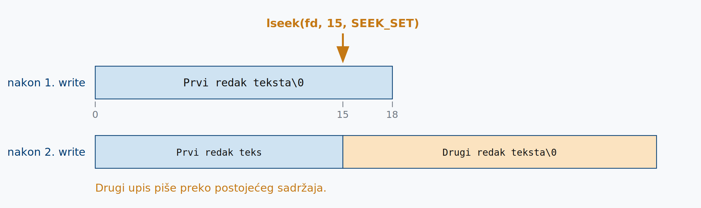
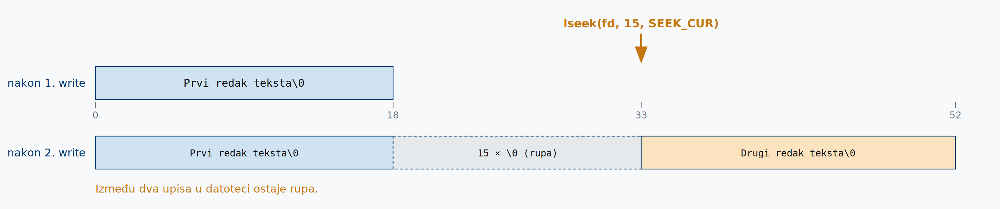

## Prošlo predavanje

\begin{beamercolorbox}[sep=1.5ex, rounded=false]{block body}
\begin{itemize}
\item Izvršna datoteka nastaje u dva odvojena koraka: \textbf{prevođenje} (\texttt{.c} $\rightarrow$ \texttt{.o}) i \textbf{povezivanje} (\texttt{.o} $\rightarrow$ program).
\item \texttt{gcc} bez \texttt{-c} radi oboje; s \texttt{-c} staje nakon prevođenja. Bez \texttt{-o} izlaz se zove \texttt{a.out}.
\item Program se pokreće s \texttt{./ime}, jer trenutni direktorij nije u \texttt{PATH}-u.
\item Nakon izmjene iznova se prevodi samo promijenjena datoteka, ali se povezivanje ponavlja uvijek.
\item \texttt{make} iz pravila i vremena izmjene sam zaključuje koje korake treba izvesti.
\item Pravilo bez naredbi preusmjerava; pravilo bez ovisnosti izvršava se bezuvjetno.
\item Objektne datoteke pakiraju se u arhive alatom \texttt{ar}; povezuju se preko \texttt{-L} i \texttt{-l}.
\end{itemize}
\end{beamercolorbox}

## Danas

1. **Deskriptori datoteka** --- kako proces referencira otvorene datoteke.
2. **Sistemski pozivi** --- `open`, `creat`, `close`, `read`, `write`, uz primjere.
3. **Pozicioniranje i prava** --- `lseek` i `umask`.

# Deskriptori datoteka

## Deskriptor datoteke

- **Deskriptor** ili opisnik datoteke (*file descriptor*) nenegativni je cijeli broj koji jedinstveno identificira otvorenu datoteku i služi za komunikaciju s njom.
- Dodjeljuje ga **jezgra**, procesu koji je zatražio otvaranje datoteke. Proces ga koristi za sve daljnje operacije, pri čemu **ne mora nužno znati gdje se datoteka nalazi ni kojeg je tipa**.
- Proces dodjele:
    1. Jezgra kao deskriptor uzima **prvi slobodan**, najniži mogući nenegativni broj.
    2. U svoju tablicu upisuje podatke o datoteci: pristupna prava, pokazivač na podatke i stanje.
    3. Jezgra procesu vraća deskriptor (broj) na kojem je datoteka otvorena; program ga koristi za sve buduće operacije nad datotekom.
    4. Kad se datoteka zatvori, deskriptor se oslobađa i može biti pridijeljen novoj datoteci koju proces otvori.

## Deskriptor datoteke

Na UNIX sustavu u pravilu su prilikom pokretanja procesa otvorena tri standardna deskriptora:

- **0** --- standardni ulaz (*standard input*), za unos podataka u program; obično tipkovnica,
- **1** --- standardni izlaz (*standard output*), za ispis podataka iz programa; obično zaslon,
- **2** --- standardni izlaz za greške (*standard error*), za poruke o greškama; također zaslon.

Ova tri deskriptora ključna su za komunikaciju UNIX procesa (pokrenutog programa) s vanjskim svijetom.

## Deskriptor datoteke

- Konvencija deskriptora 0, 1 i 2 datira iz UNIX sustava **1970-ih**, a danas je dio **POSIX standarda**.
- Simboličke konstante `STDIN_FILENO`, `STDOUT_FILENO` i `STDERR_FILENO` definirane su u zaglavlju `<unistd.h>` --- koristite njih umjesto golih brojeva 0, 1 i 2, kôd time postaje čitljiviji.
- Pri otvaranju datoteke (sistemski poziv `open`), jezgra procesu vraća **najniži slobodni** deskriptor datoteke --- prvi `open` u pravilu vraća **3**.

# Sistemski pozivi

## open()

Otvara postojeću ili stvara novu datoteku.

<!-- deklaracija -->

```c
#include <sys/types.h>
#include <sys/stat.h>
#include <fcntl.h>

int open(const char *pathname, int oflag, /* mode_t mode */);
```

- **Povratna vrijednost**: deskriptor otvorene datoteke, ili `-1` u slučaju greške.
- **`pathname`** --- putanja do datoteke,
- **`oflag`** --- kombinacija bitovnih konstanti koja određuje način otvaranja,
- **`mode`** --- prava pristupa, navodi se samo pri kreiranju nove datoteke.

## oflag: način pristupa datoteci

Vrijednost argumenta `oflag` dobiva se kombinacijom bitovnog (*bitwise*) **OR**-a konstanti definiranih u zaglavlju `<fcntl.h>`.

Mora sadržavati **točno jednu** od tri konstante:

- `O_RDONLY` --- otvori samo za čitanje,
- `O_WRONLY` --- otvori samo za pisanje,
- `O_RDWR` --- otvori za čitanje i pisanje.

\vspace{2ex}

Uključivanjem dodatnih konstanti, uz jednu od tri navedene, fino se podešava način otvaranja datoteke.

## oflag: način pristupa datoteci

- `O_CREAT` --- stvori datoteku ako ne postoji; uz ovu zastavicu obavezan je treći argument (`mode`) kojim se zadaju prava pristupa.
- `O_TRUNC` --- ako je datoteka otvorena za pisanje, obriši njezin sadržaj (duljina postaje 0).
- `O_APPEND` --- prije **svakog** pisanja pomakni offset na kraj datoteke, bez obzira na njegovu trenutnu vrijednost.
- `O_EXCL` --- u kombinaciji s `O_CREAT`: vrati grešku ako datoteka već postoji. Provjera postojanja i stvaranje izvode se kao **atomska operacija** --- jezgra jamči da ih nijedan drugi proces ne može prekinuti na pola.
- `O_NONBLOCK` --- neblokirajući način rada: ako operacija ne može odmah započeti, poziv se odmah vraća umjesto da čeka.
- `O_SYNC` --- čekaj da se svaka operacija pisanja fizički dovrši na disku.

## Tipične kombinacije

```c
O_WRONLY | O_TRUNC             /* obrisi postojeci sadrzaj        */
O_WRONLY | O_CREAT             /* stvori novu datoteku ako ne postoji */
O_WRONLY | O_CREAT | O_TRUNC   /* stvori novu, ako postoji obrisi
                                  postojeci sadrzaj               */
O_WRONLY | O_CREAT | O_EXCL    /* stvori novu, vrati gresku ako
                                  vec postoji                     */
O_WRONLY | O_APPEND            /* svako pisanje ide na kraj datoteke */
O_RDWR   | O_CREAT             /* otvori za citanje i pisanje,
                                  stvori novu ako ne postoji      */
O_RDONLY | O_NONBLOCK          /* citanje bez cekanja: open se odmah
                                  vraca i kad drugi kraj (FIFO,
                                  uredjaj) jos nije spreman       */
```

\vspace{1ex}

Zastavica `O_NONBLOCK` smislena je i uz `O_RDONLY` i uz `O_WRONLY` --- otvaranje FIFO-a inače čeka dok netko ne otvori drugi kraj.

## mode: prava pristupa datoteci

| Konstanta | Oktalno | Značenje |
|-----------|--------|-----------------------------|
| `S_IRUSR` | `0400` | čitanje za vlasnika |
| `S_IWUSR` | `0200` | pisanje za vlasnika |
| `S_IXUSR` | `0100` | izvršavanje za vlasnika |
| `S_IRGRP` | `0040` | čitanje za grupu |
| `S_IWGRP` | `0020` | pisanje za grupu |
| `S_IXGRP` | `0010` | izvršavanje za grupu |
| `S_IROTH` | `0004` | čitanje za ostale |
| `S_IWOTH` | `0002` | pisanje za ostale |
| `S_IXOTH` | `0001` | izvršavanje za ostale |

Prava se zadaju bitovnim OR-om konstanti iz `<sys/stat.h>` ili izravno oktalnim brojem: `S_IRUSR | S_IWUSR | S_IRGRP | S_IROTH` isto je što i `0644`.

## creat()

<!-- deklaracija -->

```c
#include <sys/types.h>
#include <sys/stat.h>
#include <fcntl.h>
int creat(const char *pathname, mode_t mode);
```

Stvaranje nove datoteke --- ekvivalentno pozivu:

```c
open(pathname, O_WRONLY | O_CREAT | O_TRUNC, mode);
```

- **Povratna vrijednost**: deskriptor otvorene datoteke, ili `-1` u slučaju greške.
- Datoteka se otvara **samo za pisanje**, a postojeći sadržaj se briše.

\vspace{1ex}

Upitan što bi promijenio u UNIX-u, **Ken Thompson** je odgovorio: *"I'd spell creat with an e."*

## close()

<!-- deklaracija -->

```c
#include <unistd.h>

int close(int filedes);
```

- Zatvara datoteku otvorenu na deskriptoru `filedes` i oslobađa deskriptor za ponovnu upotrebu.
- Vraća `0` u slučaju uspjeha, `-1` u slučaju greške.
- Kad proces završi, sve otvorene datoteke zatvaraju se **automatski**, pa eksplicitni poziv nije strogo nužan.
- Ipak ga koristite: broj deskriptora po procesu je ograničen, a kod nekih tipova datoteka (npr. socketa) zatvaranje pokreće važne završne operacije.

## read()

<!-- deklaracija -->

```c
#include <unistd.h>

ssize_t read(int filedes, void *buff, size_t nbytes);
```

- **Povratna vrijednost**: broj stvarno pročitanih bajtova, `0` na kraju datoteke (*EOF*), `-1` u slučaju greške.
- **`buff`** --- pokazivač na memoriju u koju se upisuje. `read()` **ne alocira** memoriju; to je posao programera.
- **`nbytes`** --- najviše koliko bajtova pokušati pročitati.
- Čitanje kreće od trenutnog **file offseta**, koji je nakon otvaranja `0` i pomiče se nakon svakog čitanja.
- Pročitano može biti **manje** od traženog: kraj datoteke, čitanje s terminala ili s mrežnog socketa.

## write()

<!-- deklaracija -->

```c
#include <unistd.h>

ssize_t write(int filedes, const void *buff, size_t nbytes);
```

- **Povratna vrijednost**: broj stvarno upisanih bajtova, ili `-1` u slučaju greške.
- Povratna vrijednost može biti **manja** od `nbytes` --- pisanje u pravilu treba realizirati u petlji.
- Pisanje kreće od trenutnog offseta, koji se nakon upisa pomiče.
- Iznimka je `O_APPEND`: tada jezgra prije svakog pisanja postavlja offset na kraj datoteke.

`ssize_t` (*signed size*) POSIX-ov je ekvivalent tipa `size_t` koji može biti negativan --- upravo zato da funkcija može vratiti `-1`.

## read_file.c

```c
int main() {
    int n, fd;
    char s;

    fd = open("moja_datoteka.txt", O_RDONLY);
    if (fd == -1) {
        perror("open");
        return 1;
    }

    while ((n = read(fd, &s, 1)) > 0)
        write(STDOUT_FILENO, &s, 1);

    close(fd);
    return 0;
}
```

## read_file.c

- Otvara datoteku samo za čitanje, čita je **znak po znak** i svaki znak ispisuje na standardni izlaz.
- Ilustrira osnovni slijed rada s datotekom: `open` $\rightarrow$ `read` / `write` $\rightarrow$ `close`.
- Uočite `STDOUT_FILENO` --- pišemo na deskriptor 1, isti onaj koji smo prošli put preusmjeravali operatorom `>`.
- Petlja završava kad `read()` vrati `0`, dakle na kraju datoteke.

\vspace{2ex}

Nedostatak: jedan sistemski poziv po znaku. Za datoteku od megabajta to je dva milijuna prijelaza u jezgru.

## perror()

<!-- deklaracija -->

```c
#include <stdio.h>

void perror(const char *s);
```

- Sistemski pozivi grešku signaliziraju povratnom vrijednošću `-1`, a **razlog** upisuju u globalnu varijablu `errno`.
- `perror("open")` ispisuje na `stderr` zadani tekst i tekstualni opis zadnje greške.

```c
fd = open("moja_datoteka.txt", O_RDONLY);
if (fd == -1) {
    perror("open");
    return 1;
}
```

Povratnu vrijednost provjeravajte **uvijek**. Program koji nastavi raditi s deskriptorom `-1` ponaša se nepredvidivo.

## perror()

```c
fd = open("nepostojeca.txt", O_RDONLY);
if (fd == -1) {
    perror("open nepostojeca.txt");
    return 1;
}
```

Ispis programa:

```
$ ./primjer
open nepostojeca.txt: No such file or directory
```

- Tekst zadan kao **argument** služi programeru da locira grešku --- pokazuje **gdje** je u programu nastala.
- Tekst koji se ispisuje **iza dvotočke** služi za otkrivanje razloga greške; generira ga sustav na temelju vrijednosti varijable `errno`.

## io_copy.c

```c
#define BUFFSIZE 1024

int main() {
    int n;
    char buf[BUFFSIZE];

    while ((n = read(STDIN_FILENO, buf, BUFFSIZE)) > 0)
        if (write(STDOUT_FILENO, buf, n) != n) {
            perror("write");
            return 1;
        }

    if (n < 0)
        perror("read");

    return 0;
}
```

## io_copy.c --- što program radi

- Kopira standardni ulaz na standardni izlaz, čitajući u **međuspremnik** veličine `BUFFSIZE`.
- Time se broj sistemskih poziva smanjuje višestruko u odnosu na čitanje znak po znak.
- Uočite da se u `write()` prosljeđuje `n`, a **ne** `BUFFSIZE`: broj pročitanih znakova gotovo nikad neće biti jednak 1024.
- Primjer je ujedno ilustracija načela "sve je datoteka": bez preusmjeravanja ulaz je tipkovnica, izlaz terminal, a kôd je isti kao za datoteke na disku.

```
$ ./io_copy
Prvi red teksta
Prvi red teksta
^D
```

## io_copy.c uz preusmjeravanje

```
$ ./io_copy > datoteka.txt
Prvi red teksta
Drugi red teksta
^D
$ cat datoteka.txt
Prvi red teksta
Drugi red teksta
```

- Isti program, bez ijedne izmjene u kodu, postaje jednostavan alat za upis teksta u datoteku.
- Program ne zna da je preusmjeren --- za njega je to i dalje deskriptor 1.
- `Ctrl+D` je oznaka kraja ulaza (EOF): `read()` vrati `0` i petlja završava.

## Argumenti naredbenog retka

- Dosadašnji primjeri imaju ime datoteke **ugrađeno u izvorni kôd**. Za svaku drugu datoteku trebalo bi mijenjati kôd i iznova prevoditi.
- Rješenje su **argumenti naredbenog retka** --- tokeni koje korisnik upiše iza imena naredbe, a ljuska ih prosljeđuje programu (`cp izvor.txt cilj.txt`).

```c
int main(int argc, char *argv[])
```

- `argc` --- broj argumenata, **uključujući ime programa**,
- `argv[0]` --- ime kojim je program pokrenut, `argv[1]` nadalje --- stvarni argumenti.

## f_write.c

```c
int main(int argc, char *argv[]) {
    int fd, n; char s;

    if (argc != 2) {
        printf("koristenje: %s <ime_datoteke>\n", argv[0]);
        return 0;
    }

    /* Obavezno provjeriti povratnu vrijednost */
    fd = creat(argv[1], S_IRUSR | S_IWUSR | S_IRGRP | S_IROTH);

    while ((n = read(STDIN_FILENO, &s, 1)) > 0)
        write(fd, &s, 1);

    close(fd);
    return 0;
}
```

## f_write.c --- provjera argumenata

- Provjera `argc != 2` na samom početku uobičajen je uzorak u svim UNIX programima.
- U poruci se koristi `argv[0]`, pa uputa uvijek prikazuje **stvarno ime** pod kojim je program pozvan --- i ako je preimenovan ili pozvan preko simboličke veze.

```
$ ./f_write izlaz.txt
Prvi red teksta
^D
$ cat izlaz.txt
Prvi red teksta
```

## f_write.c --- prava pristupa i #define

Prava se mogu izdvojiti u **predprocesorsku direktivu**:

```c
#define FMODE S_IRUSR | S_IWUSR | S_IRGRP | S_IROTH

    fd = creat(argv[1], FMODE);
```

umjesto da se pišu izravno u pozivu:

```c
    fd = creat(argv[1], S_IRUSR | S_IWUSR | S_IRGRP | S_IROTH);
```

- Predprocesor prije prevođenja svako pojavljivanje imena `FMODE` zamijeni zadanim tekstom --- poziv je time kraći i čitljiviji.
- Ako program stvara više datoteka, prava se mijenjaju na **jednom mjestu**, umjesto u svakom pozivu posebno.

# Pozicioniranje i prava

## lseek()

<!-- deklaracija -->

```c
#include <sys/types.h>
#include <unistd.h>

off_t lseek(int filedes, off_t offset, int whence);
```

- Mijenja **file offset** otvorene datoteke; koristimo ga kad želimo čitati ili pisati na određenoj poziciji bez sekvencijalnog prolaska.
- **Povratna vrijednost**: novi offset od početka datoteke, ili `(off_t)-1` u slučaju greške.
- **`whence`** --- referentna točka:
    - `SEEK_SET` --- od početka datoteke,
    - `SEEK_CUR` --- od trenutnog offseta,
    - `SEEK_END` --- od kraja datoteke (pomak može biti i negativan).

Pomicanje je samo **logičko**, na razini jezgrinog offseta. Disk se dira tek pri sljedećem `read()`-u ili `write()`-u.

## f_strip.c

```c
int main() {
    char buf1[] = "Prvi redak teksta";
    char buf2[] = "Drugi redak teksta";
    int fd;

    fd = open("file.strip", O_WRONLY | O_CREAT | O_TRUNC, (mode_t)0644);
    if (fd == -1) {
        perror("open");
        return 1;
    }
    write(fd, buf1, strlen(buf1)+1);
    lseek(fd, 15, SEEK_SET);
    write(fd, buf2, strlen(buf2)+1);
    close(fd);
    exit(0);
}
```


## f_strip.c

{width=100%}

## f_strip.c --- rezultat

```
$ ./f_strip
$ cat file.strip
Prvi redak teksDrugi redak teksta
```

- Prvih 15 bajtova (`Prvi redak teks`) ostalo je iz prvog upisa.
- Od 15. bajta nadalje drugi upis je **prepisao** postojeći sadržaj.
- Offset koji jezgra pamti nema veze s fizičkim rasporedom blokova na disku --- pozicioniranje se slobodno kombinira s čitanjem i pisanjem.

## f_hole.c

Isti primjer, ali s pomakom u odnosu na **trenutnu** poziciju:

```c
    fd = creat("file.hole", (mode_t)0644);
    write(fd, buf1, strlen(buf1)+1);
    lseek(fd, 15, SEEK_CUR);
    write(fd, buf2, strlen(buf2)+1);
    close(fd);
```

- Nakon prvog upisa offset je na kraju upisanog teksta (18), pa ga `SEEK_CUR` pomiče na 33.
- Preskočeni dio nije upisan --- u datoteci nastaje **rupa** (*hole*).
- Pri čitanju jezgra na tim mjestima vraća nul-bajtove, ali oni **ne zauzimaju prostor na disku**. Takve datoteke nazivamo *sparse files*.

## f_hole.c

{width=100%}

## umask()

- Prava koja tražimo argumentom `mode` **nisu nužno ona koja ćemo dobiti**.
- Svaki proces ima **masku kreiranja datoteka** (`umask`) --- bitove koji se iz traženih prava **uklanjaju**.

<!-- deklaracija -->

```c
#include <sys/types.h>
#include <sys/stat.h>

mode_t umask(mode_t cmask);
```

- Rezultantna prava su `mode & ~cmask`. Poziv vraća **prethodnu** vrijednost maske.
- Maska se nasljeđuje od roditeljskog procesa; tipična vrijednost u ljusci je `0022` --- oduzima pravo pisanja grupi i ostalima.

## umask()

```c
#define PRAVA S_IRUSR | S_IWUSR | S_IRGRP | S_IWGRP | S_IROTH

int main() {
    umask(0);
    if (creat("datoteka1", PRAVA) < 0)
        perror("creat datoteka1");

    umask(S_IRGRP | S_IWGRP | S_IROTH | S_IWOTH);
    if (creat("datoteka2", PRAVA) < 0)
        perror("creat datoteka2");

    return 0;
}
```

Dvije datoteke, **ista** zatražena prava (`rw-rw-r--`), različite maske.

## perm_mask.c --- rezultat

```
$ ./perm_mask
$ ls -al datoteka1 datoteka2
-rw-rw-r-- 1 dkrst users 0 Jan 16 16:23 datoteka1
-rw------- 1 dkrst users 0 Jan 16 16:23 datoteka2
```

- `datoteka1` --- maska je `0`, pa su zadržana sva zatražena prava.
- `datoteka2` --- maska isključuje prava grupi i ostalima, iako ih je program tražio.

\vspace{2ex}

Isto vrijedi i za datoteke koje stvarate u ljusci: naredba `umask` bez argumenta ispisuje trenutnu vrijednost maske.

## Sistemski pozivi i C biblioteka

- Kroz cijelo poglavlje koristili smo **isključivo sistemske pozive**. To ne znači da je takav pristup jedini ispravan, ni da je uvijek najpraktičniji.
- `write()` je jednostavan i izravan --- upisuje točno zadani broj bajtova iz međuspremnika:

```c
write(STDOUT_FILENO, "Pozdrav!!", 9);
```

- Za ispis vrijednosti varijable zajedno s tekstom morali bismo sami formatirati niz znakova: analizirati broj znamenaka, decimala, dodati kontrolne sekvence. `printf()` sve to rješava jednim pozivom:

```c
printf("Rezultat: %d (hex: 0x%x)\n", vrijednost, vrijednost);
```

## Sistemski pozivi i C biblioteka

- Funkcije C biblioteke u pozadini se oslanjaju upravo na sistemske pozive --- one su **praktičan i prenosiv sloj** iznad njih.
- Uz to koriste vlastiti **međuspremnik** (*buffering*): umjesto poziva `write()` za svaki znak, podaci se akumuliraju i šalju u jednom bloku. Isti razlog zbog kojeg je `io_copy` brži od čitanja znak po znak.
- **Nisu konkurenti, nego se nadopunjuju:**
    - sistemski pozivi daju **kontrolu** i uvid u rad operacijskog sustava,
    - funkcije biblioteke daju **produktivnost** i prenosivost.

\vspace{2ex}

Iskusan UNIX programer zna kada koristiti koje.

## Što smo naučili

\begin{beamercolorbox}[sep=1.5ex, rounded=false]{block body}
\begin{itemize}
\item \textbf{Deskriptor} je nenegativan cijeli broj kojim proces referencira otvorenu datoteku; 0, 1 i 2 najčešće su zauzeti pri pokretanju.
\item \texttt{open()} vraća najniži slobodni deskriptor; \texttt{creat()} otvara datoteku isključivo za pisanje.
\item \texttt{read()} i \texttt{write()} --- sistemski pozivi za čitanje i pisanje u datoteku.
\item \texttt{lseek()} --- pozicioniranje unutar datoteke.
\item \texttt{umask()} --- postavljanje maske za prava pristupa.
\item \texttt{perror()} --- praktična funkcija za obradu grešaka.
\end{itemize}
\end{beamercolorbox}

## Sljedeće predavanje

**Strukture podataka i dijeljenje datoteka**

- tablica procesa, tablica datoteka i v-node tablica,
- dijeljenje datoteka između procesa,
- race condition i atomske operacije,
- `dup()` i `dup2()`,
- sistemski pozivi naspram funkcija standardne C biblioteke.

Do tada: prevedite i pokrenite primjere iz poglavlja 3.
